# Repo Implementation Guide v2

Implementation-first guide for `Holstein_test` and its active subrepo `Fermi-Hamil-JW-VQE-TROTTER-PIPELINE`.

Audience assumption: you already know the physics and math, and you want confidence that the implementation is faithful, numerically sane, and interpretable.

## 1. Reader Contract And Review Goal


This document is intentionally narrow: it is an implementation review guide, not a physics tutorial and not a CLI handbook. Every major claim is tied back to concrete code paths and emitted artifacts.

What this guide optimizes for:

- What the code *actually computes* at runtime.
- Where assumptions are enforced in code.
- Why each plot channel has meaning (and what it does not mean).
- How to audit correctness without guessing from naming.

What this guide intentionally de-emphasizes:

- Long derivations of Hubbard/JW theory.
- End-user command catalogs.
- Generic software engineering process advice not specific to this repository.

Canonical artifacts used for worked examples:

- `artifacts/json/H_L2_static_t1.0_U4.0_S64_heavy.json`
- `artifacts/json/H_L3_static_t1.0_U4.0_S128_heavy.json`
- `artifacts/json/H_L4_vt_t1.0_U4.0_S256_dyn.json`

These three were selected because they span small and medium lattice size behavior, static and drive-enabled behavior, and very different parameter-vector sizes in VQE.

The review stance throughout is practical:

1. State the mathematical quantity.
2. State the exact implementation path.
3. State how it appears in JSON and plots.
4. State one or more failure signatures.

If you only read five sections, read sections 4, 5, 6, 9, and 10 first. Those cover HF placement, VQE optimizer semantics, trotter ordering semantics, observable computation, and how figures are assembled.


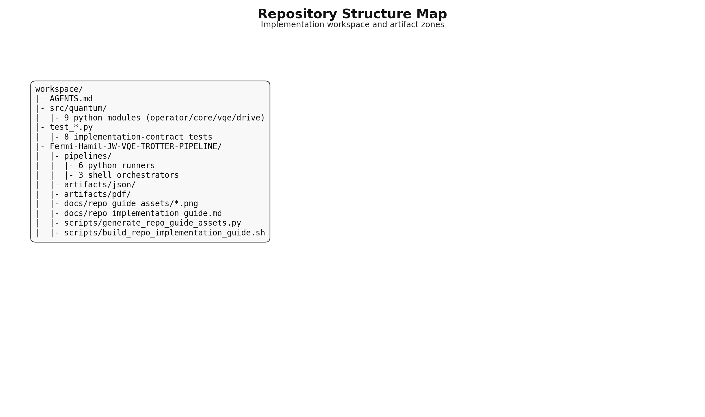

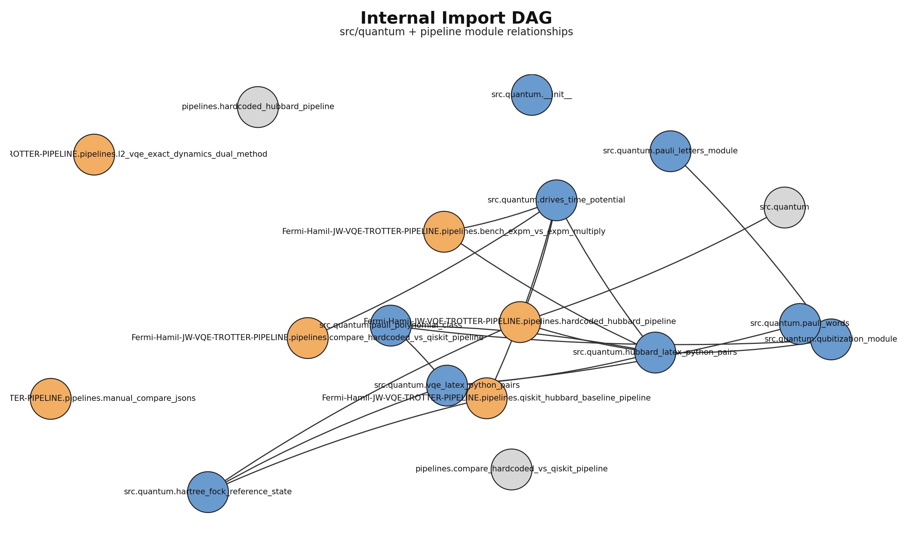

## 2. Physics-To-Code Invariants


The repository has a few invariants that are effectively non-negotiable. Most implementation mistakes eventually reduce to violating one of these.

### 2.1 Pauli symbol invariant

Internal algebra uses `e/x/y/z`, not `I/X/Y/Z`. Conversion is boundary-only. This matters because mixed symbol conventions in intermediate code silently break equality checks for labels and dictionary keys.

### 2.2 Qubit ordering invariant

Pauli word strings are written left-to-right as `q_(n-1)...q_0`; qubit 0 is rightmost in string form. Statevector indexing still uses integer bit positions where qubit 0 is least significant bit.

This dual statement is easy to remember but easy to accidentally violate when translating between string positions and bit operations.

### 2.3 JW source-of-truth invariant

New code should not hand-roll JW ladders. It should reuse helper functions from the polynomial layer. The practical reason is not style: it avoids drift between "equivalent-looking" definitions when edge cases are hit (identity terms, sign conventions, ordering changes).

### 2.4 Canonical PauliTerm source invariant

`PauliTerm` is canonical in `qubitization_module.py`. Compatibility aliases exist for interop but should not become new, divergent implementations.

### 2.5 Drive pass-through invariant

The compare pipeline routes drive arguments through. It does not reinterpret drive physics. This is a correctness property because compare mode should not perturb either HC or QK semantics.

### 2.6 Safe-test invariant

A drive-enabled run with `A=0` should numerically match the no-drive run within threshold. This is effectively a regression sentinel for the drive code path itself.


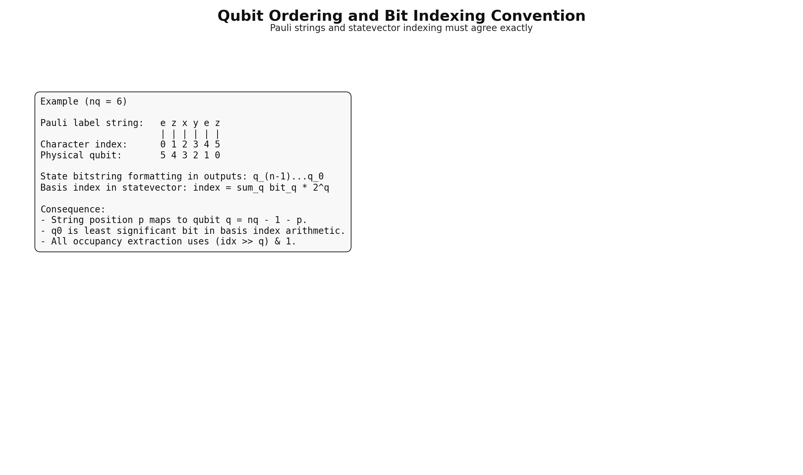

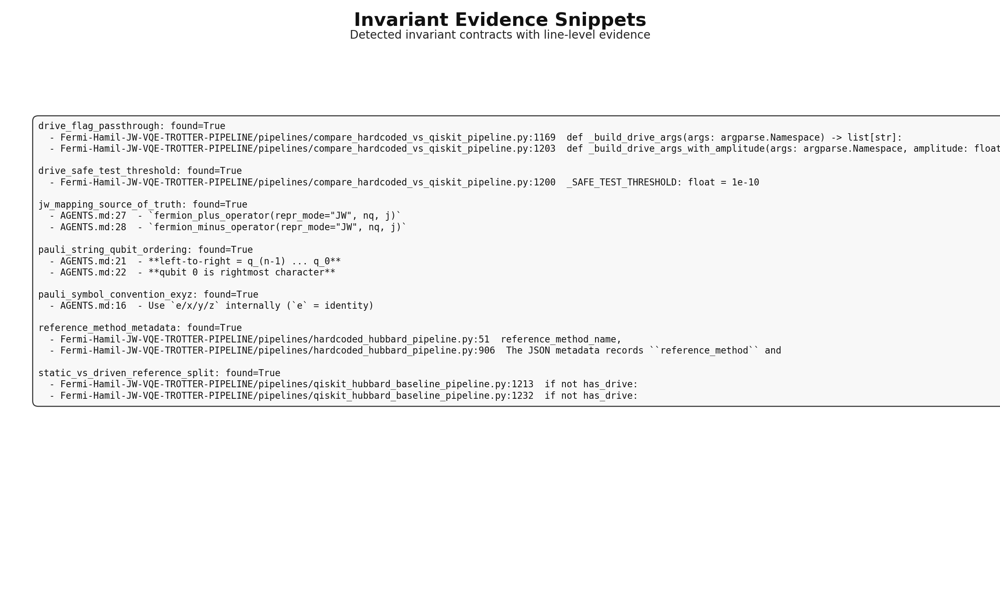

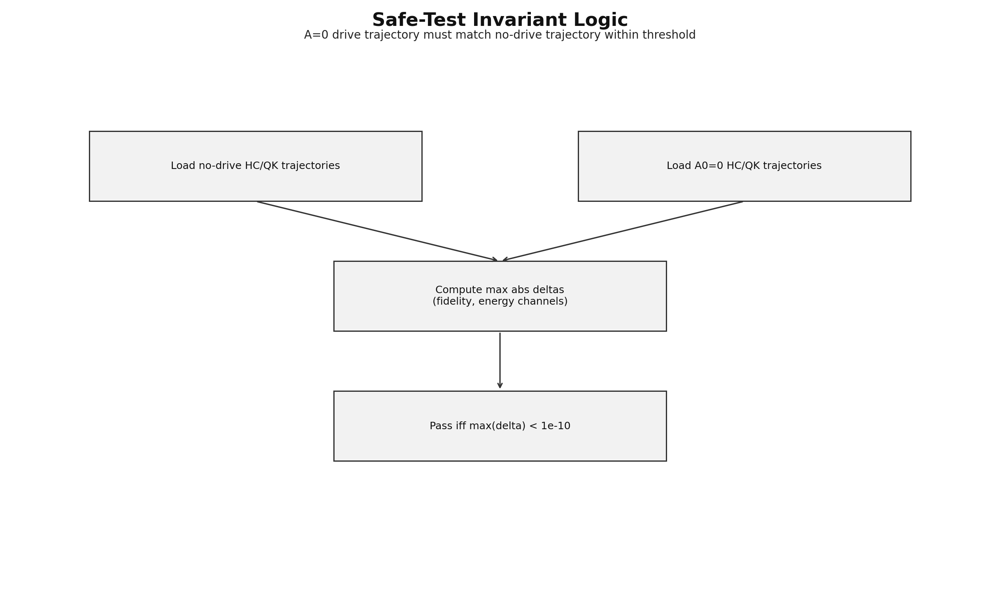

## 3. Hamiltonian Assembly And JW Contracts


Implementation path (hardcoded and qiskit both rely on the same conceptual decomposition):

$$
H = H_t + H_U + H_v = \\sum_j c_j P_j
$$

where each `P_j` is represented as a Pauli label under the repository convention.

In code, this appears as:

- construction of polynomial terms from hopping/onsite/potential logic,
- conversion into label-coefficient map,
- optional term ordering policy (`native` vs `sorted`) for trotter traversal,
- matrix assembly for exact/reference channels.

The important implementation distinction:

- the *Hamiltonian definition* (set of terms and coefficients) is separate from
- the *trotter traversal order* (sequence used to exponentiate finite-step factors).

When you hear "reordering," it means sequence of exponentials for finite-step propagation, not changing coefficients in the model.

#### Number operator contract

Number operators obey

$$
\\hat n_p = \\frac{I - Z_p}{2}
$$

with `Z_p` positioned using the same string/bit convention used everywhere else.

If this convention is broken in one place, downstream signs in site occupation and doublon channels become inconsistent even when energy looks close.

#### Practical audit checklist for Hamiltonian path

- verify term count and coefficient map non-emptiness in payload,
- verify reference sanity block in JSON,
- verify static channels are time-stationary when expected,
- verify no accidental symbol-case drift (`e/x/y/z` vs `I/X/Y/Z`) in intermediate maps.


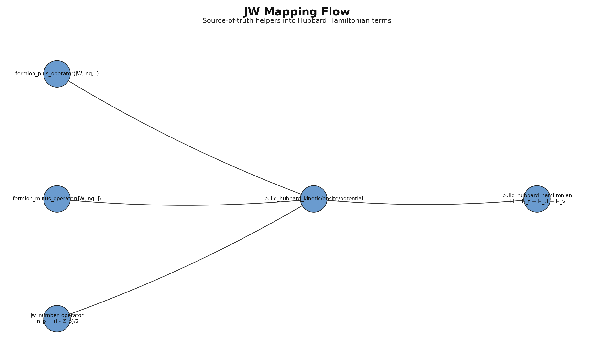

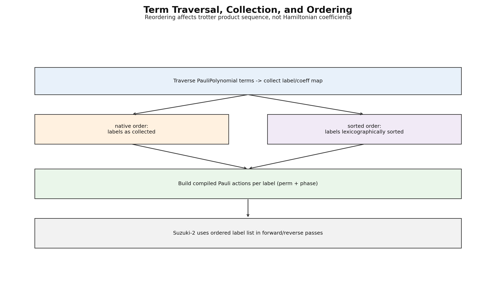

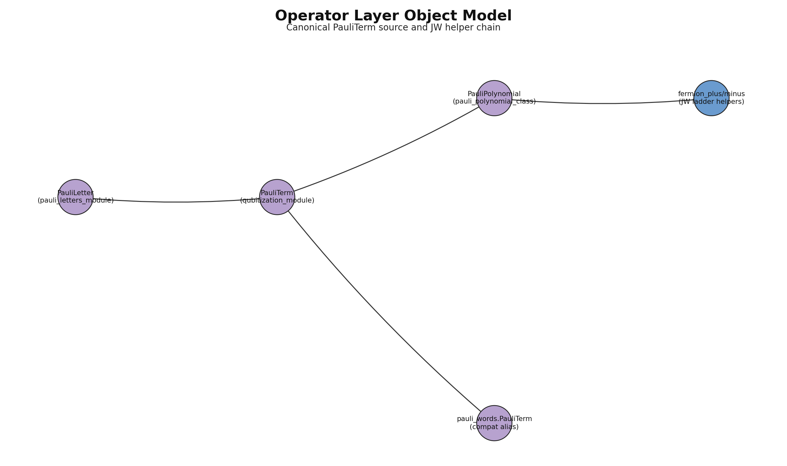

## 4. Hartree-Fock Construction And Half-Filling Placement


This is one of the most misunderstood implementation details, so this section is explicit.

For `L` sites, the repository uses `N_q = 2L` spin-orbital qubits. At half filling,

$$
N_{\\uparrow} = \\left\\lceil \\frac{L}{2} \\right\\rceil,
\\qquad
N_{\\downarrow} = \\left\\lfloor \\frac{L}{2} \\right\\rfloor.
$$

The HF state is not discovered by solving a separate mean-field equation in this code path. It is a deterministic occupation pattern used as a reference state in VQE construction and optional initial state source.

The exact qubit positions for up/down occupancy depend on indexing mode:

- `blocked`: up modes first, then down modes,
- `interleaved`: up/down alternate by site.

Bitstring convention in outputs is `q_(N_q-1)...q_0`, but occupancy extraction in simulation uses integer bit position `q` with shifts/masks.

If you want to audit this in code terms:

- check the HF bitstring helper,
- check HF statevector creation from that bitstring,
- check mapping function used by site-resolved observable extraction.

Those three together define "where each electron is placed" for initialization and subsequent diagnostics.

The six HF tables below should be read as implementation truth tables, not conceptual cartoons.


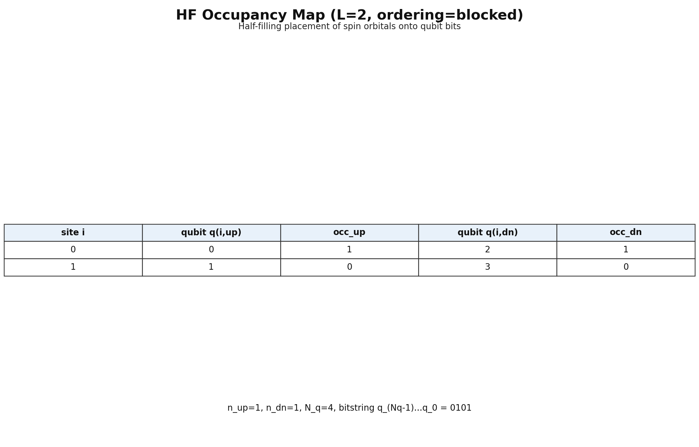

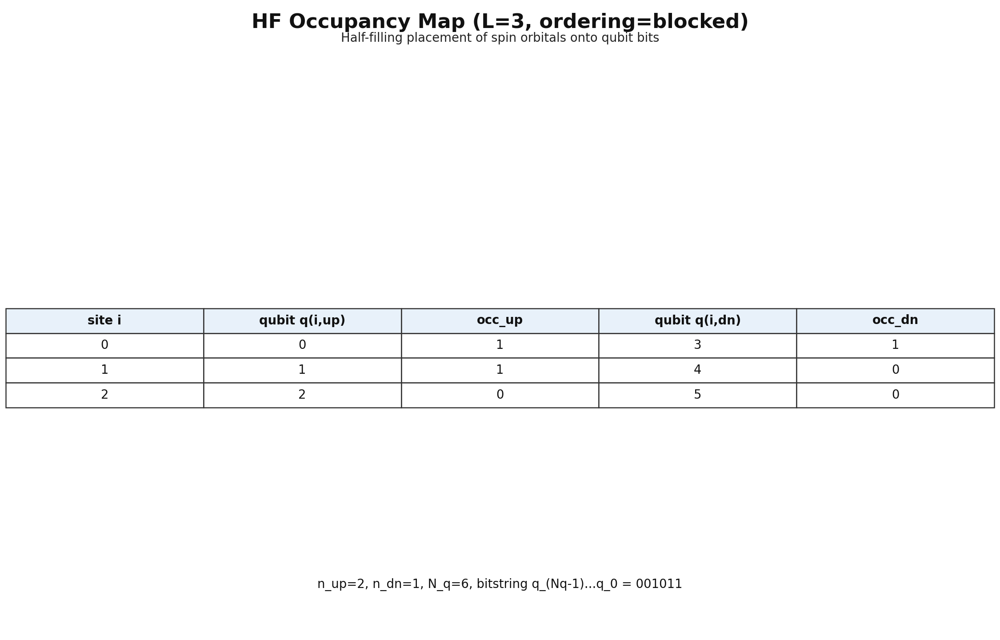

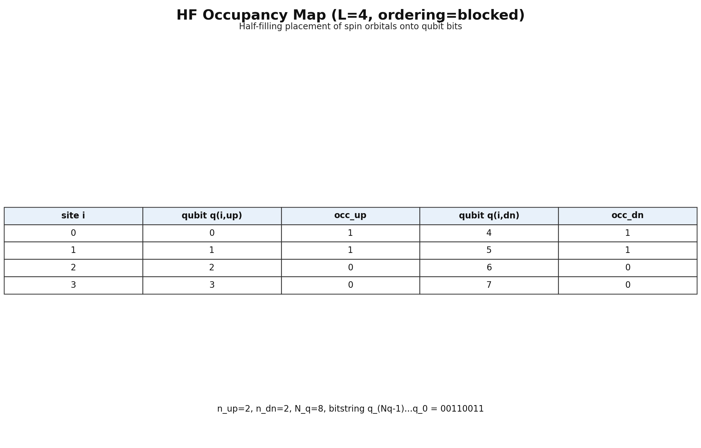

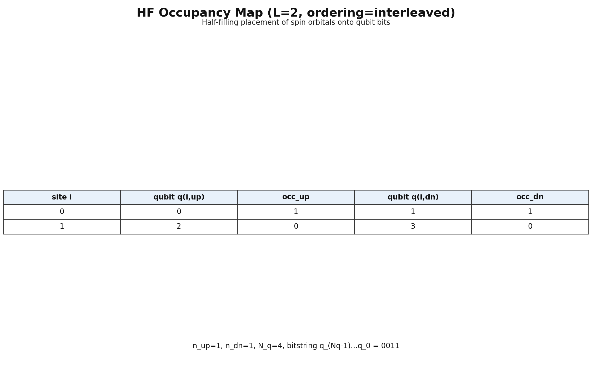

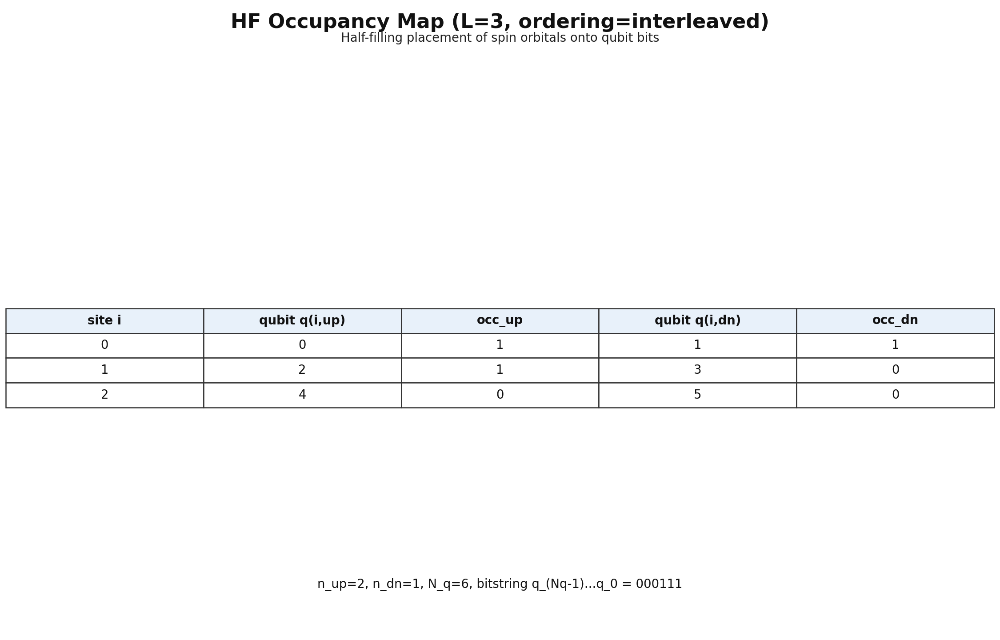

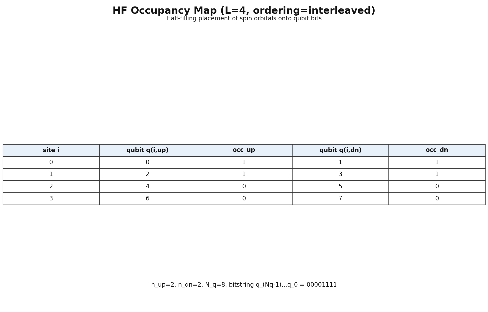

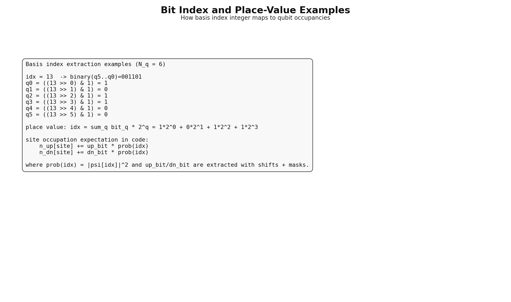

## 5. VQE Internals: Ansatz, Theta, And Inner Optimization


The hardcoded path minimizes

$$
E(\\theta) = \\langle \\psi(\\theta)|H|\\psi(\\theta)\\rangle
$$

with

$$
|\\psi(\\theta)\\rangle = U(\\theta)|\\psi_{\\text{ref}}\\rangle.
$$

### 5.1 What theta is in implementation terms

`theta` is a real vector, one scalar per ansatz generator instance per repetition layer.

- It is not one global scalar.
- It is not "one or two parameters."
- Dimension is `num_parameters = reps * len(base_terms)`.

### 5.2 How theta is consumed

The prepare-state loop iterates over reps and base terms, applying one exponential per `theta[k]` and incrementing `k`. In this code path, each generator polynomial is exponentiated via term-wise Pauli rotations.

### 5.3 Inner optimization semantics

By default in the hardcoded pipeline configuration, optimizer method is `COBYLA` (SciPy path if available). Restarts mean independent initial points are sampled and optimized; final winner is the restart with lowest achieved energy.

This is not gradient-descent on an analytic gradient object. It is derivative-free under COBYLA by default, with objective evaluations routed through state preparation + expectation evaluation.

### 5.4 What restarts do concretely

For each restart `r`:

1. sample random initial point `x0` with seeded RNG,
2. optimize `E(theta)` from `x0`,
3. compare final energy to incumbent best,
4. keep best `(energy, theta, restart-id)`.

### 5.5 Why this matters for artifact interpretation

When VQE energies differ slightly between comparable runs, first check:

- same seed,
- same restart count,
- same maxiter and method,
- same ansatz depth (`reps`) and parameter count,
- same initial-state source used for trajectory branch.


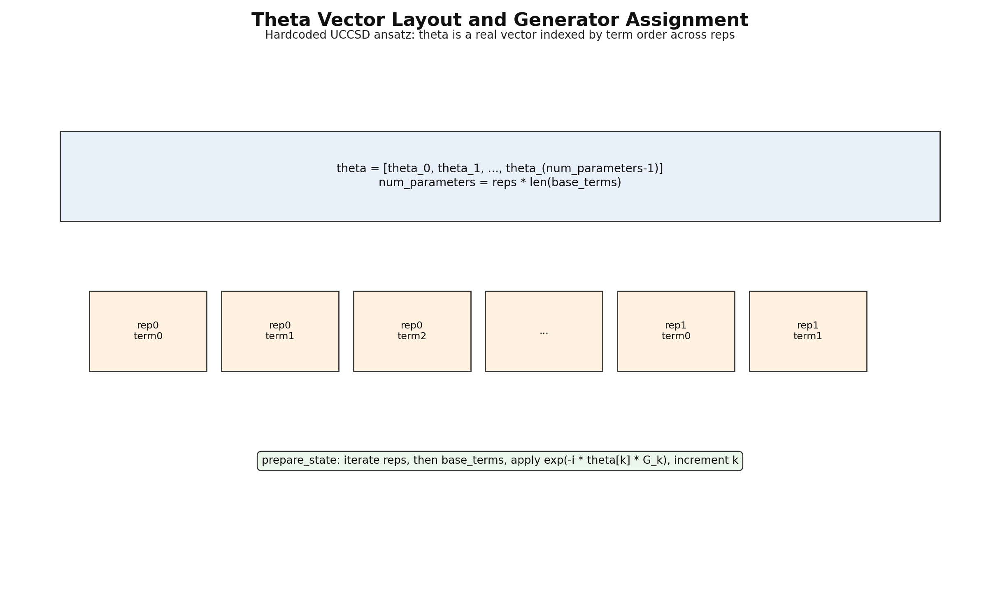

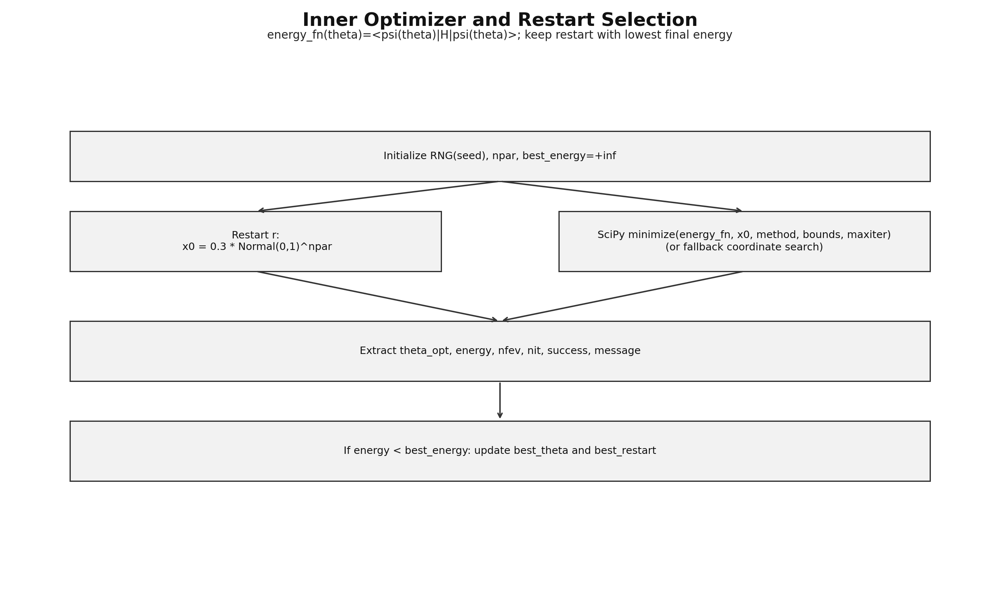


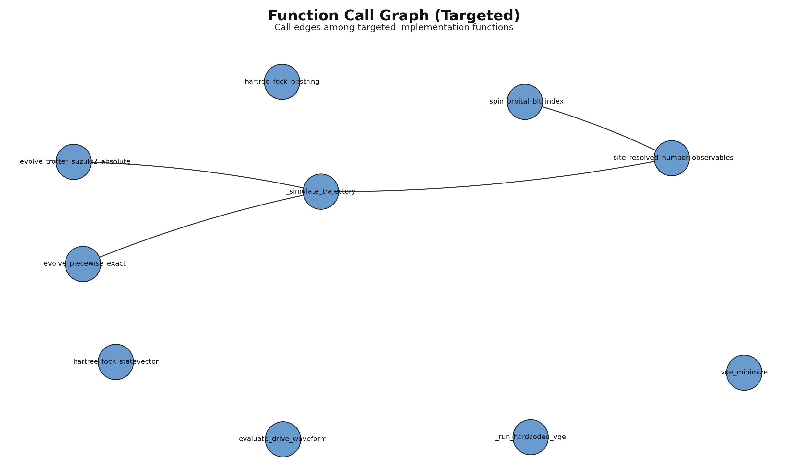

## 6. Trotter Dynamics Internals And Ordering Semantics


Trotterization in this repository is explicit product-form propagation on the statevector. The point that trips people up is the role of order.

For finite step size `dt`, different term sequences generally produce different local errors when terms do not commute. The implementation allows explicit control via term-order policy.

### 6.1 What gets reordered

The reordered object is the traversal list of Pauli labels used in

$$
\\prod_j e^{-i c_j P_j dt}
$$

(or symmetric forward/reverse variant), not the set of Hamiltonian coefficients itself.

### 6.2 Why native vs sorted exists

- `native` preserves collection order from term traversal.
- `sorted` enforces deterministic lexical order.

The repository often defaults to sorted for reproducibility and easier cross-run comparison.

### 6.3 Suzuki-2 absolute-time implementation

Drive-enabled evolution evaluates time-dependent coefficients at sampled times and applies the symmetric sequence per sub-step. In static mode this collapses to coefficient-constant behavior.

### 6.4 Expected behavior with finer discretization

As `dt` decreases (more steps at fixed final time), order sensitivity shrinks. In the infinite-step limit both orderings converge to exact evolution (assuming stable numerical implementation).

### 6.5 Review implications

If two runs disagree and everything else matches, check:

- term order policy,
- trotter steps,
- drive time sampling mode,
- reference method branch,
- normalization diagnostics.


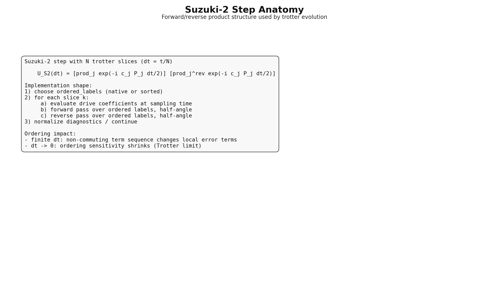

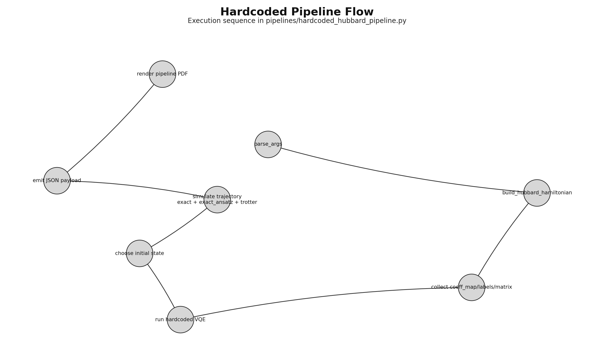

## 7. Time-Dependent Drive Implementation


Drive model implemented:

$$
v(t)=A\\sin(\\omega t+\\phi)\\exp\\!\\left(-\\frac{(t-t_0)^2}{2\\bar t^2}\\right)
$$

with spatial modulation

$$
v_j(t)=s_j\\,v(t).
$$

### 7.1 Architecture split

- waveform and spatial pattern logic: quantum drive module,
- CLI plumbing and pass-through: pipeline argument handling,
- exact/trotter integration: shared kernel path in trajectory simulation.

### 7.2 Why pass-through is strict

Compare pipeline should not reinterpret physics knobs. It should route the same drive settings into both HC and QK sub-runs so discrepancies are attributable to implementation differences, not argument rewriting.

### 7.3 Drive-enabled reference method

In drive mode, reference evolution uses piecewise exact propagation with refined step count:

$$
N_{\\text{ref}} = \\text{exact\\_steps\\_multiplier} \\times N_{\\text{trotter}}.
$$

In no-drive mode, static eigendecomposition reference is used.

### 7.4 Safe-test contract

A drive-enabled call with `A=0` should match no-drive channels within numerical threshold. This is a powerful implementation regression check because it validates both path equivalence and parameter plumbing.


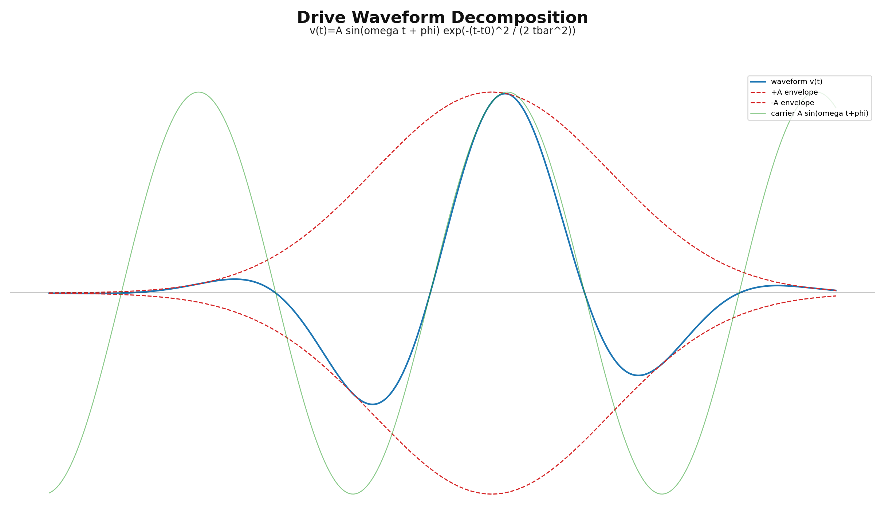

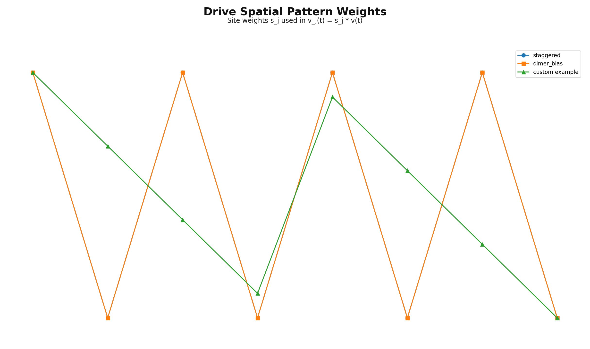

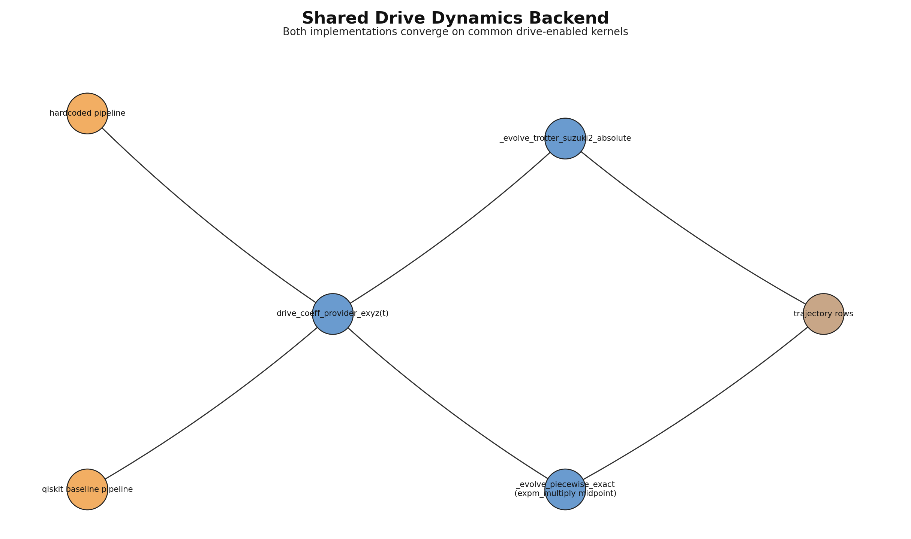

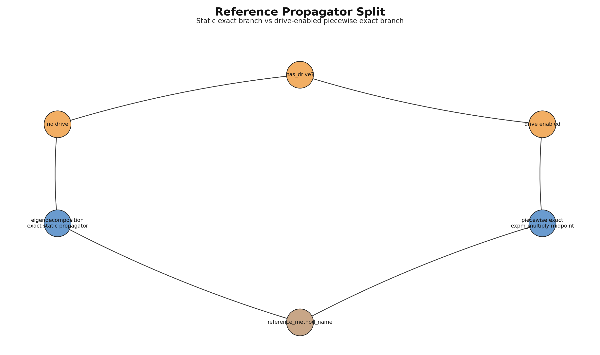

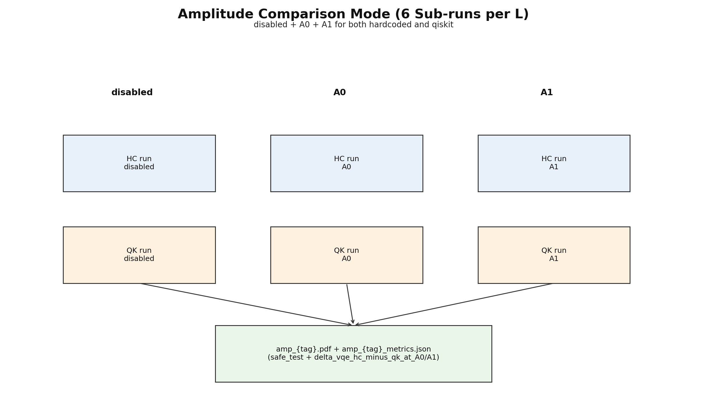

## 8. Exact Reference Semantics And exact_steps_multiplier


The repository keeps two conceptual families separate:

1. Approximate propagated state (`psi_ansatz_trot`) from Suzuki-Trotter.
2. Reference propagated states (`psi_exact_*`) from exact methods appropriate to mode.

### 8.1 Branch semantics in plain implementation terms

- `exact_gs` branch: exact/reference propagation from filtered-sector ground-state init.
- `exact_ansatz` branch: exact/reference propagation from ansatz init.
- `trotter` branch: Suzuki-Trotter propagation from ansatz init.

This branch distinction is important for interpretation: not all curves answer the same question.

### 8.2 Role of exact_steps_multiplier

In drive mode only, it decouples reference integration quality from trotter discretization quality. Increasing multiplier tightens reference accuracy without changing trotter branch itself.

### 8.3 What to check in outputs

- reference method label in settings drive block,
- multiplier value recorded,
- whether total-energy and static-energy channels should be identical (no drive) or not (drive enabled).

### 8.4 Failure signatures

- static and total channels diverge in no-drive case,
- drive-enabled reference method missing/incorrect,
- fidelity behaving erratically while reference metadata indicates inconsistent branch assumptions.


## 9. Trajectory Observables: Formulas To Code


This section maps each major trajectory quantity to exact code behavior and interpretation.

### 9.1 Site-resolved occupancy

For state

$$
|\\psi\\rangle = \\sum_{k=0}^{2^{N_q}-1} \\psi_k |k\\rangle,
\\qquad p_k = |\\psi_k|^2,
$$

site/spin occupancy is accumulated by bit extraction from basis index `k`:

$$
\\langle n_{i,\\sigma}\\rangle = \\sum_k p_k\\, b_{i,\\sigma}(k),
\\qquad b_{i,\\sigma}(k)=((k \\gg q_{i,\\sigma})\\&1).
$$

Site-0 channels in JSON are direct projections of site array index 0.

### 9.2 Doublon

Total doublon channel accumulates

$$
D = \\sum_i \\langle n_{i,\\uparrow} n_{i,\\downarrow}\\rangle.
$$

Average doublon is reported as `D/L`.

### 9.3 Staggered order

Using total density per site `n_i`, reported staggered channel is

$$
S = \\frac{1}{L}\\sum_i (-1)^i n_i.
$$

### 9.4 Energy channels

Static and total channels are separate observables with separate physical meaning in drive mode. In no-drive mode they should match numerically.

### 9.5 Fidelity

Reported fidelity is projector fidelity against propagated filtered-sector ground manifold, not full-state overlap to a single vector.


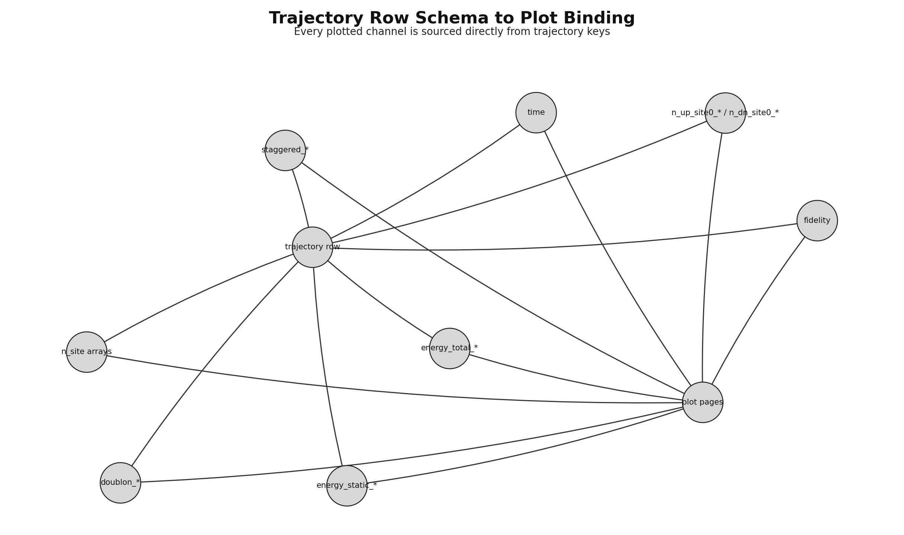

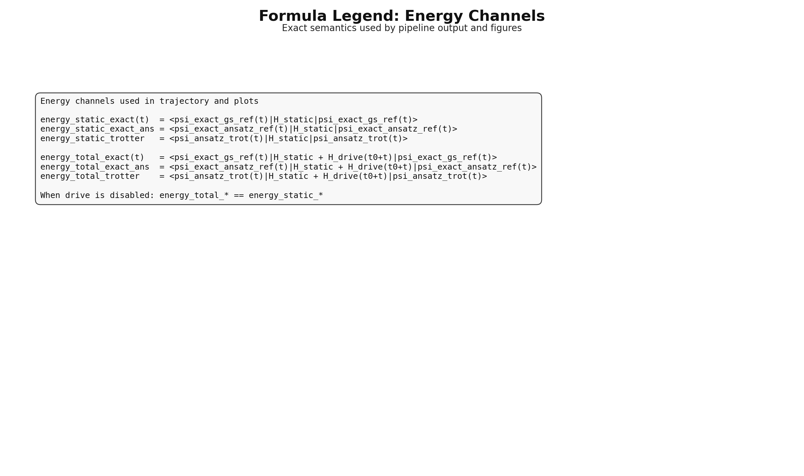


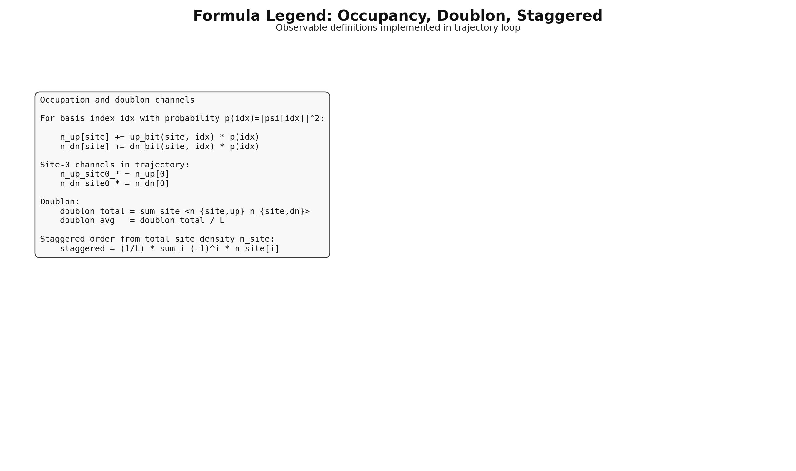

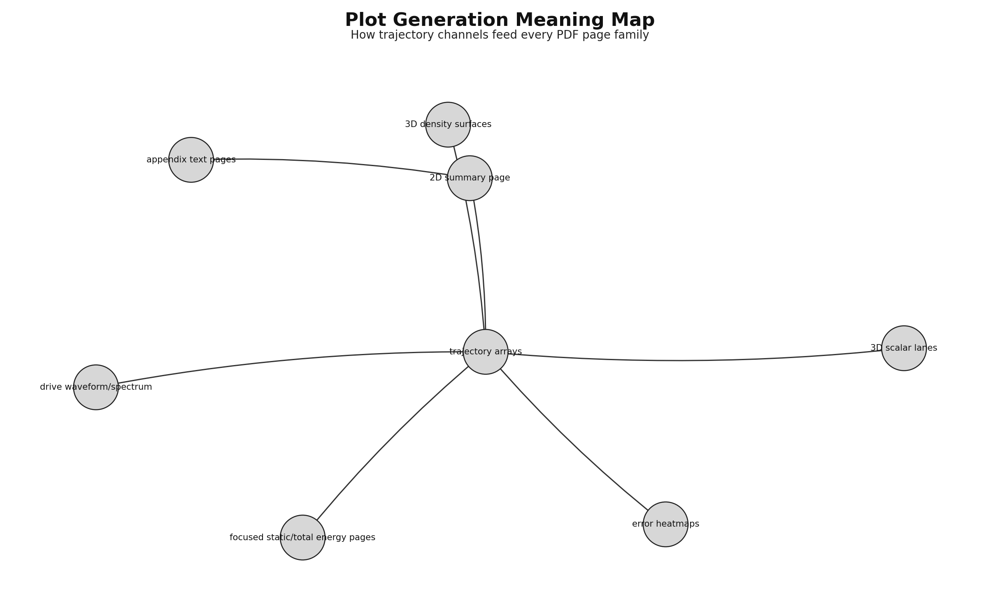

## 10. Plot Generation Internals And Meaning


This repository writes physically interpretable plots, but only if read with branch/observable semantics in mind.

### 10.1 Plot data source contract

All plotted channels are read from trajectory rows. There is no hidden post-processor inventing new physics channels. So interpretation starts with row keys.

### 10.2 Page families in hardcoded pipeline PDF

- 3D total-density surfaces: exact GS, exact ansatz, trotter.
- 3D spin-up and spin-down surfaces.
- 3D lane plots for scalar channels (energy, doublon, staggered).
- Error heatmaps (site-resolved and scalar-channel stacks).
- Drive waveform/spectrum diagnostics (when drive active).
- 2D compact summary page with fidelity, energy overlays, site-0 channels, doublon.
- Focused static-only and total-only energy pages.
- appendix text pages with run metadata and key scalar values.

### 10.3 Meaningful interpretation rules

- Compare static channels across branches to isolate discretization/initial-state effects.
- Compare total channels in drive mode for actual driven energy response.
- Use site-0 channels as readable local probes, but use site-resolved arrays and heatmaps for full spatial interpretation.
- Use error heatmaps to see where deviations localize in time and space.

### 10.4 Common misreads to avoid

- Treating total energy as conserved in driven runs.
- Treating projector fidelity as simple state overlap.
- Interpreting one branch as if it had the same initial state as another branch.
- Ignoring term-order and trotter-step settings when comparing curves.

### 10.5 Why recomputed audit plots were added

The audit figures in this guide are recomputed directly from JSON arrays. They are intended as a second implementation check so that figure interpretation does not rely on internal plotting code alone.


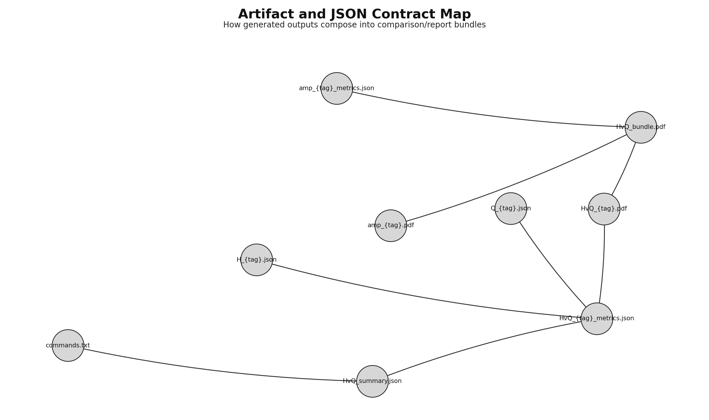

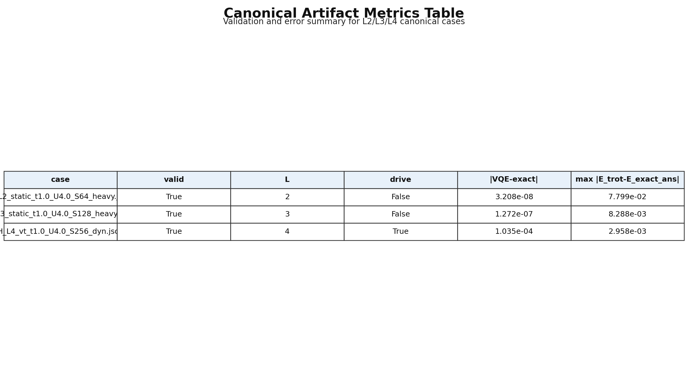

## 11. Canonical Artifact Audits (L=2,3,4)


This section records direct metrics from the canonical heavy trio and ties them to expected behavior.

### 11.1 L=2 static heavy

- drive enabled: `False`
- optimizer: `COBYLA`
- parameter count: `6`
- `|VQE - exact_filtered|`: `3.20842046264147e-08`
- max `|E_static_trot - E_static_exact_ans|`: `0.07798533165196853`
- final projector fidelity: `0.9869249072500748`

Interpretation:

- Static total-minus-static delta is exactly 0 in this case, which is expected in no-drive mode.
- Trotter vs exact-ansatz gap is visible at finite step count and should shrink with refinement.

### 11.2 L=3 static heavy

- drive enabled: `False`
- optimizer: `COBYLA`
- parameter count: `16`
- `|VQE - exact_filtered|`: `1.2720054520798385e-07`
- max `|E_static_trot - E_static_exact_ans|`: `0.008288216471344256`
- final projector fidelity: `0.9985135925614043`

Interpretation:

- Fidelity is high and stable near the final time.
- Error scale is lower than L=2 in this selected heavy static case due to chosen discretization and branch settings.

### 11.3 L=4 drive-enabled dyn

- drive enabled: `True`
- optimizer: `COBYLA`
- parameter count: `104`
- reference method: `exponential_midpoint_magnus2_order2`
- `|VQE - exact_filtered|`: `0.00010348314457075958`
- max `|E_static_trot - E_static_exact_ans|`: `0.0029578796116696005`
- max `|E_total_trot - E_static_trot|`: `0.12363082821378724`
- final projector fidelity: `0.9993357304628818`

Interpretation:

- Nonzero total-minus-static delta is expected and confirms driven observable separation.
- The reported reference method indicates the drive-aware branch was used.

### 11.4 Cross-case summary

- all canonical cases valid: `True`
- occupancy bounds checks: pass in canonical metrics payload
- doublon bounds checks: pass in canonical metrics payload


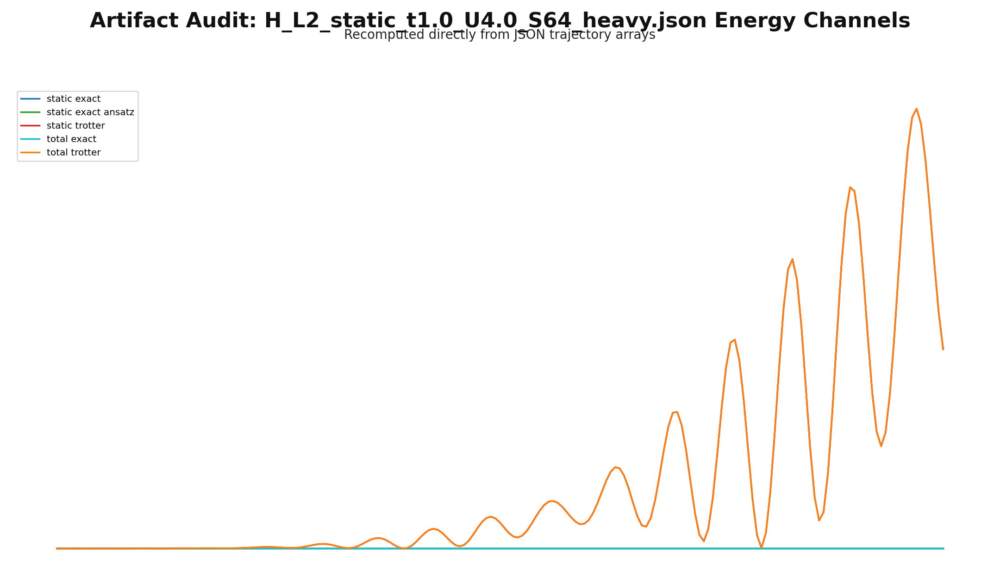

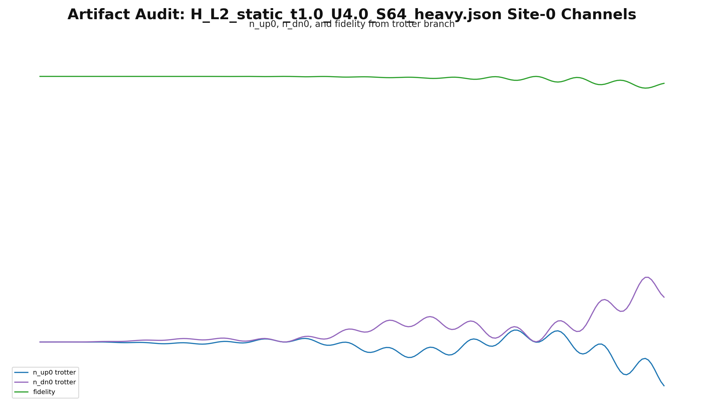


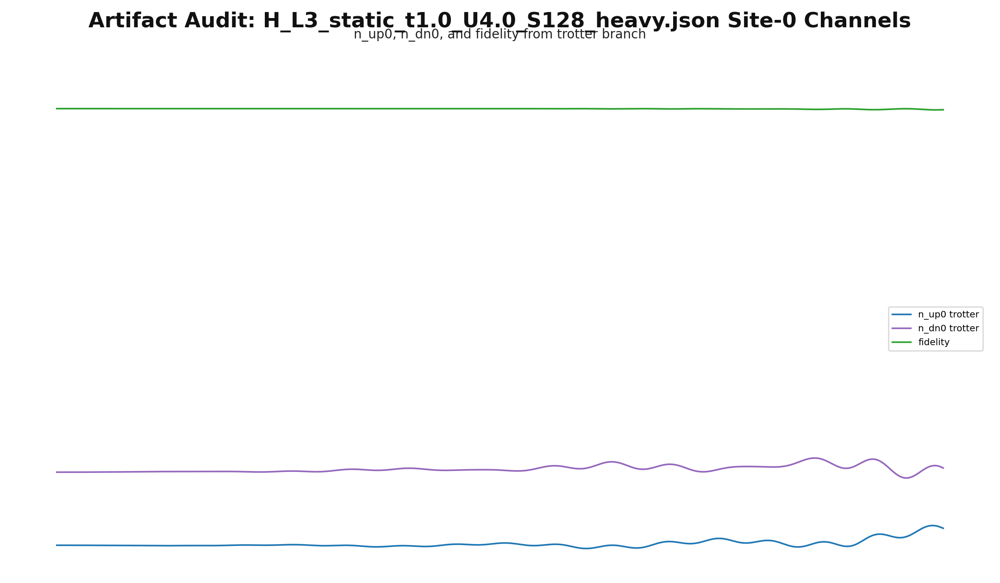

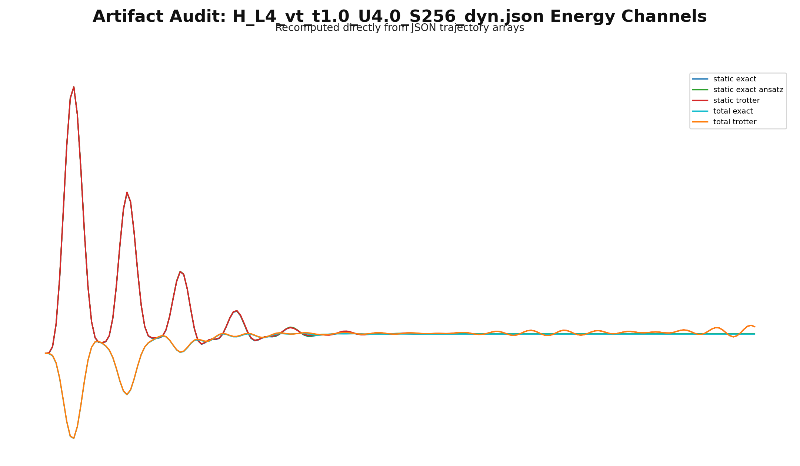

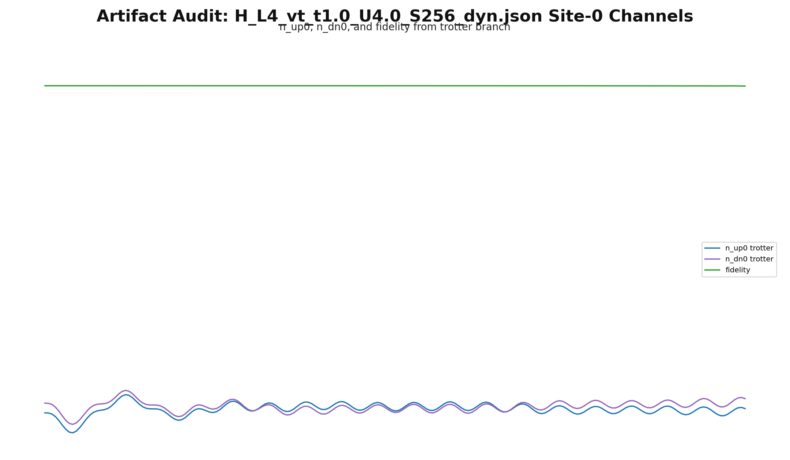

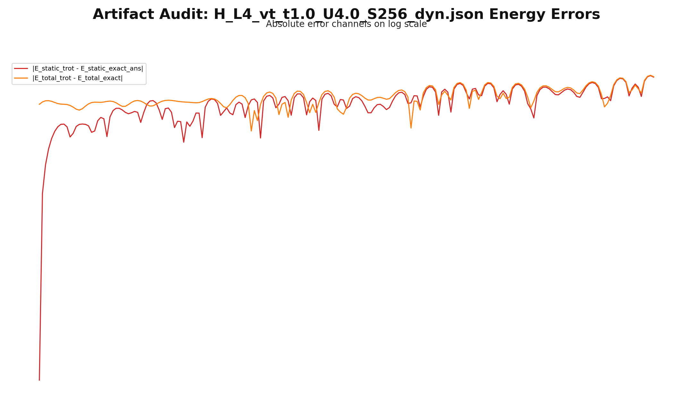

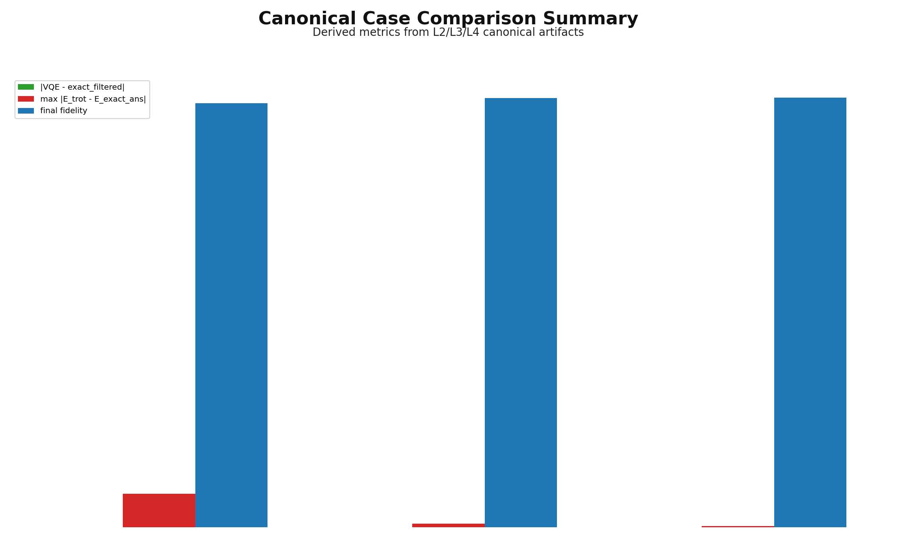

## 12. Minimal Compare/Qiskit Validation Role


This guide focuses on implementation meaning in the hardcoded path, but compare/qiskit still matter as validation infrastructure.

### 12.1 What compare runner should do

- build two commands,
- run both (or load existing JSONs),
- compute reconciled metrics,
- emit combined reports.

It should not alter the physical model settings while routing arguments.

### 12.2 What qiskit baseline contributes

- independent implementation pathway for cross-checking,
- alternative library stack for VQE internals,
- aligned output schema to enable direct comparison.

### 12.3 What this section intentionally does not do

It does not attempt to prove one backend is universally superior. It treats qiskit path as a useful comparator and schema-aligned reference baseline.


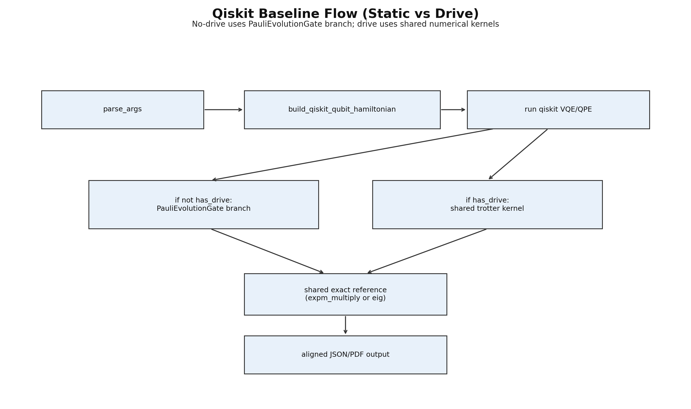

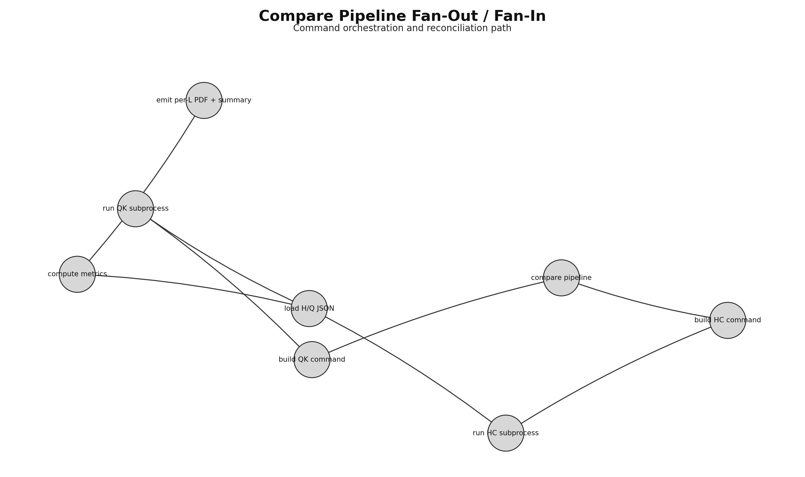

## 13. Extension Safety: Safe And High-Risk Edits


Safe edits tend to preserve one of these properties:

- no change to operator algebra semantics,
- no change to label/bit convention,
- no change to drive pass-through behavior,
- no change to trajectory key contracts.

High-risk edits include:

- touching indexing logic without exhaustive checks,
- touching JW/number-operator semantics,
- adding drive knobs without updating all pipeline surfaces,
- changing meaning of existing JSON keys.

### 13.1 Practical pre-merge checklist

1. Re-run canonical L2/L3/L4 artifact generation.
2. Recompute guide asset metrics and inspect deltas.
3. Verify safe-test logic still passes under A=0 check scenarios.
4. Confirm section-10 plot meaning rules still match code.
5. Confirm no operator-core base file edits slipped in.

### 13.2 Key targeted function anchors


- `_evolve_trotter_suzuki2_absolute` in `Fermi-Hamil-JW-VQE-TROTTER-PIPELINE/pipelines/hardcoded_hubbard_pipeline.py` lines 321-391: def _evolve_trotter_suzuki2_absolute(     psi0: np.ndarray,     ordered_labels_exyz: list[str],     coeff_map_exyz: dict[str, complex],     compiled_actions: dict[str, CompiledPauliAction],     time_value: float,     trotter_steps: int,     *,     drive_coeff_provider_exyz: Any | None = None,     t0: float = 0.0,     time_sampling: str = "midpoint",     coeff_tol: float = 1e-12, ) -> np.ndarray:     """Suzuki-Trotter order-2 evolution, with optional time-dependent drive.      When *drive_coeff_provider_exyz* is ``None`` the original bit-for-bit     time-independent path is taken (no behavioural change).      When provided, drive coefficients are sampled once per Trotter slice and     additively merged with the static coefficients.     """     # --- time-independent fast path (bit-for-bit identical to original) ---     if drive_coeff_provider_exyz is None:         psi = np.array(psi0, copy=True)         if abs(time_value) <= 1e-15:             return psi         dt = float(time_value) / float(trotter_steps)         half = 0.5 * dt         for _ in range(trotter_steps):
- `_spin_orbital_bit_index` in `Fermi-Hamil-JW-VQE-TROTTER-PIPELINE/pipelines/hardcoded_hubbard_pipeline.py` lines 430-436: def _spin_orbital_bit_index(...)
- `_site_resolved_number_observables` in `Fermi-Hamil-JW-VQE-TROTTER-PIPELINE/pipelines/hardcoded_hubbard_pipeline.py` lines 439-461: def _site_resolved_number_observables(     psi: np.ndarray,     num_sites: int,     ordering: str, ) -> tuple[np.ndarray, np.ndarray, float]:     probs = np.abs(psi) ** 2     n_up = np.zeros(int(num_sites), dtype=float)     n_dn = np.zeros(int(num_sites), dtype=float)     doublon_total = 0.0     up_bits = [_spin_orbital_bit_index(site, 0, num_sites, ordering) for site in range(int(num_sites))]     dn_bits = [_spin_orbital_bit_index(site, 1, num_sites, ordering) for site in range(int(num_sites))]      for idx, prob in enumerate(probs):
- `_run_hardcoded_vqe` in `Fermi-Hamil-JW-VQE-TROTTER-PIPELINE/pipelines/hardcoded_hubbard_pipeline.py` lines 500-577: def _run_hardcoded_vqe(...)
- `_evolve_piecewise_exact` in `Fermi-Hamil-JW-VQE-TROTTER-PIPELINE/pipelines/hardcoded_hubbard_pipeline.py` lines 875-1033: def _evolve_piecewise_exact(     *,     psi0: np.ndarray,     hmat_static: np.ndarray,     drive_coeff_provider_exyz: Any,     time_value: float,     trotter_steps: int,     t0: float = 0.0,     time_sampling: str = "midpoint", ) -> np.ndarray:     """Piecewise-constant matrix-exponential reference propagator.      Approximation order     -------------------     This function is **not** a true time-ordered exponential.  It is a     piecewise-constant approximation: each sub-interval [t_k, t_{k+1}] of     width Deltat = time_value / trotter_steps is replaced by the exact     exponential of H evaluated at a single representative time t_k.      The order depends on how t_k is chosen (``time_sampling``):
- `_simulate_trajectory` in `Fermi-Hamil-JW-VQE-TROTTER-PIPELINE/pipelines/hardcoded_hubbard_pipeline.py` lines 1036-1289: def _simulate_trajectory(     *,     num_sites: int,     ordering: str,     psi0_ansatz_trot: np.ndarray,     psi0_exact_ref: np.ndarray,     fidelity_subspace_basis_v0: np.ndarray,     fidelity_subspace_energy_tol: float,     hmat: np.ndarray,     ordered_labels_exyz: list[str],     coeff_map_exyz: dict[str, complex],     trotter_steps: int,     t_final: float,     num_times: int,     suzuki_order: int,     drive_coeff_provider_exyz: Any | None = None,     drive_t0: float = 0.0,     drive_time_sampling: str = "midpoint",     exact_steps_multiplier: int = 1, ) -> tuple[list[dict[str, float]], list[np.ndarray]]:     if int(suzuki_order) != 2:         raise ValueError("This script currently supports suzuki_order=2 only.")      nq = 2 * int(num_sites)     evals, evecs = np.linalg.eigh(hmat)     evecs_dag = np.conjugate(evecs).T      compiled = {lbl: _compile_pauli_action(lbl, nq) for lbl in ordered_labels_exyz}     times = np.linspace(0.0, float(t_final), int(num_times))     n_times = int(times.size)     stride = max(1, n_times // 20)     t0 = time.perf_counter()     basis_v0 = np.asarray(fidelity_subspace_basis_v0, dtype=complex)     if basis_v0.ndim != 2 or basis_v0.shape[0] != psi0_ansatz_trot.size:         raise ValueError("fidelity_subspace_basis_v0 must have shape (dim, k) with matching dim.")     if basis_v0.shape[1] <= 0:         raise ValueError("fidelity_subspace_basis_v0 must contain at least one basis vector.")      has_drive = drive_coeff_provider_exyz is not None      # When drive is enabled the reference propagator may use a finer step count     # to improve its quality independently of the Trotter discretization.     reference_steps = int(trotter_steps) * max(1, int(exact_steps_multiplier))     static_basis_eig = evecs_dag @ basis_v0      _ai_log(         "hardcoded_trajectory_start",         L=int(num_sites),         num_times=n_times,         t_final=float(t_final),         trotter_steps=int(trotter_steps),         reference_steps=reference_steps,         exact_steps_multiplier=int(exact_steps_multiplier),         suzuki_order=int(suzuki_order),         drive_enabled=has_drive,         ground_subspace_dimension=int(basis_v0.shape[1]),         fidelity_subspace_energy_tol=float(fidelity_subspace_energy_tol),         fidelity_selection_rule="E <= E0 + tol",     )      rows: list[dict[str, float]] = []     exact_states: list[np.ndarray] = []      for idx, time_val in enumerate(times):
- `evaluate_drive_waveform` in `src/quantum/drives_time_potential.py` lines 137-170: def evaluate_drive_waveform(...)
- `hartree_fock_bitstring` in `src/quantum/hartree_fock_reference_state.py` lines 101-112: def hartree_fock_bitstring(...)
- `hartree_fock_statevector` in `src/quantum/hartree_fock_reference_state.py` lines 115-135: def hartree_fock_statevector(...)
- `vqe_minimize` in `src/quantum/vqe_latex_python_pairs.py` lines 689-794: def vqe_minimize(     H: PauliPolynomial,     ansatz: Any,     psi_ref: np.ndarray,     *,     restarts: int = 3,     seed: int = 7,     initial_point_stddev: float = 0.3,     method: str = "SLSQP",     maxiter: int = 1800,     bounds: Optional[Tuple[float, float]] = (-math.pi, math.pi), ) -> VQEResult:     """     Hardcoded VQE: minimize <psi(theta)|H|psi(theta)> with a statevector backend.     Uses SciPy if available; otherwise falls back to a tiny coordinate search.     """     minimize = _try_import_scipy_minimize()     rng = np.random.default_rng(int(seed))     npar = int(ansatz.num_parameters)     if npar <= 0:         log.error("ansatz has no parameters")      def energy_fn(x: np.ndarray) -> float:         theta = np.asarray(x, dtype=float)         psi = ansatz.prepare_state(theta, psi_ref)         return expval_pauli_polynomial(psi, H)      best_energy = float("inf")     best_theta = None     best_restart = -1     best_nfev = 0     best_nit = 0     best_success = False     best_message = "no run"      for r in range(int(restarts)):


## 14. Ultra-Brief Run Appendix


This appendix is intentionally short.

Use the build wrapper from subrepo root:

```bash
scripts/build_repo_implementation_guide.sh
```

It regenerates assets, enforces deterministic figures, runs `pytest -q` snapshot, and builds the PDF.

Primary outputs:

- `docs/Repo implementation guide.PDF`
- `docs/repo_guide_assets/repo_guide_summary.json`
- `docs/repo_guide_assets/repo_guide_artifact_metrics.json`

For implementation review, read sections 4-11 first.

## Appendix A: Figure Atlas (Condensed)

### A.1 Repository Structure Map


Use: Workspace and artifact topology. Cross-check against section formulas before drawing conclusions.

### A.2 Internal Import DAG


Use: src/quantum and pipeline imports. Cross-check against section formulas before drawing conclusions.

### A.3 Operator Layer Object Model


Use: Pauli abstraction chain. Cross-check against section formulas before drawing conclusions.

### A.4 Qubit Ordering Convention


Use: String to qubit index mapping. Cross-check against section formulas before drawing conclusions.

### A.5 JW Mapping Flow


Use: Ladder helper flow into Hamiltonian. Cross-check against section formulas before drawing conclusions.

### A.6 Hardcoded Pipeline Flow


Use: Execution sequence. Cross-check against section formulas before drawing conclusions.

### A.7 Qiskit Baseline Flow


Use: Static vs drive branch. Cross-check against section formulas before drawing conclusions.

### A.8 Shared Drive Backend


Use: Common drive kernels. Cross-check against section formulas before drawing conclusions.

### A.9 Compare Fan-Out/Fan-In


Use: Orchestration path. Cross-check against section formulas before drawing conclusions.

### A.10 Amplitude 6-Run Workflow


Use: disabled/A0/A1 x HC/QK. Cross-check against section formulas before drawing conclusions.

### A.11 Safe-Test Logic


Use: A=0 no-drive equivalence gate. Cross-check against section formulas before drawing conclusions.

### A.12 Artifact Contract Map


Use: JSON/PDF dependency graph. Cross-check against section formulas before drawing conclusions.

### A.13 Test Contract Coverage


Use: Tests as executable spec. Cross-check against section formulas before drawing conclusions.

### A.14 Extension Playbook


Use: Safe change decision tree. Cross-check against section formulas before drawing conclusions.

### A.15 HF Occupancy Table L2 blocked


Use: Half-filling map. Cross-check against section formulas before drawing conclusions.

### A.16 HF Occupancy Table L3 blocked


Use: Half-filling map. Cross-check against section formulas before drawing conclusions.

### A.17 HF Occupancy Table L4 blocked


Use: Half-filling map. Cross-check against section formulas before drawing conclusions.

### A.18 HF Occupancy Table L2 interleaved


Use: Half-filling map. Cross-check against section formulas before drawing conclusions.

### A.19 HF Occupancy Table L3 interleaved


Use: Half-filling map. Cross-check against section formulas before drawing conclusions.

### A.20 HF Occupancy Table L4 interleaved


Use: Half-filling map. Cross-check against section formulas before drawing conclusions.

### A.21 Bit Index Examples


Use: Basis index extraction. Cross-check against section formulas before drawing conclusions.

### A.22 Theta Vector Layout


Use: Parameter indexing in ansatz. Cross-check against section formulas before drawing conclusions.

### A.23 Optimizer Restart Flow


Use: Inner VQE optimization logic. Cross-check against section formulas before drawing conclusions.

### A.24 Term Traversal vs Ordering


Use: collection/order/compiled actions. Cross-check against section formulas before drawing conclusions.

### A.25 Suzuki-2 Anatomy


Use: Forward/reverse pass implementation. Cross-check against section formulas before drawing conclusions.

### A.26 Drive Waveform


Use: Carrier-envelope decomposition. Cross-check against section formulas before drawing conclusions.

### A.27 Drive Spatial Patterns


Use: staggered/dimer/custom weights. Cross-check against section formulas before drawing conclusions.

### A.28 Reference Propagator Split


Use: static eig vs drive piecewise exact. Cross-check against section formulas before drawing conclusions.

### A.29 Trajectory Schema Map


Use: row keys to plot channels. Cross-check against section formulas before drawing conclusions.

### A.30 Formula Legend Energy


Use: energy observable definitions. Cross-check against section formulas before drawing conclusions.

### A.31 Formula Legend Fidelity


Use: projector fidelity definition. Cross-check against section formulas before drawing conclusions.

### A.32 Formula Legend Occupancy


Use: n_up/n_dn/doublon/staggered. Cross-check against section formulas before drawing conclusions.

### A.33 Artifact L2 Energy Audit


Use: L2 heavy static energy channels. Cross-check against section formulas before drawing conclusions.

### A.34 Artifact L2 Site0 Audit


Use: L2 heavy static site-0/fidelity channels. Cross-check against section formulas before drawing conclusions.

### A.35 Artifact L3 Energy Audit


Use: L3 heavy static energy channels. Cross-check against section formulas before drawing conclusions.

### A.36 Artifact L3 Site0 Audit


Use: L3 heavy static site-0/fidelity channels. Cross-check against section formulas before drawing conclusions.

### A.37 Artifact L4 Drive Energy Audit


Use: L4 drive-enabled static/total energy channels. Cross-check against section formulas before drawing conclusions.

### A.38 Artifact L4 Site0/Fidelity Audit


Use: L4 drive-enabled site-0/fidelity channels. Cross-check against section formulas before drawing conclusions.

### A.39 Artifact L4 Error Audit


Use: L4 drive energy absolute errors. Cross-check against section formulas before drawing conclusions.

### A.40 Case Comparison Summary


Use: L2/L3/L4 derived metric comparison. Cross-check against section formulas before drawing conclusions.

### A.41 Function Evidence Map


Use: Target function line spans. Cross-check against section formulas before drawing conclusions.

### A.42 Function Call Graph


Use: Call edges among target functions. Cross-check against section formulas before drawing conclusions.

### A.43 Invariant Evidence


Use: Line-level invariant snippets. Cross-check against section formulas before drawing conclusions.

### A.44 Canonical Metrics Table


Use: Validation/error summary table. Cross-check against section formulas before drawing conclusions.

### A.45 Quality Gate Summary


Use: Guide build gate inventory. Cross-check against section formulas before drawing conclusions.

### A.46 Plot Meaning Map


Use: Trajectory arrays to output pages. Cross-check against section formulas before drawing conclusions.

## Appendix B: Target Function Evidence (Condensed)

AST-derived anchors for implementation review:

- `_evolve_trotter_suzuki2_absolute` -> `Fermi-Hamil-JW-VQE-TROTTER-PIPELINE/pipelines/hardcoded_hubbard_pipeline.py` lines 321-391
- `_spin_orbital_bit_index` -> `Fermi-Hamil-JW-VQE-TROTTER-PIPELINE/pipelines/hardcoded_hubbard_pipeline.py` lines 430-436
- `_site_resolved_number_observables` -> `Fermi-Hamil-JW-VQE-TROTTER-PIPELINE/pipelines/hardcoded_hubbard_pipeline.py` lines 439-461
- `_run_hardcoded_vqe` -> `Fermi-Hamil-JW-VQE-TROTTER-PIPELINE/pipelines/hardcoded_hubbard_pipeline.py` lines 500-577
- `_evolve_piecewise_exact` -> `Fermi-Hamil-JW-VQE-TROTTER-PIPELINE/pipelines/hardcoded_hubbard_pipeline.py` lines 875-1033
- `_simulate_trajectory` -> `Fermi-Hamil-JW-VQE-TROTTER-PIPELINE/pipelines/hardcoded_hubbard_pipeline.py` lines 1036-1289
- `evaluate_drive_waveform` -> `src/quantum/drives_time_potential.py` lines 137-170
- `hartree_fock_bitstring` -> `src/quantum/hartree_fock_reference_state.py` lines 101-112
- `hartree_fock_statevector` -> `src/quantum/hartree_fock_reference_state.py` lines 115-135
- `vqe_minimize` -> `src/quantum/vqe_latex_python_pairs.py` lines 689-794

## Appendix C: Canonical Metrics Snapshot (Condensed)

- All canonical cases valid: `True`
- `H_L2_static_t1.0_U4.0_S64_heavy.json`: L=2, drive=False, |VQE-exact|=3.20842046264147e-08, max|E_trot-E_exact_ans|=0.07798533165196853, final_fidelity=0.9869249072500748
- `H_L3_static_t1.0_U4.0_S128_heavy.json`: L=3, drive=False, |VQE-exact|=1.2720054520798385e-07, max|E_trot-E_exact_ans|=0.008288216471344256, final_fidelity=0.9985135925614043
- `H_L4_vt_t1.0_U4.0_S256_dyn.json`: L=4, drive=True, |VQE-exact|=0.00010348314457075958, max|E_trot-E_exact_ans|=0.0029578796116696005, final_fidelity=0.9993357304628818

