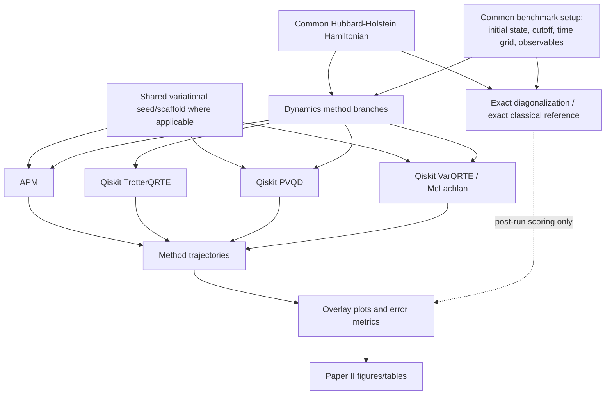

# Paper II Time-Dynamics Route README

Status: agent-facing route contract and implementation target.

This document describes the intended Paper-II time-dynamics route. It is not a
claim that the current code fully matches this route. Use it to keep future
implementation, audit, and benchmark work aligned before editing manuscript
text or promoting evidence.

Runtime and algorithmic knobs are tracked separately in
`MATH/paper_facing/paper_II_dynamics/runtime_algorithm_settings.md`.
The current working canonical/candidate-canonical settings are tracked in
`MATH/paper_facing/paper_II_dynamics/canonical_algorithm_settings.md`.

Terminology: APM means append-prune McLachlan. Older docs, module paths, and
artifact fields may still say AP-McLachlan; new agent-facing implementation
notes should use APM unless quoting a compatibility surface literally named
AP-McLachlan or `ap_mclachlan`.

## Benchmark Route

Exact diagonalization / exact classical propagation is the post-run reference
branch, not a benchmarked dynamics method. For time-independent fixtures this
can mean diagonalizing the finite truncated Hamiltonian and applying the
spectral propagator; time-dependent fixtures should use an explicitly labeled
high-accuracy exact-classical propagation rule. Each dynamics method produces a
trajectory first, and the reference branch is attached afterward for overlays
and error metrics.



## APM Internal Route

Append, prune, and exchange are internal feedback actions of the APM
controller. They modify the active scaffold before the next trajectory point is
recorded. They are not downstream result branches separate from APM.

```mermaid
flowchart LR
    A["APM state at time iteration k:<br/>active support J_k"]
    A --> B["Estimate active McLachlan geometry on J_k"]
    B --> C["Generate measurement-compatible child patch opportunities"]
    C --> Q["Optional parent-scout frontier:<br/>rank parents, expand retained parents back to children"]
    Q --> D["Assemble before/after child-support geometry"]
    D --> E["Compute grouped support-patch score Delta_nu"]
    E --> F["Apply hard gates and cost-aware ranking"]
    F --> G{"Selected support patch nu_k = (B_k^-, R_k^+)"}

    G -->|"B^- = empty, R^+ = empty"| H["No scaffold edit"]
    G -->|"B^- = empty, R^+ nonempty"| I["Append block(s)"]
    G -->|"B^- nonempty, R^+ = empty"| J["Delete block(s)"]
    G -->|"B^- nonempty, R^+ nonempty"| K["Exchange: delete + append"]

    H --> L["Solve McLachlan update on J_k^nu"]
    I --> L
    J --> L
    K --> L

    L --> M["Advance parameters/state"]
    M --> N["Record APM trajectory point"]
    N --> O{"More time iterations?"}
    O -->|yes| A
    O -->|no| P["APM trajectory output"]
```



## Implementation Meaning

- Paper I supplies static ansatz seeds. Paper II tests whether those seeds define
  useful real-time manifolds.
- The main seed comparison is append-ADAPT versus SNAKE. For each benchmark
  point, all dynamics methods must share the same selected seed when they are
  being compared directly.
- The common setup is shared across all methods: Hubbard-Holstein Hamiltonian
  construction, cutoff, initial state, time grid, observables, and post-run
  reference policy.
- Paper-I variational seeds are shared where the branch uses a variational
  ansatz/scaffold. TrotterQRTE shares the physical initial state and benchmark
  setup, but it is not an ansatz-manifold method in the same sense as
  APM, PVQD, or VarQRTE.
- Qiskit TrotterQRTE, Qiskit PVQD, Qiskit VarQRTE/McLachlan, and APM
  are method branches. Exact diagonalization / exact classical propagation is
  not a benchmarked method branch; it is the reference used for post-run scoring
  and plotting.
- APM support-patch decisions feed back into the active ansatz/scaffold
  before the McLachlan update is solved on the after-patch support.
- QPU-faithful APM decisions use measurement-compatible current/candidate-state
  quantities; exact/classical references are post-run scoring inputs only.
- Optional parent scouting is a search-budget layer, not a support granularity
  change. A parent may be scored as a temporary tangent direction, but retained
  parents are expanded back into admissible Pauli/poly-child atoms before the
  child-level append ladder and support-patch selector run.
- Qiskit comparator rows own their compiled resource evidence. The Qiskit row
  bundle must carry accumulated compiled costs and compile audit metadata before
  reporting; PDF builders consume those fields automatically and must not
  hand-fill Qiskit cost cells.
- The standalone APM Results pdf has a separate final-ansatz cost convention:
  each plotted trajectory row should carry the compiled cost of its terminal
  active APM support. That cost is reporting evidence only and is not a Qiskit
  comparator trajectory.

## Support-Patch Semantics

The APM controller should be understood as choosing one support patch
at each time iteration:

```text
nu_k = (B_k^-, R_k^+)
```

- `B_k^-`: blocks removed from the active scaffold.
- `R_k^+`: blocks added to the active scaffold.
- `B_k^- = empty` and `R_k^+ = empty`: no edit / stay.
- `B_k^- = empty`: pure append.
- `R_k^+ = empty`: pure prune.
- both nonempty: exchange / swap.

Insertion gain, deletion loss, and exchange score should use the same retained
support convention, ridge convention, damped supported inverse, whitening map,
and cost model. Schur/local/window shortcuts are acceptable as scout or confirm
diagnostics only when their relation to the full grouped objective is explicit.

## Parent-Scout Frontier

The current implementation includes an optional append-side parent frontier for
the next diagnostics. It is disabled by default and should not be described as
canonical until runs compare it against the full child append frontier.

The intended test route is:

1. Build available append atoms as Pauli/poly children under `per_pauli_term`.
2. Group those child atoms by parent metadata.
3. Score each parent using `parent_tangent_schur_gain` or
   `parent_linear_residual_v1` as a non-authoritative, measurement-compatible
   prepared-state scout.
4. Retain a finite parent set by cap/threshold/fail-open rules.
5. Expand retained parents back into child atoms.
6. Run the ordinary child-level append ladder, Schur novelty guard,
   augmented-solve confirmation, cost denominator, and unified support-patch
   selector.

This route must never commit macro parent atoms in `per_pauli_term` mode. The
temporary parent tangent is only a frontier-ranking object. `full_child_block_diagnostic`
is available for audit but is not measurement-saving because it scores the whole
child block under each parent.

## Qiskit Cost Reporting Route

Qiskit-community rows are generated through
`pipelines/time_dynamics/benchmarks/qiskit_native.py` and the pinned
Qiskit-community adapter. Their row bundles must include:

- `resources.resource_policy =
  qiskit_community_compiled_circuit_accumulated_v1`;
- `resources.qiskit_circuit_record_count`;
- `resources.compiled_backend_name`;
- `resources.compiled_count_2q_total`;
- `resources.compiled_depth_2q_total`;
- `resources.compiled_depth_total`;
- `compile_audit.selected_backend`.

The local Paper-II HH dynamics report
`pipelines/reporting/build_paper_ii_hh_local_dynamics_report.py` reads those
fields from row `table_fields`, `metrics`, or `resources` and renders them in
the `Dynamics Cost/Error Rows` section. Missing Qiskit compiled-cost evidence is
a row repair/rerun blocker before PDF generation, not a report-edit task.

## APM Results Pdf Reporting Route

The weak-weak APM progress report is the Results pdf:

`output/pdf/ap_mclachlan_weak_weak_snake_progress_diagnostic.pdf`.

Rows in this diagnostic report are APM trajectories. Their Qiskit cost entries
mean terminal final-support ansatz cost for the plotted APM row:

- `N2q`: compiled two-qubit count;
- `D2q`: compiled two-qubit-depth proxy;
- `Dc`: total compiled depth.

Those entries should be backed by a machine-readable cost sidecar or equivalent
manifest data with the trajectory path, raw trajectory path when applicable,
run index, backend, transpiler seed, optimization level, support digest, and
cost scope. They must not be hand-filled from visual inspection. Exact
reference trajectories remain post-run overlays only and must not enter the
cost compilation or APM support-patch decisions.

A short smoke row whose terminal time is not `t=3` may be shown only when its
cost note says the cost belongs to that smoke trajectory's terminal ansatz.

## Current-Code Audit Questions

- Where does the current code branch between APM and Qiskit
  comparators?
- Do all method branches share the same Hamiltonian construction, seed artifact,
  cutoff, time grid, observables, and post-run reference policy?
- Does append/prune currently feed back into the APM scaffold before
  the next trajectory point is recorded?
- Is the post-run reference attached only after method trajectories are
  produced?
- Are support-patch telemetry fields explicit enough to distinguish no edit,
  append, prune, and exchange?
- Are Paper-I seed hashes and cost terms propagated into Paper-II result
  records consistently?
- Do completed Qiskit comparator rows carry compiled resource fields and
  `compile_audit` so the PDF cost table can be rendered automatically?
- Does any parent-scout run preserve child-level final labels and record whether
  it used cheap parent-tangent scoring or non-cheap full-child diagnostics?
