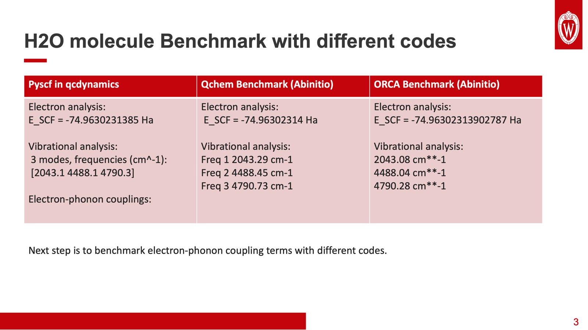

# H2O Cross-Code Electronic and Harmonic Reference Audit

Date: 2026-07-14  
Scope: RHF/STO-3G SCF energy and projected harmonic frequencies only  
Status: diagnostic support evidence; no production-fixture or manuscript mutation



## Source values

The colleague-supplied slide reports the following values, but does not state
the molecular geometry, basis, masses, Hessian projection convention, or SCF
thresholds.

| Backend | SCF energy (Ha) | Frequencies (cm^-1) |
|---|---:|---:|
| PySCF in qcdynamics | -74.9630231385 | 2043.1, 4488.1, 4790.3 |
| Q-Chem | -74.96302314 | 2043.29, 4488.45, 4790.73 |
| ORCA | -74.96302313902787 | 2043.08, 4488.04, 4790.28 |

These three rows are mutually consistent. They are not the same numerical
calculation as the retained Paper-IV fixture because the geometry differs.

## Independent reproduction of the retained fixture

The production fixture uses the Psi4 RHF/STO-3G optimized geometry

- O-H bond length: 0.9895537744 Angstrom
- H-O-H angle: 99.97965082 degrees

At those exact coordinates, an independent PySCF 2.13.1 RHF/STO-3G calculation
with the fixture isotopic masses gives

| Quantity | Retained Psi4 fixture | Independent PySCF | Absolute difference |
|---|---:|---:|---:|
| SCF energy (Ha) | -74.96590106193595 | -74.96590106193611 | 1.56e-13 |
| Bend (cm^-1) | 2170.79252067 | 2170.79251862 | 2.05e-6 |
| Symmetric stretch (cm^-1) | 4138.68736581 | 4138.68736146 | 4.35e-6 |
| Antisymmetric stretch (cm^-1) | 4389.24385480 | 4389.24382894 | 2.59e-5 |

This checks the retained center-geometry energy and Hessian frequencies across
two independent electronic-structure backends at matched settings.

## Recovery of the colleague values

Using the same PySCF RHF/STO-3G calculation at the fixed near-experimental
geometry

- O-H bond length: 0.9578 Angstrom
- H-O-H angle: 104.49 degrees

gives

| Quantity | Colleague PySCF row | Reproduction | Absolute difference |
|---|---:|---:|---:|
| SCF energy (Ha) | -74.9630231385 | -74.9630234434 | 3.05e-7 |
| Bend (cm^-1) | 2043.1 | 2043.1883 | 0.0883 |
| Symmetric stretch (cm^-1) | 4488.1 | 4488.0636 | 0.0364 |
| Antisymmetric stretch (cm^-1) | 4790.3 | 4790.4301 | 0.1301 |

The geometry change accounts for the apparent discrepancy to the precision
available from the slide. The small remaining differences are consistent with
the undisclosed coordinate digits, mass convention, frequency constants, and
backend version. The exact colleague input deck is still required for a
bitwise or threshold-defined reproduction.

## Evidence boundary and next comparison

This result supports two narrow statements:

1. The retained optimized-geometry Psi4 center energy and frequencies are
   independently reproduced by PySCF at matched coordinates.
2. The colleague slide is recovered by moving to a fixed near-experimental
   geometry, so it does not contradict the retained optimized fixture.

It does not yet validate the electron-phonon coupling coefficients. That
requires matching the exact geometry, normal-mode vectors and signs,
mass-weighted coordinate normalization, finite-difference displacement, and
orbital gauge, then comparing all three components of each derivative operator:

- scalar derivative `dE_scalar/dQ`;
- aligned active-space one-body derivative `dh_pq/dQ`;
- aligned active-space two-body derivative `d(pq|rs)/dQ`.

## Reproduction artifacts

- Audit script: `pipelines/exact_bench/audit_h2o_cross_code_reference.py`
- Machine-readable result: `output/molecular_vibronic_h2o/h2o_cross_code_reference_audit.json`
- Production fixture: `tmp/h2o_linear_fd_valence_psi4_optimized/h2o_linear_fd_sparse_fixture_nph1_ref2_reencoded_v2.json`
- Source image: `MATH/paper_facing/paper_IV_molecular_vibronic_h2o/assets/h2o_cross_code_benchmark_colleague_20260714.png`

The audit command is

```bash
tmp/h2o_cross_code_audit/.venv/bin/python \
  pipelines/exact_bench/audit_h2o_cross_code_reference.py \
  --fixture-json tmp/h2o_linear_fd_valence_psi4_optimized/h2o_linear_fd_sparse_fixture_nph1_ref2_reencoded_v2.json \
  --benchmark-image MATH/paper_facing/paper_IV_molecular_vibronic_h2o/assets/h2o_cross_code_benchmark_colleague_20260714.png \
  --output-json output/molecular_vibronic_h2o/h2o_cross_code_reference_audit.json
```
