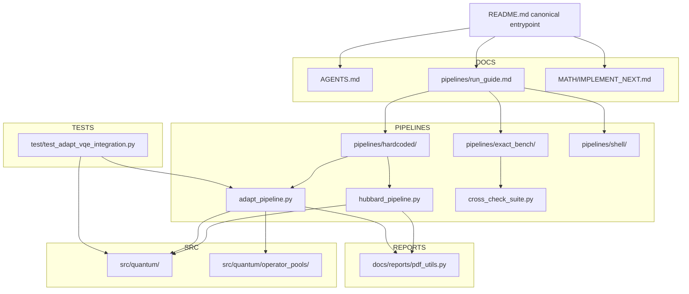

# Holstein_test

Canonical repository onboarding document.

This repo implements Hubbard-Holstein (HH) simulation workflows with
Jordan-Wigner operator construction, binary or unary bosonic encoding, blocked or periodic boundary conditions, with hardcoded HVA/ADAPT/VQE ground-state preparation, and exact vs Trotterized vs CFQM dynamics pipelines.

## Project focus

- Primary production model: `Hubbard-Holstein (HH)`.
- Pure Hubbard is retained as a limiting-case validation path.
- Standard regression checks: HH with `g_ep = 0` and `omega0 = 0` under
  matched settings should reduce to Hubbard behavior.
- Noiseless shots and Aer simulator should match the pipeline with noise simular turned off.


### Warm-start chain

Warm-start runs follow the active three-stage HH continuation contract:

1. Run HH-HVA VQE warm start with `hh_hva_ptw`.
2. Use that warm-start state as the ADAPT reference state.
3. Run ADAPT from that warm-start state in staged HH continuation mode (`phase1_v1` / `phase2_v1` / `phase3_v1`).
   - For new HH agent work, depth-0 ADAPT starts from the narrow physics-aligned core; current runtime resolves this to `paop_lf_std`.
   - `full_meta` remains a supported broad-pool preset, but only as controlled residual enrichment after plateau diagnosis, not the default depth-0 path.
   - Optional phase-3 follow-ons stay opt-in: `--phase3-runtime-split-mode shortlist_pauli_children_v1` is a shortlist-only continuation aid, and widened `--phase3-symmetry-mitigation-mode` choices remain phase-3 metadata/telemetry hooks on raw staged/hardcoded/replay paths.
4. Replay conventional VQE from ADAPT with ADAPT-family matching (`--generator-family match_adapt`, fallback `full_meta`) via `pipelines/hardcoded/hh_vqe_from_adapt_family.py`.

One-shot noiseless wrapper for this contract:

```bash
python pipelines/hardcoded/hh_staged_noiseless.py --L 2
```

This wrapper keeps drive opt-in, runs final matched-family replay (not fixed `hh_hva_*` replay), and compares final Suzuki/CFQM dynamics to exact.

## Repository map (minimal)

- `src/quantum/`: operator algebra, Hamiltonian builders, ansatz/statevector math
- `pipelines/hardcoded/`: production hardcoded pipeline entrypoints
- `pipelines/exact_bench/`: exact-diagonalization benchmark tooling
- `docs/reports/`: PDF and reporting utilities
- root markdown docs: active repo-facing contracts and workflow notes
- `MATH/`: near-term HH implementation notes and math targets

## Visual overview



## Physics algorithm flow (VQE / ADAPT / pools)


### ADAPT Pool Summary (plaintext fallback)

- `hubbard` pools: `uccsd`, `cse`, `full_hamiltonian`.
- `hh` pools: `hva`, `full_hamiltonian`, `paop_min`, `paop_std`, `paop_full`, `paop_lf` (`paop_lf_std` alias), `paop_lf2_std`, `paop_lf_full`.
- HH staged continuation default for new agent work: `phase1_v1` / `phase2_v1` / `phase3_v1` start from the narrow HH core and runtime-resolve depth-0 HH ADAPT to `paop_lf_std`.
- HH built-in combined preset: `uccsd_paop_lf_full` = `uccsd_lifted + paop_lf_full` (deduplicated) via one CLI value.
- HH full-meta preset: `full_meta` = `uccsd_lifted + hva + paop_full + paop_lf_full` (deduplicated) via one CLI value; keep it as a compatibility/broad-pool preset and replay fallback, not the default depth-0 staged HH pool.
- Opt-in runtime split (`--phase3-runtime-split-mode shortlist_pauli_children_v1`) probes shortlisted macro generators as serialized child terms for continuation/replay provenance; it does **not** change the default HH pool curriculum or create a new replay mode.
- `paop_min`: displacement-focused PAOP operators.
- `paop_std`: displacement plus dressed-hopping (`hopdrag`) operators.
- `paop_full`: `paop_std` plus doublon dressing and extended cloud operators.
- `paop_lf_std`: `paop_std` plus LF-leading odd channel (`curdrag`).
- HH merge behavior (when `g_ep != 0`): merge `hva` + `hh_termwise_augmented` + selected `paop_*` pool, then deduplicate by polynomial signature.

### Compiled speedup stack note (2026-03-04)

The hardcoded VQE/ADAPT path now includes a shared compiled-action acceleration stack, with additive (backward-compatible) interfaces and parity tests.

- Shared compiled polynomial utility:
  - `src/quantum/compiled_polynomial.py`
  - Provides `compile_polynomial_action`, `apply_compiled_polynomial`, `energy_via_one_apply`, and `adapt_commutator_grad_from_hpsi`.
- Compiled ansatz executor:
  - `src/quantum/compiled_ansatz.py`
  - Applies Pauli rotations through compiled permutation+phase actions (no per-amplitude string loops).
- VQE one-apply energy backend:
  - `src/quantum/vqe_latex_python_pairs.py` adds `expval_pauli_polynomial_one_apply(...)`.
  - `vqe_minimize(...)` supports `energy_backend="legacy"|"one_apply_compiled"` (default remains legacy).
  - `pipelines/hardcoded/hubbard_pipeline.py` exposes `--vqe-energy-backend {legacy,one_apply_compiled}` and defaults to `one_apply_compiled`.
  - Hardcoded VQE can emit live progress heartbeats via `--vqe-progress-every-s` (default `60` seconds), including restart lifecycle and periodic energy/nfev telemetry.
- ADAPT runtime acceleration:
  - `pipelines/hardcoded/adapt_pipeline.py` compiles Hamiltonian/pool once, computes `H|psi>` once per depth, evaluates pool gradients via `2*Im(<Hpsi|Apsi>)`, and uses compiled ansatz execution in COBYLA objective/state updates.
- Regression coverage added:
  - `test/test_compiled_polynomial.py`
  - `test/test_compiled_ansatz.py`
  - `test/test_vqe_energy_backend.py`
  - existing ADAPT integration suite remains passing.
- Additive ADAPT telemetry fields:
  - `adapt_vqe.compiled_pauli_cache`
  - `adapt_vqe.history[*].gradient_eval_elapsed_s`
  - `adapt_vqe.history[*].optimizer_elapsed_s`
Fast VQE-from-ADAPT replay (HH, ADAPT-family matched):

```bash
python pipelines/hardcoded/hh_vqe_from_adapt_family.py \
  --adapt-input-json .vscode-userdata/artifacts/useful/L4/l4_hh_seq_20260302_215706_resume_adaptB_20260303_111311_adapt_B_B_probe_checkpoint_state.json \
  --generator-family match_adapt --fallback-family full_meta \
  --L 4 --boundary open --ordering blocked \
  --boson-encoding binary --n-ph-max 1 --t 1.0 --u 4.0 --dv 0.0 --omega0 1.0 --g-ep 0.5 \
  --reps 4 --restarts 16 --maxiter 12000 --method SPSA --seed 7 \
  --energy-backend one_apply_compiled --progress-every-s 60 \
  --output-json artifacts/json/hc_hh_L4_from_adaptB_family_matched_fastcomp.json
```

This path matches the ADAPT generator-family contract. Replay remains canonical via `--generator-family match_adapt` with `--fallback-family full_meta`, and replay continuation modes stay `legacy | phase1_v1 | phase2_v1 | phase3_v1`.
If an opt-in runtime split admitted child labels outside the resolved family pool, replay can still rebuild them from serialized continuation metadata when that metadata is present.
`hubbard_pipeline.py --vqe-ansatz hh_hva_*` remains a fixed-ansatz baseline.

## Start here (doc priority)

Use this order when onboarding:

1. `AGENTS.md` - repo conventions and non-negotiable implementation rules
2. `pipelines/run_guide.md` - CLI and runbook for active pipelines
3. `README.md` - current repo map and kept workflow surface
4. `MATH/IMPLEMENT_NEXT.md` - next HH implementation target when math work is in scope

Canonical authority chain: `AGENTS.md` -> `pipelines/run_guide.md` -> `README.md` -> task-specific `MATH/` notes.
Agent-facing automation should ignore `docs/` unless PDF/report output is in scope, in which case use `docs/reports/`.

Task-type doc split:
- `AGENTS.md`: hard policy and escalation rules.
- `pipelines/run_guide.md`: executable commands and run contracts.
- `README.md`: repo map and active workflow overview.
- `MATH/IMPLEMENT_NEXT.md`: near-term HH implementation target.

## Important note on README files

Subdirectory README files are component-scoped documentation, not repo-canonical
onboarding docs. Use this root `README.md` first, then drill into local READMEs
for module-specific details.

## Quick run examples

Default hard gate policy for agent execution:
- Final conventional VQE hard gate: `ΔE_abs < 1e-4`.
- Script strict mode (`1e-7`) is optional and should be treated as strict mode only.

ADAPT-VQE (HH, PAOP pool):

```bash
python pipelines/hardcoded/adapt_pipeline.py \
  --L 2 --problem hh --omega0 1.0 --g-ep 0.5 --n-ph-max 1 \
  --adapt-pool paop_std --paop-r 1 --paop-normalization none \
  --adapt-max-depth 30 --adapt-eps-grad 1e-5 --adapt-maxiter 600 \
  --initial-state-source adapt_vqe --skip-pdf \
  --output-json artifacts/json/adapt_L2_hh_paop_std.json
```

Cross-check suite (exact benchmark; auto-scaled by L/problem defaults):

```bash
python pipelines/exact_bench/cross_check_suite.py --L 2 --problem hubbard
```

CFQM propagation (hardcoded pipeline):

```bash
python pipelines/hardcoded/hubbard_pipeline.py \
  --L 2 --problem hubbard \
  --propagator cfqm4 \
  --cfqm-stage-exp expm_multiply_sparse \
  --cfqm-coeff-drop-abs-tol 0.0 \
  --trotter-steps 64 --t-final 10.0 --num-times 201 \
  --skip-qpe
```

CFQM propagation status (hardcoded pipeline):
- `--propagator` defaults to `cfqm4`; use `suzuki2` explicitly for baseline comparison.
- CFQM uses fixed scheme nodes (`c_j`) and ignores legacy midpoint/left/right `--drive-time-sampling`.
- `--exact-steps-multiplier` remains a reference-only control and does not change CFQM macro-step count.
- `--cfqm-stage-exp` default is `expm_multiply_sparse`; `--cfqm-coeff-drop-abs-tol` default is `0.0`; `--cfqm-normalize` default is off.
- Sparse CFQM stage backend uses native sparse stage assembly + `scipy.sparse.linalg.expm_multiply` (no dense->csc stage materialization).
- Shared Pauli-term exponentiation helpers are centralized in `src/quantum/pauli_actions.py` (used by both the hardcoded pipeline and CFQM backend).
- Unknown drive labels are handled with a guardrail policy: nontrivial coefficients warn once per label then are ignored; tiny coefficients (`abs(coeff) <= 1e-14`) are silently ignored.
- A=0 invariance is preserved by the zero-increment insertion guard; safe-test target is `<= 1e-10`.
- If non-midpoint sampling is supplied under CFQM, runtime warns:
  `CFQM ignores midpoint/left/right sampling; uses fixed scheme nodes c_j.`
- If `--cfqm-stage-exp pauli_suzuki2` is selected, runtime warns:
  `Inner Suzuki-2 makes overall method 2nd order; use expm_multiply_sparse/dense_expm for true CFQM order.`

CFQM6 command:

```bash
python pipelines/hardcoded/hubbard_pipeline.py \
  --L 2 --problem hubbard \
  --propagator cfqm6 \
  --cfqm-stage-exp expm_multiply_sparse \
  --cfqm-coeff-drop-abs-tol 0.0 \
  --trotter-steps 64 --t-final 10.0 --num-times 201 \
  --skip-qpe
```

CFQM tests:

```bash
pytest -q test/test_cfqm_schemes.py test/test_cfqm_propagator.py test/test_cfqm_acceptance.py
```

Acceptance highlights:
- static regression vs exact expm
- A=0 invariance (drive provider present vs absent)
- manufactured 1-qubit order slopes (`~4` for cfqm4, `~6` for cfqm6, `~2` with inner suzuki2)
- small HH sanity trend vs fine piecewise reference

Quantum-processor proxy benchmark (CFQM vs Suzuki):

```bash
python pipelines/exact_bench/cfqm_vs_suzuki_qproc_proxy_benchmark.py \
  --problem hubbard --L 2 \
  --methods suzuki2,cfqm4,cfqm6 \
  --steps-grid 64,128,256,512 \
  --reference-steps 2048 \
  --drive-enabled

# Equal-cost policy (optional, apples-to-apples):
python pipelines/exact_bench/cfqm_vs_suzuki_qproc_proxy_benchmark.py \
  --problem hubbard --L 2 \
  --methods suzuki2,cfqm4,cfqm6 \
  --steps-grid 64,128,256,512 \
  --reference-steps 2048 \
  --compare-policy cost_match \
  --cost-match-metric cx_proxy_total \
  --cost-match-tolerance 0.0 \
  --drive-enabled
```

Why this benchmark:
- Local runtime is machine-dependent and not the main comparison axis.
- The benchmark ranks methods by final energy error versus processor-oriented cost proxies:
  - term exponential count
  - 2-qubit gate proxy (`cx_proxy_total`)
  - 1-qubit gate proxy (`sq_proxy_total`)
- `S` in the result tables is macro-step count (`trotter_steps`), not a cost metric.
- Use `--compare-policy cost_match` for fair, equal-cost comparisons; default remains
  sweep-only row listing.
- Default cost axis for fair matching is `cx_proxy_total`; fallback metric is `term_exp_count_total` when requested.
- CFQM runs use `pauli_suzuki2` stage exponentials in this benchmark to produce hardware-comparable termwise gate proxies (this is a benchmarking profile, not the high-order dense/sparse CFQM profile).

Artifacts:
- `artifacts/cfqm_benchmark/cfqm_vs_suzuki_proxy_runs.json`
- `artifacts/cfqm_benchmark/cfqm_vs_suzuki_proxy_runs.csv`
- `artifacts/cfqm_benchmark/cfqm_vs_suzuki_proxy_summary.json`

CFQM efficiency suite (error-vs-cost, apples-to-apples):

```bash
python pipelines/exact_bench/cfqm_vs_suzuki_efficiency_suite.py \
  --problem-grid hubbard_L4,hh_L2_nb1,hh_L2_nb2,hh_L2_nb3,hh_L3_nb1 \
  --drive-grid sinusoid,gaussian_sharp \
  --methods suzuki2,cfqm4,cfqm6 \
  --stage-mode-grid exact_sparse,exact_dense,pauli_suzuki2 \
  --reference-steps-multiplier 8 \
  --equal-cost-axis cx_proxy,pauli_rot_count,expm_calls,wall_time \
  --equal-cost-policy exact_tie_only \
  --calibrate-transpile \
  --output-dir artifacts/cfqm_efficiency_benchmark
```

L2 HH statevector warm-start variant:

```bash
python pipelines/exact_bench/cfqm_vs_suzuki_efficiency_suite.py \
  --problem-grid hh_L2_nb1 \
  --drive-grid sinusoid,gaussian_sharp \
  --methods suzuki2,cfqm4,cfqm6 \
  --stage-mode-grid exact_sparse,exact_dense,pauli_suzuki2 \
  --initial-state-source adapt_json \
  --adapt-input-json artifacts/useful/L2/H_L2_hh_termwise_regular_lbfgs_t1.0_U2.0_g1_nph1.json \
  --no-adapt-strict-match \
  --reference-steps-multiplier 8 \
  --equal-cost-axis cx_proxy,pauli_rot_count,expm_calls,wall_time \
  --equal-cost-policy exact_tie_only \
  --calibrate-transpile \
  --output-dir artifacts/cfqm_efficiency_benchmark/overnight_hh_L2_nb1_lbfgs_state
```

Note: strict ADAPT metadata matching is on by default; this command disables it because the referenced warm-start JSON does not carry full HH metadata keys.

Efficiency-suite ADAPT pool default is `auto`:
- `hubbard*` scenarios resolve to `--adapt-pool uccsd`
- `hh*` scenarios resolve to `--adapt-pool paop_std`

Efficiency-suite outputs:
- `artifacts/cfqm_efficiency_benchmark/runs_full.json`
- `artifacts/cfqm_efficiency_benchmark/runs_full.csv`
- `artifacts/cfqm_efficiency_benchmark/summary_by_scenario.json`
- `artifacts/cfqm_efficiency_benchmark/pareto_by_metric.json`
- `artifacts/cfqm_efficiency_benchmark/slope_fits.json`
- `artifacts/cfqm_efficiency_benchmark/equal_cost_exact_ties_<metric>.csv`
- `artifacts/cfqm_efficiency_benchmark/cfqm_efficiency_suite.pdf`

Efficiency-suite interpretation rules:
- Main fair tables are exact-cost ties only (`delta=0`) for `cx_proxy`, `pauli_rot_count`, and `expm_calls`.
- Wall-time comparisons are near-tie bins and explicitly marked approximate.
- Fallback nearest-neighbor matches are appendix-only (non-fair direct comparisons).
- `S` always means macro-step count (`trotter_steps`), never a fairness axis.

For compare/orchestration workflows, use `pipelines/run_guide.md`.

## Major Markdown docs index

- `AGENTS.md`
- `README.md`
- `pipelines/run_guide.md`
- `MATH/IMPLEMENT_NEXT.md`
- `MATH/IMPLEMENT_SOON.md`
- `pipelines/exact_bench/README.md`

Legacy archived docs live under `docs/archive/` and are non-canonical.

## HH noisy estimator validation

The repo now includes an HH-first noisy/hardware validation pipeline:
- `pipelines/exact_bench/hh_noise_hardware_validation.py`

It provides one shared expectation oracle across `ideal`, `shots`, `aer_noise`, and `runtime` modes.  
`shots`/`aer_noise` emulate finite-shot measurement noise using Qiskit `AerSimulator`, with optional noisy ADAPT and PDF/JSON reporting.  
Use `pipelines/run_guide.md` section 11+ for operational commands and mode-by-mode guidance.

High-level symmetry note:
- `--symmetry-mitigation-mode` is the active oracle-backed symmetry surface in the noise validation / robustness flows; default is `off`.
- Active modes (`postselect_diag_v1`, `projector_renorm_v1`) are intentionally narrow first versions: they run only on eligible diagonal/counts-compatible paths and fall back explicitly to `verify_only` when unsupported.
- This differs from `--phase3-symmetry-mitigation-mode` on raw staged ADAPT / hardcoded / replay paths, where the flag is a continuation metadata/telemetry hook unless the workflow is routed through the oracle runtime.

For staged heavy HH robustness with warm-start -> ADAPT Pool B -> final VQE and noisy dynamics benchmarking:
- `pipelines/exact_bench/hh_noise_robustness_seq_report.py`

Key additions:
- strict ADAPT Pool B composition enforcement (`UCCSD_lifted + HVA + PAOP_full`)
- noisy dynamics methods via `--noisy-methods` (default `suzuki2,cfqm4`)
- shared oracle-backed `--symmetry-mitigation-mode` surface (default `off`; active modes remain opt-in and diagnostics-backed)
- embedded benchmark metrics in JSON/PDF (`term_exp_count_total`, `cx_proxy_total`, `sq_proxy_total`, `depth_proxy_total`, `wall_total_s`, `oracle_eval_s_total`)
- backward-compatible `dynamics_noisy.profiles.<profile>.modes` alias mirroring `suzuki2`

For a long, code/docs-only repository guide focused on noise-model behavior:
- `pipelines/exact_bench/hh_noise_model_repo_guide.py`
- convenience wrapper: `pipelines/shell/build_hh_noise_model_repo_guide.sh`

Default guide artifacts:
- `docs/HH_noise_model_repo_guide.pdf`
- `artifacts/json/hh_noise_model_repo_guide_index.json`
