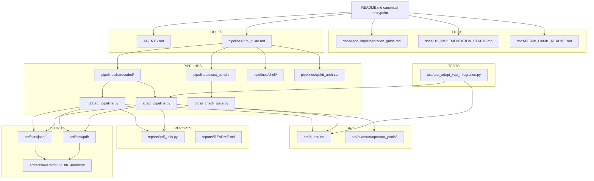

# Holstein_test

Canonical repository onboarding document.

This repo implements Hubbard / Hubbard-Holstein (HH) simulation workflows with
Jordan-Wigner operator construction, hardcoded VQE/ADAPT ground-state
preparation, and exact vs Trotterized dynamics pipelines.

## Project focus

- Primary production model: `Hubbard-Holstein (HH)`.
- Pure Hubbard is retained as a limiting-case validation path.
- Standard regression limit check: HH with `g_ep = 0` and `omega0 = 0` under
  matched settings should reduce to Hubbard behavior.

## Recent HH L2/L3 Results (as of 2026-03-02)

### Warm-start chain (separate family)

Warm-start runs use a two-stage sequence:

1. Run HH-HVA VQE warm start (for example `hh_hva_ptw`).
2. Use that warm-start state as the ADAPT reference state.
3. Run ADAPT with `paop_lf_std`.

Do not mix interpretation of this family with the separate combined-pool trend
family below.

### Combined pools (separate family)

Separate trend runs evaluate:

- `UCCSD+PAOP`
- `UCCSD+PAOP+HVA`

These are a different experiment family from warm-start B/C runs.

### Default path going forward (L-specific)

- `L3+` static runs: use the combined-pool family as primary.
- `L2` and driven runs: use warm-start + `paop_lf_std` as the fallback path.

### Evidence Table (artifact-backed)

| Case | Artifact run | `|DeltaE|` |
|---|---|---:|
| L3 meta-pool best | `A_medium` in `l3_uccsd_paop_hva_trend_full_20260302T000521.json` | `2.622402274776725e-4` |
| L3 warm-start C | `fix1_warm_start_C` in `l3_hh_accessibility_fixes_under8pct.json` | `4.393299375013565e-3` |
| L2 warm-start C/export | exported state in `fix1_warm_start_B_l2_state.json` (`adapt_vqe.abs_delta_e`) | `1.0866130099410898e-3` |
| L2 strict meta-pool crosscheck | `A_heavy` in `l2_uccsd_paop_hva_trend_crosscheck.json` | `3.283230696724525e-1` |

L2 caveat: in the strict L2 meta-pool crosscheck artifact above, the combined
pool family is not competitive versus the warm-start accessibility export.

### Provenance links

- [docs/hh_l2_l3_warmstart_paop_hva_results_explainer.md](docs/hh_l2_l3_warmstart_paop_hva_results_explainer.md)
- [artifacts/useful/L3/l3_uccsd_paop_hva_trend_full_20260302T000521.json](artifacts/useful/L3/l3_uccsd_paop_hva_trend_full_20260302T000521.json)
- [artifacts/useful/L3/l3_hh_accessibility_fixes_under8pct.json](artifacts/useful/L3/l3_hh_accessibility_fixes_under8pct.json)
- [artifacts/useful/L2/warmstart_states/fix1_warm_start_B_l2_state.json](artifacts/useful/L2/warmstart_states/fix1_warm_start_B_l2_state.json)
- [artifacts/useful/L2/l2_uccsd_paop_hva_trend_crosscheck.json](artifacts/useful/L2/l2_uccsd_paop_hva_trend_crosscheck.json)

## Repository map (minimal)

- `src/quantum/`: operator algebra, Hamiltonian builders, ansatz/statevector math
- `pipelines/hardcoded/`: production hardcoded pipeline entrypoints
- `pipelines/exact_bench/`: exact-diagonalization benchmark tooling
- `reports/`: PDF and reporting utilities
- `docs/`: architecture, implementation, and status documents

## Visual overview



## Physics algorithm flow (VQE / ADAPT / pools)


### ADAPT Pool Summary (plaintext fallback)

- `hubbard` pools: `uccsd`, `cse`, `full_hamiltonian`.
- `hh` pools: `hva`, `full_hamiltonian`, `paop_min`, `paop_std`, `paop_full`, `paop_lf` (`paop_lf_std` alias), `paop_lf2_std`, `paop_lf_full`.
- `paop_min`: displacement-focused PAOP operators.
- `paop_std`: displacement plus dressed-hopping (`hopdrag`) operators.
- `paop_full`: `paop_std` plus doublon dressing and extended cloud operators.
- `paop_lf_std`: `paop_std` plus LF-leading odd channel (`curdrag`).
- HH merge behavior (when `g_ep != 0`): merge `hva` + `hh_termwise_augmented` + selected `paop_*` pool, then deduplicate by polynomial signature.

## Start here (doc priority)

Use this order when onboarding:

1. `AGENTS.md` - repo conventions and non-negotiable implementation rules
2. `pipelines/run_guide.md` - CLI and runbook for active pipelines
3. `docs/repo_implementation_guide.md` - implementation-deep walkthrough
4. `docs/HH_IMPLEMENTATION_STATUS.md` - current HH status and remaining work
5. `docs/FERMI_HAMIL_README.md` - legacy high-level architecture overview

## Important note on README files

Subdirectory README files are component-scoped documentation, not repo-canonical
onboarding docs. Use this root `README.md` first, then drill into local READMEs
for module-specific details.

## Quick run examples

ADAPT-VQE (HH, PAOP pool):

```bash
python pipelines/hardcoded/adapt_pipeline.py \
  --L 2 --problem hh --omega0 1.0 --g-ep 0.5 --n-ph-max 1 \
  --adapt-pool paop_std --paop-r 1 --paop-normalization none \
  --adapt-max-depth 30 --adapt-eps-grad 1e-5 --adapt-maxiter 600 \
  --initial-state-source adapt_vqe --skip-pdf \
  --output-json artifacts/json/adapt_L2_hh_paop_std.json
```

Cross-check suite (exact benchmark; auto-scaled by L/problem defaults):

```bash
python pipelines/exact_bench/cross_check_suite.py --L 2 --problem hubbard
```

For compare/orchestration workflows, use `pipelines/run_guide.md`.

## Major Markdown docs index

- `AGENTS.md`
- `pipelines/run_guide.md`
- `docs/LLM_RESEARCH_CONTEXT.md`
- `docs/repo_implementation_guide.md`
- `docs/HH_IMPLEMENTATION_STATUS.md`
- `docs/FERMI_HAMIL_README.md`
- `reports/README.md`
- `pipelines/exact_bench/README.md`
- `pipelines/qiskit_archive/README.md`
- `pipelines/qiskit_archive/DESIGN_NOTE_TIMEDEP.md`
