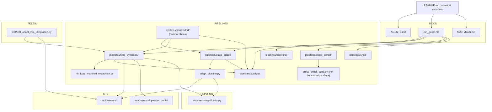
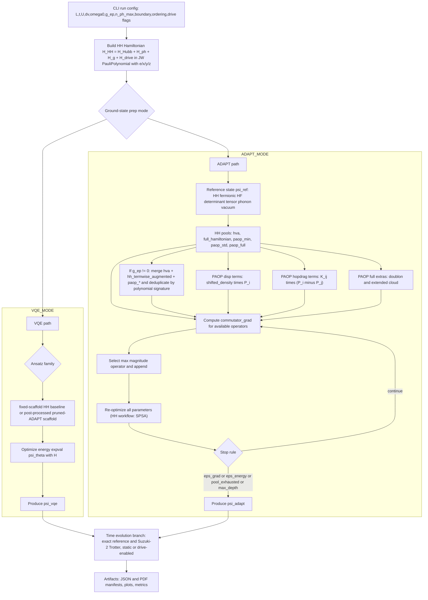

# Holstein_test

This path is the canonical repository onboarding document.

## Active checkout snapshot (2026-04-10)

This README reflects the active non-archived toolchain in this repository:

- canonical direct HH ADAPT: `pipelines/static_adapt/adapt_pipeline.py`
- historical regression anchor: `pipelines/static_adapt/adapt_pipeline_legacy_20260322.py`
- post-processed scaffold follow-on / exact-bench surfaces: `pipelines/scaffold/hh_vqe_from_adapt_family.py`, `pipelines/exact_bench/cross_check_suite.py`, `pipelines/exact_bench/hh_noise_hardware_validation.py`
- fixed-manifold / realtime sweep surfaces: `pipelines/time_dynamics/hh_fixed_manifold_mclachlan.py`, `pipelines/time_dynamics/hh_fixed_manifold_measured.py`, `pipelines/time_dynamics/hh_l2_static_realtime_pareto_sweep.py`, `pipelines/time_dynamics/hh_l2_driven_realtime_pareto_sweep.py`
- legacy shorthand helper: `pipelines/shell/run_drive_accurate.sh`

Some older README examples below had drifted toward removed scripts. This pass keeps only surfaces that exist in this checkout and marks legacy-only seams explicitly.

This repo implements Hubbard-Holstein (HH) simulation workflows with
Jordan-Wigner operator construction, binary or unary bosonic encoding, blocked or periodic boundary conditions, with direct HH ADAPT plus fixed-scaffold/post-processed VQE ground-state preparation, exact reference propagation, Suzuki dynamics, and McLachlan dynamics surfaces.

## Project focus

- Primary production and public-facing model: `Hubbard-Holstein (HH)`.
- HH still reuses the shared fermionic Hubbard core internally. In code, `build_hubbard_holstein_hamiltonian(...)` forms `H = H_Hubb + H_ph + H_g + H_drive`, so we should remove pure-Hubbard-facing modes and docs before deleting shared fermionic builders HH still imports.
- Pure Hubbard should be treated as legacy cleanup debt, not as an active repo surface.
- The old `HVA -> ADAPT -> matched-family VQE replay` ladder is no longer a living workflow in this repo. Direct HH ADAPT is the canonical route; VQE remains only as an optional follow-on on existing post-processed or pruned ADAPT scaffolds.
- Noiseless shots and Aer simulator should match the pipeline with noise simulation turned off.

### Current L=2 HH reference routes

Standard repo workflow: first solve the **static / undriven** HH ground state, then optionally reuse that scaffold or state in the later **drive-enabled** time-dynamics stage. Do not assume drive is active during ground-state ADAPT unless a run explicitly includes drive flags.

- Scientific cost-vs-energy oracle: `pipelines/static_adapt/adapt_pipeline_legacy_20260322.py` on the frozen fullhorse-style `full_meta + phase3_v1 + POWELL` strong-coupling route. In the current checkout this still reproduces `|\Delta E|=5.6178234645e-05` at `81` transpiled two-qubit gates, and it is the regression anchor we keep to detect scaffold-selection drift.
- Best current-route comparable line: the motif-guided current route from `artifacts/agent_runs/20260409_hh_l2_current_motif_from_legacy81_v1/`, which reaches `|\Delta E|=5.7102691670e-05` at `168` transpiled two-qubit gates.
- Best current fullhorse-style line: `artifacts/agent_runs/20260410_hh_l2_current_fullhorse_recovery_v1/cases/fullhorse_spliton_norepeats_motif/`, which reaches `|\Delta E|=5.7102730821e-05` at `193` transpiled two-qubit gates.
- Best current diagnostic native recovery line: `artifacts/agent_runs/20260409_hh_l2_children_repeat_bridge_diag_v1/cases/d10_children_off_repeats_off_hist/`, which reaches `|\Delta E|=5.6178241861e-05` at `160` transpiled two-qubit gates.
- Public / deployment anchor: direct `pipelines/static_adapt/adapt_pipeline.py` on the validated `pareto_lean + phase3_v1 + SPSA` raw-HF-start route. This is the current rerunnable real-QPU-facing anchor described at the top of `MATH/Math.md`, with `|\Delta E|=1.0822209459e-04` at `218` transpiled two-qubit gates.
- Driven / time-dynamics anchor: the `secant_lead100` controller result at the top of `MATH/Math.md`.
- Control pathways: keep Suzuki and standard fixed-scaffold/projective McLachlan pathways as controls and baselines for adaptive McLachlan, not as the headline winner surfaces.

For the exact artifact paths and current cost-vs-energy ranking, use the front page of `MATH/Math.md` and `run_guide.md` Section `0c. Useful runs (current L=2 cost-vs-energy state)`.


### Canonical HH ADAPT path

The only non-archaic HH ADAPT default path is direct `pipelines/static_adapt/adapt_pipeline.py`.

- On the direct CLI, omitting `--adapt-continuation-mode` now defaults to `phase3_v1`.
- This is the full Phase 3 HH path with the current cheap pre-cap + ratio rerank selector.
- For new HH ADAPT work, depth-0 starts from the narrow physics-aligned core; current runtime resolves this to `paop_lf_std`.
- `full_meta` remains a supported broad-pool preset, but only as an explicit compatibility/broad-search choice, not the default depth-0 path.
- `legacy`, `phase1_v1`, and `phase2_v1` remain explicit historical/compatibility modes only.

### Retired staged warm-start ladder

The old staged `VQE -> ADAPT -> VQE` wrapper story is retired as a living workflow.

- Do not treat HH-HVA warm start, staged seed-refine, or matched-family replay as the canonical path for new HH work.
- If `pipelines/hardcoded/hh_staged_noiseless.py` or `pipelines/hardcoded/hh_staged_noise.py` are still present in the checkout, treat them as archival compatibility surfaces only.
- The maintained path is direct raw-HF-start HH ADAPT on `pipelines/static_adapt/adapt_pipeline.py`.
- Optional VQE follow-on is retained only for deliberate post-processing on an existing ADAPT or pruned-ADAPT scaffold; it is not a required tail stage of the canonical run contract.

## Repository map (minimal)

- `src/quantum/`: operator algebra, Hamiltonian builders, ansatz/statevector math
- `pipelines/static_adapt/`: canonical static HH ADAPT and scaffold-selection entrypoints
- `pipelines/time_dynamics/`: canonical HH adaptive McLachlan and realtime dynamics entrypoints
- `pipelines/scaffold/`: shared scaffold, continuation, replay, and handoff helpers
- `pipelines/hardcoded/`: compatibility shims for older imports/CLI paths plus remaining mixed legacy surfaces
- `pipelines/reporting/`: report/document compilers over existing JSON/artifacts
- `pipelines/exact_bench/`: exact-diagonalization benchmark tooling
- `docs/reports/`: PDF and reporting utilities
- root markdown docs: active repo-facing contracts and workflow notes
- `MATH/`: near-term HH implementation notes and math targets

## Visual overview



## Physics algorithm flow (VQE / ADAPT / pools)



### ADAPT Pool Summary (plaintext fallback)

- `hh` pools: `hva`, `full_hamiltonian`, `paop_min`, `paop_std`, `paop_full`, `paop_lf` (`paop_lf_std` alias), `paop_lf2_std`, `paop_lf_full`.
- Experimental offline/local exact-noiseless probe families: `paop_lf3_std`, `paop_lf4_std`, `paop_sq_std`, `paop_sq_full`.
- HH direct ADAPT default for new agent work: `phase3_v1` starts from the narrow HH core and runtime-resolves depth-0 HH ADAPT to `paop_lf_std`.
- Older repo-doc statements that staged wrappers default to `phase1_v1` are archival only; the manuscript/current canonical HH ADAPT surface uses `phase3_v1`, and manuscript guidance wins when those older docs disagree.
- HH built-in combined preset: `uccsd_paop_lf_full` = `uccsd_lifted + paop_lf_full` (deduplicated) via one CLI value.
- HH explicit product families: `uccsd_otimes_paop_lf_std`, `uccsd_otimes_paop_lf2_std`, `uccsd_otimes_paop_bond_disp_std`.
  - These are the canonical lifted-UCCSD ⊗ boson-only-phonon constructions in this repo: one lifted fermionic UCCSD factor times one boson-only phonon motif, locality-filtered, canonicalized, and deduplicated.
  - They remain available as explicit scaffold/materialization families and as optional post-processing surfaces without mutating the older additive unions.
- HH logical two-parameter product variants: `uccsd_otimes_paop_lf_std_seq2p`, `uccsd_otimes_paop_lf2_std_seq2p`, `uccsd_otimes_paop_bond_disp_std_seq2p`.
  - These treat one logical `(F_a, M_μ)` pair as separate fermion/motif parameters during execution and serialized-scaffold reconstruction.
  - They are additive opt-in surfaces and do not change the direct `phase3_v1` default path.
- HH full-meta preset: `full_meta` = `uccsd_lifted + hva + paop_full + paop_lf_full` (deduplicated) via one CLI value; keep it as a compatibility/broad-pool preset, not the default depth-0 HH pool.
- HH lean reduced presets: `pareto_lean` and `pareto_lean_l2`.
  - `pareto_lean_l2` is intentionally narrow: valid only for `L=2` and `n_ph_max=1`.
- Phase-3 runtime split is disabled on the canonical public HH run surfaces. The old shortlist Pauli-child split implementation is retained only as an internal archival/testing path and is not part of the manuscript-facing algorithm contract.
- ADAPT serialized-scaffold parameter contract:
  - `operators` / `ansatz_depth` remain the logical generator scaffold.
  - `optimal_point` / `num_parameters` are the runtime per-Pauli rotation vector/count.
  - `logical_optimal_point` / `logical_num_parameters` preserve one-value-per-generator reporting.
  - `parameterization` stores the logical-to-runtime block map used by post-processing and cost reconstruction.
- `paop_min`: displacement-focused PAOP operators.
- `paop_std`: displacement plus dressed-hopping (`hopdrag`) operators.
- `paop_full`: `paop_std` plus doublon dressing and extended cloud operators.
- `paop_lf_std`: `paop_std` plus LF-leading odd channel (`curdrag`).
- These experimental families are opt-in only; they are not part of the canonical direct `phase3_v1` default path and are not folded into default `full_meta`.
- HH merge behavior (when `g_ep != 0`): merge `hva` + `hh_termwise_augmented` + selected `paop_*` pool, then deduplicate by polynomial signature.

### Compiled speedup stack note (2026-03-04)

The hardcoded VQE/ADAPT path now includes a shared compiled-action acceleration stack, with additive (backward-compatible) interfaces and parity tests.

- Shared compiled polynomial utility:
  - `src/quantum/compiled_polynomial.py`
  - Provides `compile_polynomial_action`, `apply_compiled_polynomial`, `energy_via_one_apply`, and `adapt_commutator_grad_from_hpsi`.
- Compiled ansatz executor:
  - `src/quantum/compiled_ansatz.py`
  - Applies Pauli rotations through compiled permutation+phase actions (no per-amplitude string loops).
- VQE one-apply energy backend:
  - `src/quantum/vqe_latex_python_pairs.py` adds `expval_pauli_polynomial_one_apply(...)`.
- `vqe_minimize(...)` supports `energy_backend="legacy"|"one_apply_compiled"` (default is `one_apply_compiled`).
  - The shared hardcoded propagator carrier `pipelines/hardcoded/hubbard_pipeline.py` exposes `--vqe-energy-backend {legacy,one_apply_compiled}` and defaults to `one_apply_compiled`.
  - Hardcoded VQE can emit live progress heartbeats via `--vqe-progress-every-s` (default `60` seconds), including restart lifecycle and periodic energy/nfev telemetry.
- ADAPT runtime acceleration:
  - `pipelines/hardcoded/adapt_pipeline.py` compiles Hamiltonian/pool once, computes `H|psi>` once per depth, evaluates pool gradients via `2*Im(<Hpsi|Apsi>)`, and uses compiled ansatz execution in COBYLA objective/state updates.
- Regression coverage added:
  - `test/test_compiled_polynomial.py`
  - `test/test_compiled_ansatz.py`
  - `test/test_vqe_energy_backend.py`
- Existing ADAPT integration suite remains passing.
- Additive ADAPT telemetry fields:
  - `adapt_vqe.compiled_pauli_cache`
  - `adapt_vqe.history[*].gradient_eval_elapsed_s`
  - `adapt_vqe.history[*].optimizer_elapsed_s`

Post-processed VQE on an existing ADAPT scaffold (optional compatibility utility):

```bash
python pipelines/hardcoded/hh_vqe_from_adapt_family.py \
  --adapt-input-json <adapt_hh_json_path> \
  --generator-family match_adapt --fallback-family full_meta \
  --L 4 --boundary open --ordering blocked \
  --boson-encoding binary --n-ph-max 1 --t 1.0 --u 4.0 --dv 0.0 --omega0 1.0 --g-ep 0.5 \
  --reps 4 --restarts 16 --maxiter 12000 --method SPSA --seed 7 \
  --energy-backend one_apply_compiled --progress-every-s 60 \
  --output-json artifacts/json/hc_hh_L4_from_adaptB_family_matched_fastcomp.json
```

Use this only when you intentionally want to rebuild a fixed VQE scaffold from an existing ADAPT or pruned-ADAPT JSON artifact. It is a post-processing surface, not a canonical live run ladder, and the repo no longer treats `HVA -> ADAPT -> matched-family VQE` as a maintained workflow.
If an opt-in runtime split admitted child labels outside the resolved family pool, the follow-on utility can still rebuild them from serialized continuation metadata when that metadata is present.
`hubbard_pipeline.py --vqe-ansatz hh_hva_*` remains the fixed-ansatz HH baseline surface; the filename is legacy, but the active public usage here is HH.

## Start here (doc priority)

Use this order when onboarding:

1. `AGENTS.md` - repo conventions and non-negotiable implementation rules
2. `run_guide.md` - CLI and runbook for active pipelines
3. `README.md` - current repo map and kept workflow surface
4. `MATH/Math.md` - math-facing repo source of truth

Canonical authority chain: `AGENTS.md` -> `run_guide.md` -> `README.md` -> task-specific `MATH/` notes.
Agent-facing automation should ignore `docs/` unless PDF/report output is in scope, in which case use `docs/reports/`.

Task-type doc split:
- `AGENTS.md`: hard policy and escalation rules.
- `run_guide.md`: executable commands and run contracts.
- `README.md`: repo map and active workflow overview.
- `MATH/Math.md`: math-facing route framing, winners, and manuscript-sync source.

## Important note on README files

Subdirectory README files are component-scoped documentation, not repo-canonical
onboarding docs. Use this root `README.md` first, then drill into local READMEs
for module-specific details.

## AI run/report contract

For agent-run work in this repo:

- frame the run around an **Objective** first: a short scientific / mathematical / physical sub-problem that could improve the real-QPU `ΔE / K` Pareto front
- keep **Objective** separate from **Execution mode**:
  - `fresh_run`
  - `reuse_artifact`
  - `compare_artifacts`
  - `promote_candidate`
- default emphasis is **HH**, **`L=2`**, and **driven** dynamics unless the user says otherwise; this is an **agent planning priority**, not a CLI default
- in RepoPrompt agent mode, default to three compact lines with **no blank lines**: `Objective<...>`, `Why/Intent<...>`, `Suggested Next step/how this fits into broader picture<...>`; each line should be **1-3 sentences max**
- frame verification as soft expectations by default, unless the user or the chosen repo surface explicitly defines a hard gate
- the **agent wrapper** should write machine-oriented logs under:
  - `artifacts/agent_runs/<tag>/`
  - `artifacts/agent_runs/<tag>/logs/`
  - with `command.sh`, `stdout.log`, `stderr.log`, and `progress.json` when supported
- if the user says **execute**, the agent should execute without an extra permission prompt unless a real runtime/policy choice is still unresolved
- as an **agent post-processing convention**, after each run first give a short in-chat report that retells the objective and result; only write/update markdown or PDF report files when the user explicitly asks or report output is already in scope

## Quick run examples

Default hard gate policy for agent execution:
- Final conventional VQE hard gate: `ΔE_abs < 1e-4`.
- In this checkout, `run_drive_accurate.sh` enforces `ΔE_abs < 1e-7` with no built-in strict-mode toggle. This is stricter than the AGENTS default.

ADAPT-VQE (HH, canonical direct phase3 path):

```bash
python pipelines/hardcoded/adapt_pipeline.py \
  --L 2 --problem hh --omega0 1.0 --g-ep 0.5 --n-ph-max 1 \
  --adapt-max-depth 30 --adapt-eps-grad 1e-5 --adapt-maxiter 800 \
  --initial-state-source adapt_vqe --skip-pdf \
  --output-json artifacts/json/adapt_L2_hh_phase3_default.json
```

Omitting `--adapt-continuation-mode` on the direct CLI now means `phase3_v1`. Pass `legacy`, `phase1_v1`, or `phase2_v1` explicitly only when reproducing older behavior.

Runtime note: ADAPT execution now applies one variational parameter per active Pauli term inside each selected generator. Exported JSON therefore distinguishes logical scaffold size (`ansatz_depth`, `logical_*`) from runtime rotation count (`num_parameters`, `optimal_point`).

Cross-check suite (exact benchmark; auto-scaled by L/problem defaults):

```bash
python pipelines/exact_bench/cross_check_suite.py \
  --problem hh --L 2 --omega0 1.0 --g-ep 0.5 --n-ph-max 1
```

Cross-check note:
- In this checkout, `cross_check_suite.py --help` exposes only the benchmark-matrix CLI shown above.
- Older README references to `--hh-seed-refine-surface` and `--hh-seed-benchmark-preset` were stale and are removed here.

Suzuki propagation (hardcoded pipeline):

```bash
python pipelines/hardcoded/hubbard_pipeline.py \
  --L 2 --problem hh --omega0 1.0 --g-ep 0.5 --n-ph-max 1 \
  --propagator suzuki2 \
  --trotter-steps 64 --t-final 10.0 --num-times 201 \
  --skip-qpe
```

Trajectory propagation status (hardcoded pipeline):
- `--propagator` now supports `suzuki2` and `piecewise_exact`.
- `suzuki2` is the maintained approximate propagator surface.
- `piecewise_exact` remains the reference-style propagation option on the reported trajectory grid.
- `--exact-steps-multiplier` remains a reference-only control.
- A=0 invariance remains a required safe-test target at `<= 1e-10`.

Current fixed-manifold / realtime surfaces:
- exact locked-manifold compare:

```bash
python -m pipelines.hardcoded.hh_fixed_manifold_mclachlan
```

- measured/oracle fixed-manifold run:

```bash
python -m pipelines.hardcoded.hh_fixed_manifold_measured \
  --manifold locked_7term --enable-drive \
  --drive-A 0.6 --exact-steps-multiplier 2
```

- L=2 static realtime sweep from saved artifacts:

```bash
python -m pipelines.hardcoded.hh_l2_static_realtime_pareto_sweep
```

- L=2 driven realtime sweep from saved artifacts:

```bash
python -m pipelines.hardcoded.hh_l2_driven_realtime_pareto_sweep
```

Notes:
- Use `python -m ...` for these newer hardcoded modules; some do not support direct file-path invocation cleanly.
- `hh_fixed_manifold_measured.py` currently supports `noise_mode=ideal`, `oracle_repeats=1`, and mean aggregation only.
- The `hh_l2_*_realtime_pareto_sweep.py` surfaces are specifically `L=2` saved-artifact sweeps, not generic `run L` wrappers.

For compare/orchestration workflows that still exist in this checkout, use `run_guide.md`.

## Major Markdown docs index

- `AGENTS.md`
- `README.md`
- `run_guide.md`
- `MATH/Math.md`
- `pipelines/exact_bench/README.md`

Legacy archived docs live under `docs/archive/` and are non-canonical.

## HH noisy estimator validation

The repo now includes an HH-first noisy/hardware validation pipeline:
- `pipelines/exact_bench/hh_noise_hardware_validation.py`

It provides one shared expectation oracle across `ideal`, `shots`, `aer_noise`, and `runtime` modes.  
`shots`/`aer_noise` emulate finite-shot measurement noise using Qiskit `AerSimulator`, with optional noisy ADAPT and PDF/JSON reporting.  
Use the current-surface summary at the top of `run_guide.md` for operational commands.

High-level symmetry note:
- `--symmetry-mitigation-mode` is the active oracle-backed symmetry surface in the noise validation / robustness flows; default is `off`.
- Active modes (`postselect_diag_v1`, `projector_renorm_v1`) are intentionally narrow first versions: they run only on eligible diagonal/counts-compatible paths and fall back explicitly to `verify_only` when unsupported.
- This differs from `--phase3-symmetry-mitigation-mode` on raw direct ADAPT / hardcoded / serialized-scaffold follow-on paths, where the flag is a continuation metadata/telemetry hook unless the workflow is routed through the oracle runtime.

Legacy staged heavy-HH robustness surface (archival compatibility only):
- `pipelines/exact_bench/hh_noise_robustness_seq_report.py`

Surface characteristics:
- strict ADAPT Pool B composition enforcement (`UCCSD_lifted + HVA + PAOP_full`)
- noisy dynamics methods via `--noisy-methods` (default `suzuki2`)
- shared oracle-backed `--symmetry-mitigation-mode` surface (default `off`; active modes remain opt-in and diagnostics-backed)
- embedded benchmark metrics in JSON/PDF (`term_exp_count_total`, `cx_proxy_total`, `sq_proxy_total`, `depth_proxy_total`, `wall_total_s`, `oracle_eval_s_total`)
- backward-compatible `dynamics_noisy.profiles.<profile>.modes` alias mirroring `suzuki2`
