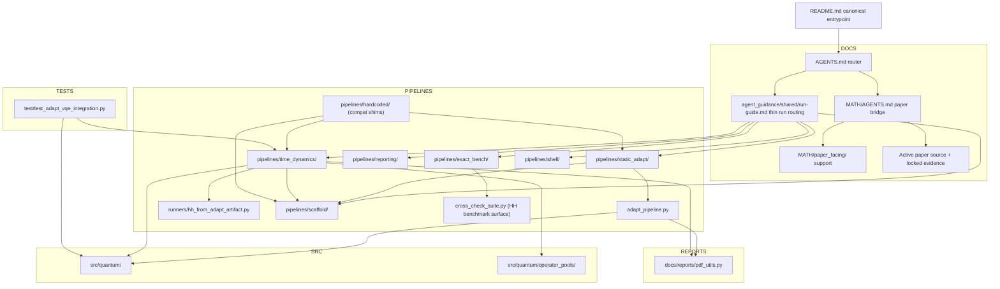
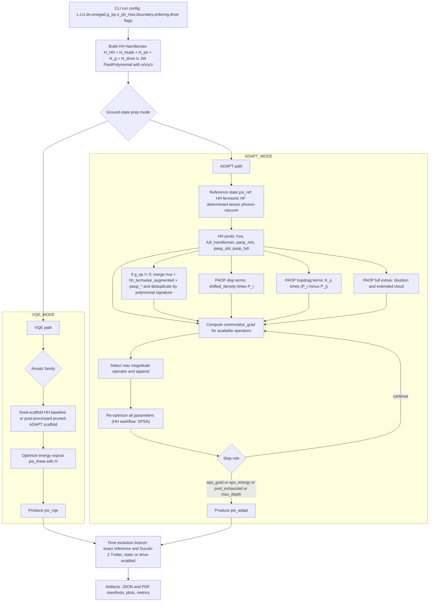

# Holstein_test

This path is the canonical repository onboarding document.

## Current orientation

This repository now centers on five paper-facing partitions:

- Paper I static ADAPT/SNAKE: `MATH/paper_details/static_adapt_paper_I.tex` and `.pdf`.
- Paper II checkpoint McLachlan dynamics: `MATH/paper_details/time_dynamics_paper_II.tex` and `.pdf`.
- Paper III geometry-selected QSE / excited dynamics: `MATH/paper_details/excited_spectra_dynamics_paper_III.tex` and `.pdf`.
- Paper IV molecular-vibronic water: `MATH/paper_details/molecular_vibronic_h2o_paper_IV.tex` and `.pdf`.
- Paper V high-`U` regularization / GKBA exploration: `MATH/paper_details/paper_V_high_u_gkba.tex` and `.pdf`, with workspace code/notes in `paper_5/`.

For agent-facing guidance, start with `agent_guidance/README.md`. Static
ADAPT / Route-A language lives under `agent_guidance/static-adapt/`; shared
transitional language lives under `agent_guidance/shared/`. For run planning and
artifact promotion, use the relevant paper-specific run skill and
`agent_guidance/shared/run-guide.md`. Papers IV and V inherit the Paper I, II,
or III run/results gates whenever they reuse those method surfaces.

### First-principles open-dynamics flagship

The repository's new cross-paper flagship is a source-anchored,
solver-neutral benchmark for equal-time non-Markovian electron--phonon
dynamics, aligned with the public Riva--Simoni--Ping and FPDMD program. The
implemented first slice lives in `pipelines/open_dynamics/`: common reduced
trajectories, explicit provenance and exact-reference access policy, a field-wise
adapter over the existing Paper V dimer code, physicality diagnostics, and
declared polarization/spectrum conventions.

This is an independent invariant benchmark, not an ab initio result, published
curve reproduction, collaborator-reviewed result, or quantum-advantage claim.
The next proposed seam is a portable producer-side FeynWann material export;
QE/EPW will be an alternate producer only after a pinned complex-coupling
fixture exists. See `docs/ping_group_open_dynamics_program.md` and
`pipelines/open_dynamics/README.md`.

Legacy PHYS 765 report sources, root-level paper drafts, and LaTeX build
byproducts have been archived under
`output/archive/cleanup_20260531/root_paper_clutter/`. Do not treat root-level
`main_condensed*`, `static_adapt_paper_*`, or `Benchmark.md` files as current
editable entrypoints unless explicitly restored from that archive.

## Active checkout snapshot (2026-04-21)

This README reflects the active non-archived toolchain in this repository:

- canonical direct HH ADAPT: `pipelines/static_adapt/adapt_pipeline.py`
- historical regression anchor: `pipelines/static_adapt/adapt_pipeline_legacy_20260322.py`
- post-processed scaffold follow-on / exact-bench surfaces: `pipelines/scaffold/hh_vqe_from_adapt_family.py`, `pipelines/exact_bench/cross_check_suite.py`, `pipelines/exact_bench/hh_noise_hardware_validation.py`
- Chapter 17A realtime default: `pipelines/time_dynamics/runners/hh_from_adapt_artifact.py`
- fixed-manifold / realtime sweep controls: `pipelines/time_dynamics/fixed_manifold/mclachlan.py`, `pipelines/time_dynamics/fixed_manifold/measured.py`, `pipelines/time_dynamics/legacy/sweeps/hh_l2_static_realtime_pareto_sweep.py`, `pipelines/time_dynamics/legacy/sweeps/hh_l2_driven_realtime_pareto_sweep.py`
- legacy shorthand helper: `pipelines/shell/run_drive_accurate.sh`

Some older README examples below had drifted toward removed scripts. This pass keeps only surfaces that exist in this checkout and marks legacy-only seams explicitly.

This repo implements Hubbard-Holstein (HH) simulation workflows with
Jordan-Wigner operator construction, binary or unary bosonic encoding, blocked or periodic boundary conditions, with direct HH ADAPT plus fixed-scaffold/post-processed VQE ground-state preparation, exact reference propagation, Suzuki dynamics, and McLachlan dynamics surfaces.

## Project focus

- Primary production and public-facing model: `Hubbard-Holstein (HH)`.
- HH still reuses the shared fermionic Hubbard core internally. In code, `build_hubbard_holstein_hamiltonian(...)` forms `H = H_Hubb + H_ph + H_g + H_drive`, so we should remove pure-Hubbard-facing modes and docs before deleting shared fermionic builders HH still imports.
- Pure Hubbard should be treated as legacy cleanup debt, not as an active repo surface.
- The old `HVA -> ADAPT -> matched-family VQE replay` ladder is no longer a living workflow in this repo. Direct HH ADAPT is the canonical route; VQE remains only as an optional follow-on on existing post-processed or pruned ADAPT scaffolds.
- Noiseless shots and Aer simulator should match the pipeline with noise simulation turned off.

### Current L=2 HH reference routes

Standard repo workflow: first solve the **static / undriven** HH ground state, then optionally reuse that scaffold or state in the later **drive-enabled** time-dynamics stage. Do not assume drive is active during ground-state ADAPT unless a run explicitly includes drive flags.

Documentation default for HH ADAPT accuracy: artifact `|\Delta E|` values are same-cutoff ADAPT-convergence diagnostics unless labeled otherwise. For physical accuracy prose, compare the `n_ph_max=1` variational energy to the higher-cutoff exact HH sector with `n_ph_max=3` at the canonical L=2 point. The best raw winner has `E_ADAPT=0.1587240823603705`, `E_exact(n_ph_max=1)=0.158667904125724`, and `E_exact(n_ph_max=3)=0.158439453796385`, so docs should headline `|E_ADAPT - E_exact(n_ph_max=3)|=2.8462856399e-04` while retaining same-cutoff `|\Delta E|=5.6178234645e-05` as the internal-convergence number.

- Scientific cost-vs-energy oracle: `pipelines/static_adapt/adapt_pipeline_legacy_20260322.py` on the frozen fullhorse-style `full_meta + phase3_v1 + POWELL` strong-coupling route. In the current checkout this still reproduces same-cutoff `|\Delta E|=5.6178234645e-05` at `81` transpiled two-qubit gates; under the documentation-default `n_ph_max=3` external benchmark its physical error is `2.8462856399e-04`. It is the regression anchor we keep to detect scaffold-selection drift.
- Best current-route comparable line: the motif-guided current route from `artifacts/agent_runs/20260409_hh_l2_current_motif_from_legacy81_v1/`, which reaches `|\Delta E|=5.7102691670e-05` at `168` transpiled two-qubit gates.
- Best current fullhorse-style line: `artifacts/agent_runs/20260410_hh_l2_current_fullhorse_recovery_v1/cases/fullhorse_spliton_norepeats_motif/`, which reaches `|\Delta E|=5.7102730821e-05` at `193` transpiled two-qubit gates.
- Best current diagnostic native recovery line: `artifacts/agent_runs/20260409_hh_l2_children_repeat_bridge_diag_v1/cases/d10_children_off_repeats_off_hist/`, which reaches `|\Delta E|=5.6178241861e-05` at `160` transpiled two-qubit gates.
- Public / deployment anchor: direct `pipelines/static_adapt/adapt_pipeline.py` on the validated `pareto_lean + phase3_v1 + SPSA` raw-HF-start route. Its active Paper-I authority is the co-located `MATH/paper_details/Paper_I.tex` / `MATH/paper_details/Paper_I.pdf` pair and its locked evidence, with same-cutoff `|\Delta E|=1.0822209459e-04` at `218` transpiled two-qubit gates; docs should also report the external `n_ph_max=3` comparison when discussing physical truncation accuracy.
- Realtime / time-dynamics anchor: `python -m pipelines.time_dynamics.runners.hh_from_adapt_artifact`, governed by the active Paper-II source and time-dynamics support contract. Drive is opt-in via `--enable-drive`; no flag is static/no-drive. Default high-miss/no-admit resolution is `bounded_stay_advance`, which advances a physical `state_sample` with warning telemetry without relaxing append thresholds.
- Archival driven calibration: `secant_lead*` results are historical evidence only; do not use them as route identity, defaults, or agent route selectors.
- Control pathways: keep Suzuki, fixed-scaffold, fixed-manifold, and sweep pathways as controls and baselines for adaptive McLachlan, not as the headline route.

### QPU-faithful realtime dynamics contract

The promoted QPU-compatible realtime path is the strict `oracle_v1` McLachlan
controller route. Its decisions may use measurement-compatible observables of
the prepared ansatz/circuit state, including ideal/infinite-shot local
observable estimates used as a fast development shortcut. In that role,
statevector simulation is only an ideal observable estimator for the prepared
circuit/scaffold state, not an ED target state or exact evolved reference.

Do not present a route as QPU-faithful if append/prune admission, stay/advance
selection, integrator policy, candidate scoring, or strict Optuna feedback uses
ED target-state information, exact target trajectories, benchmark-exact future
errors, `state_at(...)`, `exact_step_forecast`, `decision_backend=exact`, or
`exact_v1` action-selection logic. Exact references are still expected for
benchmarking, reports, and controller-minus-exact plots; they are diagnostic
outputs, not controller inputs.

Before generalizing realtime dynamics to a new Hamiltonian family, add boundary
tests using `strict_qpu_faithful_decision_contract(...)` or an explicitly
equivalent helper so exact target/reference data cannot silently feed decisions.
`--checkpoint-controller-reference-mode off` is the historical controller
exact-input guard; it does not mean exact benchmarking is omitted. Diagnostic
exact overlays are controlled separately by `--diagnostic-exact-reference-mode`.
Prefer `controller_exact_input_mode` in artifacts and prose. New realtime
artifacts also expose `decision_data_flow`, `uses_reference_for_decision`,
`uses_future_exact_forecast_for_decision`,
`uses_statevector_as_ideal_observable_estimator`, and
`strict_measurement_oracle_certified` so local prepared-state geometry is not
confused with exact-reference-assisted control.

For exact Paper-I notation, claims, artifact paths, and current cost-vs-energy ranking, start with `MATH/paper_details/Paper_I.tex`, `MATH/paper_details/Paper_I.pdf`, and their named support/evidence artifacts; for run/evidence work, follow `AGENTS.md` -> `MATH/AGENTS.md` -> the relevant paper-specific run skill -> `agent_guidance/shared/run-guide.md`.


### Canonical HH ADAPT path

The non-archaic HH ADAPT implementation path is direct `pipelines/static_adapt/adapt_pipeline.py`; paper-facing defaults are governed by the relevant paper-specific run skill.

- On the direct CLI, omitting `--adapt-continuation-mode` now defaults to `phase3_v1`.
- Current Paper-I/static HH production uses Route A / `paper_i_production_v1`, the new problem-local `full_meta` pool, and Pauli-child / child-set candidate exploration by default. See `agent_guidance/static-adapt/history/route-a-language.md` for the visual Route-A language map.
- Do not treat narrow cores, `paop_lf_std`, reduced winning pools, or old selected-logical surfaces as current HH production defaults. They are diagnostic, ablation, appendix, or legacy-reproduction surfaces unless explicitly requested.
- `legacy`, `phase1_v1`, and `phase2_v1` remain explicit historical/compatibility modes only.

### Retired staged warm-start ladder

The old staged `VQE -> ADAPT -> VQE` wrapper story is retired as a living workflow.

- Do not treat HH-HVA warm start, staged seed-refine, or matched-family replay as the canonical path for new HH work.
- If `pipelines/hardcoded/hh_staged_noiseless.py` or `pipelines/hardcoded/hh_staged_noise.py` are still present in the checkout, treat them as archival compatibility surfaces only.
- The maintained path is direct raw-HF-start HH ADAPT on `pipelines/static_adapt/adapt_pipeline.py`.
- Optional VQE follow-on is retained only for deliberate post-processing on an existing ADAPT or pruned-ADAPT scaffold; it is not a required tail stage of the canonical run contract.

## Repository map (minimal)

- `src/quantum/`: operator algebra, Hamiltonian builders, ansatz/statevector math
- `pipelines/static_adapt/`: canonical static HH ADAPT and scaffold-selection entrypoints
- `pipelines/time_dynamics/`: canonical HH adaptive McLachlan and realtime dynamics entrypoints
- `pipelines/scaffold/`: shared scaffold, continuation, replay, and handoff helpers
- `pipelines/hardcoded/`: compatibility shims for older imports/CLI paths plus remaining mixed legacy surfaces
- `pipelines/reporting/`: report/document compilers over existing JSON/artifacts
- `pipelines/exact_bench/`: exact-diagonalization benchmark tooling
- `docs/reports/`: PDF and reporting utilities
- root markdown docs: active repo-facing contracts and workflow notes
- `MATH/`: near-term HH implementation notes and math targets

## Visual overview


```mermaid
graph TB
  R["README.md canonical entrypoint"]

  subgraph DOCS
    D1["AGENTS.md router"]
    D4["MATH/AGENTS.md paper bridge"]
    D5["MATH/paper_facing/ support"]
    D2["agent_guidance/shared/run-guide.md thin run routing"]
    D3["Active paper source + locked evidence"]
  end

  subgraph SRC
    S0["src/quantum/"]
    S1["src/quantum/operator_pools/"]
  end

  subgraph PIPELINES
    P0["pipelines/static_adapt/"]
    P1["adapt_pipeline.py"]
    P2["pipelines/time_dynamics/"]
    P3["runners/hh_from_adapt_artifact.py"]
    P4["pipelines/scaffold/"]
    P5["pipelines/hardcoded/ (compat shims)"]
    P6["pipelines/reporting/"]
    P7["pipelines/exact_bench/"]
    P8["cross_check_suite.py (HH benchmark surface)"]
    P9["pipelines/shell/"]
  end

  subgraph REPORTS
    RP0["docs/reports/pdf_utils.py"]
  end

  subgraph TESTS
    T0["test/test_adapt_vqe_integration.py"]
  end

  R --> D1
  D1 --> D4
  D1 --> D2
  D4 --> D5
  D4 --> D3

  D2 --> P0
  D2 --> P2
  D2 --> P4
  D2 --> P6
  D2 --> P7
  D2 --> P9

  P0 --> P1
  P2 --> P3
  P0 --> P4
  P2 --> P4
  P5 --> P0
  P5 --> P2
  P5 --> P4
  P7 --> P8

  P1 --> S0
  P2 --> S0
  P2 --> S1
  P1 --> RP0
  P2 --> RP0

  T0 --> P2
  T0 --> S0
```

## Physics algorithm flow (VQE / ADAPT / pools)


```mermaid
graph TB
  A["CLI run config: L,t,U,dv,omega0,g_ep,n_ph_max,boundary,ordering,drive flags"] --> B["Build HH Hamiltonian H_HH = H_Hubb + H_ph + H_g + H_drive in JW PauliPolynomial with e/x/y/z"]
  B --> C{"Ground-state prep mode"}

  C --> V["VQE path"]
  C --> AD["ADAPT path"]

  subgraph VQE_MODE
    V --> V1{"Ansatz family"}
    V1 --> V2["fixed-scaffold HH baseline or post-processed pruned-ADAPT scaffold"]
    V2 --> V3["Optimize energy expval psi_theta with H"]
    V3 --> V4["Produce psi_vqe"]
  end

  subgraph ADAPT_MODE
    AD --> AD0["Reference state psi_ref: HH fermionic HF determinant tensor phonon vacuum"]
    AD0 --> HHPOOL["HH pools: hva, full_hamiltonian, paop_min, paop_std, paop_full"]

    HHPOOL --> PD1["PAOP disp terms: shifted_density times P_i"]
    HHPOOL --> PD2["PAOP hopdrag terms: K_ij times (P_i minus P_j)"]
    HHPOOL --> PD3["PAOP full extras: doublon and extended cloud"]
    HHPOOL --> HMERGE["If g_ep != 0: merge hva + hh_termwise_augmented + paop_* and deduplicate by polynomial signature"]

    HHPOOL --> GCompute
    HMERGE --> GCompute
    PD1 --> GCompute
    PD2 --> GCompute
    PD3 --> GCompute

    GCompute["Compute commutator_grad for available operators"] --> GSelect["Select max magnitude operator and append"]
    GSelect --> Reopt["Re-optimize all parameters (HH workflow: SPSA)"]
    Reopt --> Stop{"Stop rule"}
    Stop -->|eps_grad or eps_energy or pool_exhausted or max_depth| ADOut["Produce psi_adapt"]
    Stop -->|continue| GCompute
  end

  V4 --> DYN
  ADOut --> DYN
  DYN["Time evolution branch: exact reference and Suzuki-2 Trotter, static or drive-enabled"] --> OUT["Artifacts: JSON and PDF manifests, plots, metrics"]
```

### ADAPT Pool Summary (plaintext fallback)

- `hh` pools: `hva`, `full_hamiltonian`, `paop_min`, `paop_std`, `paop_full`, `paop_lf` (`paop_lf_std` alias), `paop_lf2_std`, `paop_lf_full`.
- Experimental offline/local exact-noiseless probe families: `paop_lf3_std`, `paop_lf4_std`, `paop_sq_std`, `paop_sq_full`.
- HH production/default ADAPT for current Paper-I/static work uses `phase3_v1` with the new problem-local `full_meta` pool. Do not reduce current HH production rows to old winning pools unless the user explicitly asks for a diagnostic, ablation, appendix, or legacy reproduction.
- Older repo-doc statements that staged wrappers default to `phase1_v1`, narrow HH cores, or reduced winning pools are archival only; the manuscript/current canonical HH ADAPT surface uses `phase3_v1` and current run-skill guidance wins when those older docs disagree.
- HH built-in combined preset: `uccsd_paop_lf_full` = `uccsd_lifted + paop_lf_full` (deduplicated) via one CLI value.
- HH explicit product families: `uccsd_otimes_paop_lf_std`, `uccsd_otimes_paop_lf2_std`, `uccsd_otimes_paop_bond_disp_std`.
  - These are the canonical lifted-UCCSD ⊗ boson-only-phonon constructions in this repo: one lifted fermionic UCCSD factor times one boson-only phonon motif, locality-filtered, canonicalized, and deduplicated.
  - They remain available as explicit scaffold/materialization families and as optional post-processing surfaces without mutating the older additive unions.
- HH logical two-parameter product variants: `uccsd_otimes_paop_lf_std_seq2p`, `uccsd_otimes_paop_lf2_std_seq2p`, `uccsd_otimes_paop_bond_disp_std_seq2p`.
  - These treat one logical `(F_a, M_μ)` pair as separate fermion/motif parameters during execution and serialized-scaffold reconstruction.
  - They are additive opt-in surfaces and do not change the direct `phase3_v1` default path.
- HH full-meta preset: `full_meta` = `uccsd_lifted + hva + paop_full + paop_lf_full` plus available problem-local HH/operator-family extensions, deduplicated via one CLI value. For current HH production rows, this is the required same-pool ADAPT universe, not merely a compatibility/broad-pool option.
- HH lean reduced presets: `pareto_lean` and `pareto_lean_l2`.
  - `pareto_lean_l2` is intentionally narrow: valid only for `L=2` and `n_ph_max=1`; treat it as diagnostic/legacy unless explicitly requested.
- Pauli-child / child-set candidate exploration is enabled by default for current HH Route-A production runs. Artifact fields vary by generation: report observed child/batch/runtime-split fields literally.
- HH phonon cutoff language must report both the algorithmic working cutoff and the reference/evaluation cutoff. Default unspecified HH static work starts at `n_ph_work=2` and generally compares to `n_ph_ref=n_ph_work+3`; escalate the working cutoff when Table III/source locks or exact-cutoff-floor checks require it.
- ADAPT serialized-scaffold parameter contract:
  - `operators` / `ansatz_depth` remain the logical generator scaffold.
  - `optimal_point` / `num_parameters` are the runtime per-Pauli rotation vector/count.
  - `logical_optimal_point` / `logical_num_parameters` preserve one-value-per-generator reporting.
  - `parameterization` stores the logical-to-runtime block map used by post-processing and cost reconstruction.
- `paop_min`: displacement-focused PAOP operators.
- `paop_std`: displacement plus dressed-hopping (`hopdrag`) operators.
- `paop_full`: `paop_std` plus doublon dressing and extended cloud operators.
- `paop_lf_std`: `paop_std` plus LF-leading odd channel (`curdrag`).
- These experimental families are opt-in only; they are not part of the canonical direct `phase3_v1` default path and are not folded into default `full_meta`.
- HH merge behavior (when `g_ep != 0`): merge `hva` + `hh_termwise_augmented` + selected `paop_*` pool, then deduplicate by polynomial signature.

### Compiled speedup stack note (2026-03-04)

The hardcoded VQE/ADAPT path now includes a shared compiled-action acceleration stack, with additive (backward-compatible) interfaces and parity tests.

- Shared compiled polynomial utility:
  - `src/quantum/compiled_polynomial.py`
  - Provides `compile_polynomial_action`, `apply_compiled_polynomial`, `energy_via_one_apply`, and `adapt_commutator_grad_from_hpsi`.
- Compiled ansatz executor:
  - `src/quantum/compiled_ansatz.py`
  - Applies Pauli rotations through compiled permutation+phase actions (no per-amplitude string loops).
- VQE one-apply energy backend:
  - `src/quantum/vqe_latex_python_pairs.py` adds `expval_pauli_polynomial_one_apply(...)`.
- `vqe_minimize(...)` supports `energy_backend="legacy"|"one_apply_compiled"` (default is `one_apply_compiled`).
  - The shared hardcoded propagator carrier `pipelines/hardcoded/hubbard_pipeline.py` exposes `--vqe-energy-backend {legacy,one_apply_compiled}` and defaults to `one_apply_compiled`.
  - Hardcoded VQE can emit live progress heartbeats via `--vqe-progress-every-s` (default `60` seconds), including restart lifecycle and periodic energy/nfev telemetry.
- ADAPT runtime acceleration:
  - `pipelines/hardcoded/adapt_pipeline.py` compiles Hamiltonian/pool once, computes `H|psi>` once per depth, evaluates pool gradients via `2*Im(<Hpsi|Apsi>)`, and uses compiled ansatz execution in COBYLA objective/state updates.
- Regression coverage added:
  - `test/test_compiled_polynomial.py`
  - `test/test_compiled_ansatz.py`
  - `test/test_vqe_energy_backend.py`
- Existing ADAPT integration suite remains passing.
- Additive ADAPT telemetry fields:
  - `adapt_vqe.compiled_pauli_cache`
  - `adapt_vqe.history[*].gradient_eval_elapsed_s`
  - `adapt_vqe.history[*].optimizer_elapsed_s`

Post-processed VQE on an existing ADAPT scaffold (optional compatibility utility):

```bash
python pipelines/hardcoded/hh_vqe_from_adapt_family.py \
  --adapt-input-json <adapt_hh_json_path> \
  --generator-family match_adapt --fallback-family full_meta \
  --L 4 --boundary open --ordering blocked \
  --boson-encoding binary --n-ph-max 1 --t 1.0 --u 4.0 --dv 0.0 --omega0 1.0 --g-ep 0.5 \
  --reps 4 --restarts 16 --maxiter 12000 --method SPSA --seed 7 \
  --energy-backend one_apply_compiled --progress-every-s 60 \
  --output-json artifacts/json/hc_hh_L4_from_adaptB_family_matched_fastcomp.json
```

Use this only when you intentionally want to rebuild a fixed VQE scaffold from an existing ADAPT or pruned-ADAPT JSON artifact. It is a post-processing surface, not a canonical live run ladder, and the repo no longer treats `HVA -> ADAPT -> matched-family VQE` as a maintained workflow.
If an opt-in runtime split admitted child labels outside the resolved family pool, the follow-on utility can still rebuild them from serialized continuation metadata when that metadata is present.
`hubbard_pipeline.py --vqe-ansatz hh_hva_*` remains the fixed-ansatz HH baseline surface; the filename is legacy, but the active public usage here is HH.

## Start here (doc priority)

Use this router-first order when onboarding:

1. `AGENTS.md` - first-stop router, hard policy, global invariants, and escalation rules.
2. Nearest subtree `AGENTS.md`; for ADAPT, HH, time-dynamics, reporting, paper, run, table, manuscript, or math-default work, use `MATH/AGENTS.md` as the paper-program bridge.
3. Required skill gate when triggered: the relevant paper-specific run skill, then the matching paper-specific results skill for table data, or `$journal-math-manuscript-refiner` followed by `MATH/paper_facing/shared/journal_math_skill_supplement.md` for manuscript/PDF-facing work.
4. `agent_guidance/shared/run-guide.md` - thin run-routing reminder below the root/MATH routers and active run/table skills.
5. `README.md` - current repo map and kept workflow surface; orientation, not authority.
6. The active paper source/PDF pair named in `MATH/AGENTS.md`; for Paper I,
   use `MATH/paper_details/Paper_I.tex` and `MATH/paper_details/Paper_I.pdf`.

Canonical navigation chain: `AGENTS.md` -> conditional `MATH/AGENTS.md` -> required skill gate -> paper-support docs or target code/tests -> `agent_guidance/shared/run-guide.md` as a run reminder when relevant -> target manuscripts/manifests only when needed.
Agent-facing automation should ignore `docs/` unless PDF/report output is in scope, in which case use `docs/reports/`.

Task-type doc split:
- `AGENTS.md`: router, hard policy, escalation rules, scientific invariants, and artifact hygiene.
- `MATH/AGENTS.md`: paper-program bridge, paper-support load order, and MATH-local gates.
- the relevant paper-specific run skill: mandatory paper-run manager for benchmark/run/evidence/report/promotion work.
- the matching paper-specific results skill: mandatory evidence-to-table gate after the run skill.
- `$journal-math-manuscript-refiner`, followed by `MATH/paper_facing/shared/journal_math_skill_supplement.md`: mandatory manuscript/PDF-facing gate.
- `agent_guidance/shared/run-guide.md`: thin run-routing reminder, not the main CLI/runbook authority.
- `README.md`: repo map and active workflow overview.
- Active paper source/PDF pair: mathematical and reader-facing authority; for
  Paper I, `MATH/paper_details/Paper_I.tex` and `MATH/paper_details/Paper_I.pdf`.

## Important note on README files

Subdirectory README files are component-scoped documentation, not repo-canonical
onboarding docs. After following the router-first chain above, use this root
`README.md` as the README entrypoint, then drill into local READMEs for
module-specific details.

## AI run/report contract

For agent-run work in this repo:

- frame the run around an **Objective** first: a short scientific / mathematical / physical sub-problem that could improve the real-QPU `ΔE / K` Pareto front
- keep **Objective** separate from **Execution mode**:
  - `fresh_run`
  - `reuse_artifact`
  - `compare_artifacts`
  - `promote_candidate`
- default emphasis is **HH**, **`L=2`**, and **driven** dynamics unless the user says otherwise; this is an **agent planning priority**, not a CLI default
- in RepoPrompt agent mode, default to three compact lines with **no blank lines**: `Objective<...>`, `Why/Intent<...>`, `Suggested Next step/how this fits into broader picture<...>`; each line should be **1-3 sentences max**
- frame verification as soft expectations by default, unless the user or the chosen repo surface explicitly defines a hard gate
- the **agent wrapper** should write machine-oriented logs under:
  - `artifacts/agent_runs/<tag>/`
  - `artifacts/agent_runs/<tag>/logs/`
  - with `command.sh`, `stdout.log`, `stderr.log`, and `progress.json` when supported
- if the user says **execute**, the agent should execute without an extra permission prompt unless a real runtime/policy choice is still unresolved
- as an **agent post-processing convention**, after each run first give a short in-chat report that retells the objective and result; only write/update markdown or PDF report files when the user explicitly asks or report output is already in scope

## Quick run examples

Default hard gate policy for agent execution:
- Final conventional VQE hard gate: `ΔE_abs < 1e-4`.
- In this checkout, `run_drive_accurate.sh` enforces `ΔE_abs < 1e-7` with no built-in strict-mode toggle. This is stricter than the AGENTS default.

ADAPT-VQE (HH, canonical direct phase3 path):

```bash
python pipelines/hardcoded/adapt_pipeline.py \
  --L 2 --problem hh --omega0 1.0 --g-ep 0.5 --n-ph-max 1 \
  --adapt-max-depth 30 --adapt-eps-grad 1e-5 --adapt-maxiter 800 \
  --initial-state-source adapt_vqe --skip-pdf \
  --output-json artifacts/json/adapt_L2_hh_phase3_default.json
```

Omitting `--adapt-continuation-mode` on the direct CLI now means `phase3_v1`. Pass `legacy`, `phase1_v1`, or `phase2_v1` explicitly only when reproducing older behavior.

Runtime note: ADAPT execution now applies one variational parameter per active Pauli term inside each selected generator. Exported JSON therefore distinguishes logical scaffold size (`ansatz_depth`, `logical_*`) from runtime rotation count (`num_parameters`, `optimal_point`). Existing ADAPT JSON `exact_gs_energy` / `abs_delta_e` fields are same-working-cutoff values; docs and reports should add an explicit external higher-cutoff exact comparison, defaulting to `n_ph_max=3` for canonical L=2 HH, when making physical-accuracy claims.

Cross-check suite (exact benchmark; auto-scaled by L/problem defaults):

```bash
python pipelines/exact_bench/cross_check_suite.py \
  --problem hh --L 2 --omega0 1.0 --g-ep 0.5 --n-ph-max 1
```

Cross-check note:
- In this checkout, `cross_check_suite.py --help` exposes only the benchmark-matrix CLI shown above.
- Older README references to `--hh-seed-refine-surface` and `--hh-seed-benchmark-preset` were stale and are removed here.

Suzuki propagation (hardcoded pipeline):

```bash
python pipelines/hardcoded/hubbard_pipeline.py \
  --L 2 --problem hh --omega0 1.0 --g-ep 0.5 --n-ph-max 1 \
  --propagator suzuki2 \
  --trotter-steps 64 --t-final 10.0 --num-times 201 \
  --skip-qpe
```

Trajectory propagation status (hardcoded pipeline):
- `--propagator` now supports `suzuki2` and `piecewise_exact`.
- `suzuki2` is the maintained approximate propagator surface.
- `piecewise_exact` remains the reference-style propagation option on the reported trajectory grid.
- `--exact-steps-multiplier` remains a reference-only control.
- A=0 invariance remains a required safe-test target at `<= 1e-10`.

Current Chapter 17A / realtime surfaces:
- canonical artifact-seeded Chapter 17A controller:

```bash
python -m pipelines.time_dynamics.runners.hh_from_adapt_artifact \
  --artifact-json artifacts/json/adapt_hh_L2_phase3_v1.json \
  --output-json artifacts/json/time_dynamics_from_adapt_L2.json
```

- exact locked-manifold compare control:

```bash
python -m pipelines.time_dynamics.fixed_manifold.mclachlan
```

- measured/oracle fixed-manifold control:

```bash
python -m pipelines.time_dynamics.fixed_manifold.measured \
  --manifold locked_7term --enable-drive \
  --drive-A 0.6 --exact-steps-multiplier 2
```

- L=2 static realtime sweep from saved artifacts:

```bash
python -m pipelines.time_dynamics.legacy.sweeps.hh_l2_static_realtime_pareto_sweep
```

- L=2 driven realtime sweep from saved artifacts:

```bash
python -m pipelines.time_dynamics.legacy.sweeps.hh_l2_driven_realtime_pareto_sweep
```

Notes:
- Use `python -m ...` for these newer `pipelines/time_dynamics` modules; direct file-path invocation can fail on imports.
- `runners.hh_from_adapt_artifact` is static/no-drive unless `--enable-drive` is supplied.
- Canonical high-miss/no-admit policy is `bounded_stay_advance`: no append thresholds are relaxed; the fallback advances a physical `state_sample` with loud `high_miss_no_admit_soft_fallback*` telemetry. `legacy_advance_stay` is an input alias only; `repair_stop` and `repair_retry` are explicit diagnostic/experimental no-advance modes.
- Tangent/secant proposals are explicit diagnostics only; `secant_lead*` artifacts are archival, not route defaults.
- `hh_fixed_manifold_measured.py` currently supports `noise_mode=ideal`, `oracle_repeats=1`, and mean aggregation only.
- The `hh_l2_*_realtime_pareto_sweep.py` surfaces are specifically `L=2` saved-artifact sweeps, not generic `run L` wrappers.

For compare/orchestration workflows that still exist in this checkout, start with `AGENTS.md` and `MATH/AGENTS.md`; if the task is run-facing, use the relevant paper-specific run skill and `agent_guidance/shared/run-guide.md` before touching scripts or artifacts.

## Major Markdown docs index

- `AGENTS.md`
- `README.md`
- `agent_guidance/shared/run-guide.md`
- `MATH/paper_details/Paper_I.tex` and `MATH/paper_details/Paper_I.pdf` for Paper I
- `pipelines/exact_bench/README.md`

Legacy archived docs live under `docs/archive/` and are non-canonical.

## HH noisy estimator validation

The repo now includes an HH-first noisy/hardware validation pipeline:
- `pipelines/exact_bench/hh_noise_hardware_validation.py`

It provides one shared expectation oracle across `ideal`, `shots`, `aer_noise`, and `runtime` modes.  
`shots`/`aer_noise` emulate finite-shot measurement noise using Qiskit `AerSimulator`, with optional noisy ADAPT and PDF/JSON reporting.  
For operational command selection, follow `AGENTS.md` -> `MATH/AGENTS.md` -> the relevant paper-specific run skill; use `agent_guidance/shared/run-guide.md` only as the thin run-routing reminder.

High-level symmetry note:
- `--symmetry-mitigation-mode` is the active oracle-backed symmetry surface in the noise validation / robustness flows; default is `off`.
- Active modes (`postselect_diag_v1`, `projector_renorm_v1`) are intentionally narrow first versions: they run only on eligible diagonal/counts-compatible paths and fall back explicitly to `verify_only` when unsupported.
- This differs from `--phase3-symmetry-mitigation-mode` on raw direct ADAPT / hardcoded / serialized-scaffold follow-on paths, where the flag is a continuation metadata/telemetry hook unless the workflow is routed through the oracle runtime.

Legacy staged heavy-HH robustness surface (archival compatibility only):
- `pipelines/exact_bench/hh_noise_robustness_seq_report.py`

Surface characteristics:
- strict ADAPT Pool B composition enforcement (`UCCSD_lifted + HVA + PAOP_full`)
- noisy dynamics methods via `--noisy-methods` (default `suzuki2`)
- shared oracle-backed `--symmetry-mitigation-mode` surface (default `off`; active modes remain opt-in and diagnostics-backed)
- embedded benchmark metrics in JSON/PDF (`term_exp_count_total`, `cx_proxy_total`, `sq_proxy_total`, `depth_proxy_total`, `wall_total_s`, `oracle_eval_s_total`)
- backward-compatible `dynamics_noisy.profiles.<profile>.modes` alias mirroring `suzuki2`
