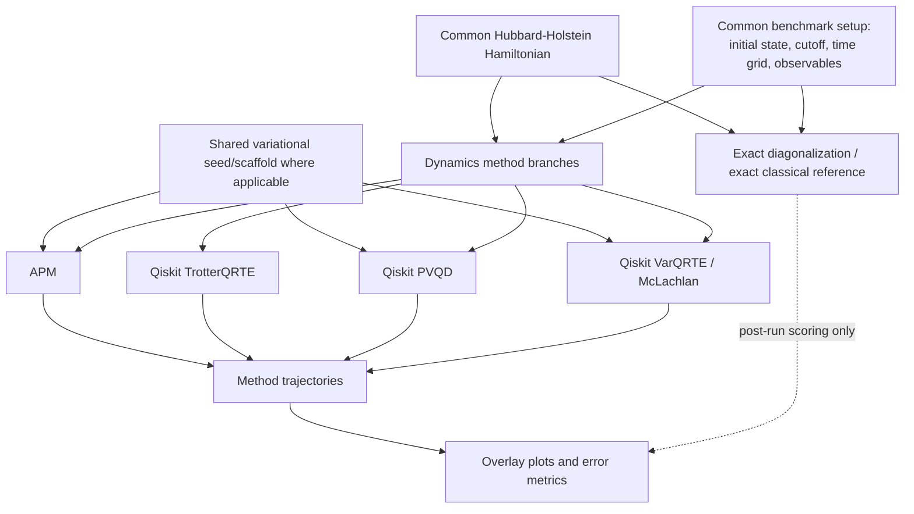

# Time-Dynamics Route README

Status: code-folder route map and implementation contract.

This README is scoped to `pipelines/time_dynamics/`. It describes how the
runtime code is organized and how new Paper-II APM work should enter this
folder. The paper-facing route note lives separately at
`MATH/paper_facing/paper_II_dynamics/time_dynamics_route_readme.md`.

Terminology: APM means append-prune McLachlan. Older docs, module paths, and
artifact fields may still say AP-McLachlan; new agent-facing text should use
APM unless referring to a compatibility surface literally named `ap_mclachlan`.

## Route Contract

Exact diagonalization / exact classical propagation is the post-run reference
branch, not a benchmarked dynamics method. It produces the reference trajectory
for the same finite truncated Hamiltonian only after method trajectories exist,
for overlays and error metrics.



TrotterQRTE shares the physical initial state and benchmark setup. It does not
consume a Paper-I variational seed/scaffold in the same sense as APM, PVQD, or
VarQRTE.

## Terminology Firewall

Paper II route identity is APM, meaning append-prune McLachlan. The
central controller action is a support patch
`nu_k = (B_k^-, R_k^+)`, not an append route, prune route, or repair lane.

Use `time point`, `time step`, or `time iteration` for the discrete index `k`.
Legacy public CLI flags, old artifact fields, or compatibility class names do
not define route identity.

Any file or command whose main purpose is old local adaptation or historical
benchmark reproduction belongs under `legacy/` or a clearly labeled
compatibility surface. New Paper-II APM work must enter through `ap_mclachlan/` and
support-patch terminology.

## APM Internal Route

APM support-patch decisions are internal feedback actions. They modify
the active ansatz/scaffold before the McLachlan update is solved on the
after-patch support.

```mermaid
flowchart LR
    A["APM state at time iteration k:<br/>active support J_k"]
    A --> B["Estimate active McLachlan geometry on J_k"]
    B --> C["Generate measurement-compatible child patch opportunities"]
    C --> Q["Optional parent/frontier scout"]
    Q --> D["Assemble before/after child-support geometry"]
    D --> E["Compute grouped support-patch score Delta_nu"]
    E --> F["Apply hard gates and cost-aware ranking"]
    F --> G{"Selected support patch nu_k = (B_k^-, R_k^+)"}

    G -->|"B^- = empty, R^+ = empty"| H["No scaffold edit"]
    G -->|"B^- = empty, R^+ nonempty"| I["Append block(s)"]
    G -->|"B^- nonempty, R^+ = empty"| J["Delete block(s)"]
    G -->|"B^- nonempty, R^+ nonempty"| K["Exchange: delete + append"]

    H --> L["Solve McLachlan update on J_k^nu"]
    I --> L
    J --> L
    K --> L

    L --> M["Advance parameters/state"]
    M --> N["Record APM trajectory point"]
    N --> O{"More time iterations?"}
    O -->|yes| A
    O -->|no| P["APM trajectory output"]
```



## Primary Surfaces

Canonical namespace boundary for new code:

- `ap_mclachlan/`: fresh APM support-patch scoring only; no legacy
  controller runtime and no Qiskit/community comparator imports.
- `fixed_manifold/`: fixed-manifold McLachlan and fixed-scaffold support code.
- `runners/`, `adapters/`, and `tables/`: command, Hamiltonian/observable
  adapter, and generic table entrypoint shims.
- `legacy/`: compatibility command shims and historical benchmark reproduction
  entrypoints that are not APM core or fixed-manifold surfaces.

Root-level command wrappers have been removed. Imports and `python -m` commands
should use canonical package paths.

- `ap_mclachlan/support_patch.py`: pure array-level APM
  support-patch scoring for no edit, insert, delete, and exchange.
- `ap_mclachlan/support_frontier.py`: non-authoritative parent-indexed append
  frontier filtering. It may reduce the child append atoms submitted to the
  ladder, but it must not select or commit support patches.
- `legacy/`: old controller, motion, measurement, prune-loss, and HH benchmark
  compatibility modules. Do not import these from new APM code.
- `runners/hh_from_adapt_artifact.py`: legacy artifact-seeded runner retained
  until all callers migrate to APM runners.
- `optimization/hh_realtime_optuna.py`: controller profile/tuning surface,
  token forwarding, strict metrics, objective values, and class-settings
  payloads.
- `benchmarks/qiskit_native.py`: Paper-II Qiskit comparator boundary for
  TrotterQRTE, PVQD, and VarQRTE. Keep this separate from APM
  controller internals. Qiskit comparator rows must emit compiled resource
  fields and `compile_audit` through their row bundles; the local dynamics PDF
  report reads those fields automatically for cost/error rows. Missing Qiskit
  cost fields are a row repair/rerun issue, not a manual PDF-edit task.
- `benchmarks/legacy_native.py`: collapsed old repo-native benchmark
  implementations: exact reference, fixed McLachlan, product formula, qDRIFT,
  fixed/adaptive PVQD, AVQDS/AVQDS-T, controller-ablation diagnostics, and old
  HH wrapper dispatch into `legacy/hh_benchmarks/`.

## Support-Patch Implementation Target

New APM support-patch scoring should enter through a pure sibling
module:

```text
pipelines/time_dynamics/ap_mclachlan/support_patch.py
```

That module should own array-level scoring only:

- support before/after indexing;
- `McLachlanInversePolicy`;
- grouped `Gamma` score on a declared support;
- no-op/add-only/delete-only/exchange support-patch score payloads;
- JSON-safe payload conversion;
- optional legacy prune-field conversion for parity.

It must not own:

- controller state mutation;
- circuit construction;
- reference trajectory computation;
- Optuna/profile logic;
- plotting, reports, CHTC, or paper artifacts.

## Support-Patch Semantics

The controller chooses one patch at time iteration `k`:

```text
nu_k = (B_k^-, R_k^+)
J_k^nu = (J_k \\ I(B_k^-)) union I(R_k^+)
```

- `B_k^- = empty`, `R_k^+ = empty`: no edit.
- `B_k^- = empty`, `R_k^+ nonempty`: insertion.
- `B_k^- nonempty`, `R_k^+ = empty`: deletion.
- `B_k^- nonempty`, `R_k^+ nonempty`: exchange.

Insertion, deletion, exchange, batching, and whitening diagnostics must use the
same inverse policy: retained-support threshold, ridge/damping convention,
supported inverse, denominator, and whitening schema. Local Schur/window values
may be scouts or confirm diagnostics only when their relation to the grouped
support objective is explicit.

Hardware cost may affect rank score among gate-valid patches. It must not alter
the raw grouped score, insertion gain, or deletion loss.

Optional parent scouting is an append-side frontier construction tool. Cheap
parent-tangent modes rank parent metadata and then expand retained parents back
to Pauli/poly-child atoms. Full-parent child-block scoring is diagnostic and
non-cheap. Under `per_pauli_term`, final support-patch labels must remain child
labels; macro parent labels are final support atoms only in an explicit
`logical_shared` route.

## APM Data-Flow Boundary

Support-patch decisions, integrator choices, and parameter updates use
measurement-compatible quantities for the prepared current or candidate state.
Reference trajectories are attached after the run for plotting and error
metrics only.

## Implementation Order For Support Patch

1. Keep `state.py` and `hamiltonian.py` as the neutral scaffold/Hamiltonian
   adapters shared by APM runners.
2. Maintain the fixed-support McLachlan path: geometry evaluation, supported
   inverse, Eq. (8) solve, and isolated integrators.
3. Route insertion, deletion, and exchange through one grouped support-patch
   scoring abstraction with the same inverse/ridge/whitening convention.
4. Batch candidate scoring where possible, then apply hard gates and
   cost-aware ranking.
5. Attach reference energies and observable errors only in runner/reporting
   layers after the trajectory is produced.
