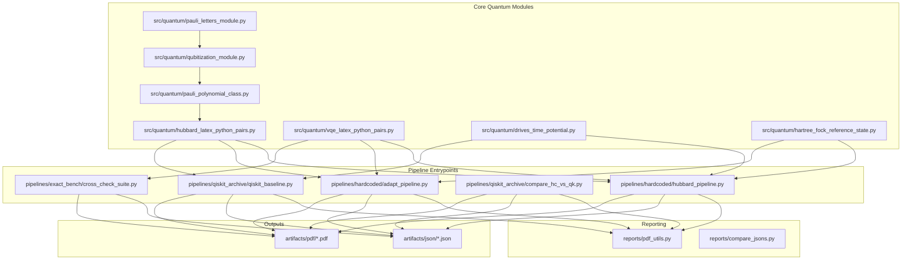

# LLM Research Context Dossier

Document path: `docs/LLM_RESEARCH_CONTEXT.md`  
Repository root: `/Users/jakestrobel/Documents/Holstein_implementation/Holstein_test`  
Snapshot generated: `2026-03-04T04:16:35Z` (UTC)  
Git branch at snapshot: `backup/pre-delete-20260221_213720`  
Git short commit at snapshot: `1be683c`

This dossier is designed as an LLM-first handoff artifact for deep research and implementation planning. It prioritizes implementation truth, invariants, and concrete code anchors over abstract summaries.

## Purpose and How to Use This with an LLM
### Why this exists

This file is meant to remove repeated onboarding friction when handing this repo to a deep-research LLM model. Instead of asking the model to rediscover conventions, locate entry points, infer state from scattered docs, and guess what is already in flight, this dossier centralizes all of that context.

The intended outcome is better research proposals: concrete, feasible, and aligned with existing operator conventions and pipeline constraints.

### What this document is and is not

This document is:

- a source-truth map of active code paths,
- a constraint map (what must not be violated),
- a capability map (what currently exists),
- a gap map (factual bottlenecks and missing pieces),
- a WIP map (current uncommitted direction),
- and an exhaustive function anchor appendix for major modules.

This document is not:

- a beginner tutorial for Hubbard or Hubbard-Holstein physics,
- a replacement for reading code before merge,
- or a guarantee that all older docs are current.

### Source-of-truth priority used in this dossier

When statements conflict, this dossier treats sources in this order:

| Priority | Source class | Reason |
|---|---|---|
| 1 | Runtime code in [`src/quantum`](../src/quantum) and [`pipelines/`](../pipelines) | Actual behavior comes from executable code. |
| 2 | Tests in [`test/`](../test) | Enforced behavior and guardrails are best reflected in tests. |
| 3 | Active runbook docs ([`pipelines/run_guide.md`](../pipelines/run_guide.md), [`AGENTS.md`](../AGENTS.md)) | These encode operational policy and constraints. |
| 4 | Broader docs in [`docs/`](.) and [`reports/`](../reports) | Valuable context, but can lag current path names or scripts. |

### Recommended workflow for deep-research LLM use

1. Paste the "Quick briefing prompt" below.
2. Attach this file as context.
3. Ask the model to produce a proposal that references exact file paths and line anchors.
4. Require the model to explicitly state which AGENTS constraints it respected.
5. Ask for a test plan tied to current test modules.

### Copy-paste quick briefing prompt (top-level)

```text
Use docs/LLM_RESEARCH_CONTEXT.md as the primary context source.
Goal: propose high-impact, repo-compatible research additions.
Constraints:
1) Do not violate operator conventions (e/x/y/z; q_(n-1)...q_0; JW source-of-truth helpers).
2) No Qiskit in core hardcoded VQE implementation paths.
3) Preserve drive safe-test invariant (A=0 equals no-drive within threshold).
4) Keep proposals compatible with existing artifact/report contracts.
Deliverables:
- ranked proposal list,
- per-proposal code zones,
- risk/validation plan,
- required new tests,
- migration/backward-compat notes.
```

### Copy-paste deep briefing prompt (research mode)

```text
Read docs/LLM_RESEARCH_CONTEXT.md end to end.
Then produce a decision-ready implementation brief for the top 3 research additions.
For each addition include:
- hypothesis and expected measurable gain,
- exact files/functions to modify,
- constraints to preserve from AGENTS.md,
- failure modes,
- minimal acceptance tests,
- stretch validation experiments,
- artifact outputs required (JSON/PDF/metrics pages).
Use current path names only; if older aliases appear, normalize to active paths.
```

## Repo Identity and Model Scope

### Project identity

Current repository scope is Hubbard and Hubbard-Holstein simulation tooling with:

- Jordan-Wigner based operator construction,
- hardcoded numpy/scipy statevector evolution and VQE/ADAPT paths,
- optional Qiskit-baseline comparison paths for validation,
- structured JSON artifacts and PDF reporting.

Primary onboarding index:

- [`README.md`](../README.md)
- [`AGENTS.md`](../AGENTS.md)
- [`pipelines/run_guide.md`](../pipelines/run_guide.md)
- [`docs/repo_implementation_guide.md`](../docs/repo_implementation_guide.md)
- [`docs/HH_IMPLEMENTATION_STATUS.md`](../docs/HH_IMPLEMENTATION_STATUS.md)

### Model scope convention

Based on current repository text and active docs:

- Hubbard-Holstein (HH) is treated as the primary production model direction.
- Pure Hubbard remains an essential limiting-case and validation path.
- A standard reduction check is HH with `g_ep=0` and `omega0=0` under matched settings.

### Active pipeline entrypoints

| Path | Role | Notes |
|---|---|---|
| [`pipelines/hardcoded/hubbard_pipeline.py`](../pipelines/hardcoded/hubbard_pipeline.py) | Hardcoded Hamiltonian + VQE + dynamics + optional QPE adapter | Main hardcoded runtime path. |
| [`pipelines/hardcoded/adapt_pipeline.py`](../pipelines/hardcoded/adapt_pipeline.py) | Hardcoded ADAPT-VQE + dynamics | HH pools and PAOP families live here via pool builders. |
| [`pipelines/qiskit_archive/qiskit_baseline.py`](../pipelines/qiskit_archive/qiskit_baseline.py) | Qiskit baseline for comparison/validation | Not core production VQE path. |
| [`pipelines/qiskit_archive/compare_hc_vs_qk.py`](../pipelines/qiskit_archive/compare_hc_vs_qk.py) | Orchestrator for HC vs QK compare artifacts | Includes drive passthrough, safe-test checks, and compare PDFs. |
| [`pipelines/exact_bench/cross_check_suite.py`](../pipelines/exact_bench/cross_check_suite.py) | Exact benchmark suite across ansatz/modes | Auto-scales from AGENTS minimum guidance tables. |
| [`pipelines/exact_bench/cfqm_vs_suzuki_efficiency_suite.py`](../pipelines/exact_bench/cfqm_vs_suzuki_efficiency_suite.py) | CFQM-vs-Suzuki error/cost suite | Includes `hh_L2_nb1` and `hh_L3_nb1`, `adapt_json` imports, and `adapt_pool=auto` mapping. |
| [`pipelines/exact_bench/hh_noise_hardware_validation.py`](../pipelines/exact_bench/hh_noise_hardware_validation.py) | HH noisy-estimator and hardware-facing validation | Produces JSON/PDF with manifest-first report structure. |
| [`pipelines/exact_bench/hh_noise_robustness_seq_report.py`](../pipelines/exact_bench/hh_noise_robustness_seq_report.py) | Sequential HH robustness report | Warm-start -> ADAPT Pool-B strict union -> conventional VQE, then noiseless/noisy audits. |

### Reality note on script naming

There is currently path-name drift between some policy docs and current filesystem script names.

- AGENTS/run-guide references include older names like `run_L_drive_accurate.sh` and `run_scaling_preset_L2_L6.sh`.
- Current scripts in [`pipelines/shell/`](../pipelines/shell) are `run_drive_accurate.sh` and `run_scaling_L2_L6.sh`.

This dossier uses current on-disk names and captures aliases in staleness notes below.

## Non-Negotiable Conventions and Invariants

This section condenses constraints from [`AGENTS.md`](../AGENTS.md) and enforcement signals in tests.

### Operator and indexing invariants

1. Internal Pauli symbols are `e/x/y/z`.
2. Pauli string ordering is left-to-right `q_(n-1)...q_0`; qubit 0 is rightmost character.
3. Statevector bit indexing must remain consistent with the string convention.
4. JW ladder definitions should come from helper operators in [`src/quantum/pauli_polynomial_class.py`](../src/quantum/pauli_polynomial_class.py), not ad hoc re-derivations.
5. Number operator representation must remain consistent with `n_p = (I - Z_p)/2`.

### Canonical class source invariant

`PauliTerm` canonical source is [`src/quantum/qubitization_module.py`](../src/quantum/qubitization_module.py). Compatibility alias in [`src/quantum/pauli_words.py`](../src/quantum/pauli_words.py) is allowed only as alias, not a divergent implementation.

### Core VQE path invariant

Core production VQE path is hardcoded numpy/scipy (with fallback behavior if SciPy unavailable), not Qiskit.

Qiskit usage is constrained to validation/comparison contexts.

### Drive invariants

Drive behavior invariants include:

- opt-in activation (`--enable-drive`),
- pass-through forwarding in compare pipeline,
- no-drive behavior unchanged when flags are absent,
- safe-test invariant: amplitude `A=0` must match no-drive behavior within threshold.

Drive pass-through coverage is explicitly tested in [`test/test_compare_drive_passthrough.py`](../test/test_compare_drive_passthrough.py).

### Report contract invariant

PDF artifacts should start with a clear parameter manifest listing run-defining physics and runtime settings.

This is policy-critical for reproducibility and applies to single-run, compare, bundle, and amplitude-comparison outputs.

## Architecture Map (Modules, Pipelines, Artifact Flow)

### High-level architecture



### Subsystem responsibilities

| Subsystem | Primary files | Responsibility |
|---|---|---|
| Operator algebra core | [`src/quantum/pauli_letters_module.py`](../src/quantum/pauli_letters_module.py), [`src/quantum/qubitization_module.py`](../src/quantum/qubitization_module.py), [`src/quantum/pauli_polynomial_class.py`](../src/quantum/pauli_polynomial_class.py) | Pauli symbols, term algebra, polynomial operations, JW ladder operators. |
| Physics builders | [`src/quantum/hubbard_latex_python_pairs.py`](../src/quantum/hubbard_latex_python_pairs.py) | Hubbard and HH Hamiltonian terms, boson encodings, drive terms. |
| VQE/ansatz engine | [`src/quantum/vqe_latex_python_pairs.py`](../src/quantum/vqe_latex_python_pairs.py) | Ansatz families, state prep, objective evaluation, optimizer wrapper. |
| Drive utilities | [`src/quantum/drives_time_potential.py`](../src/quantum/drives_time_potential.py) | Waveforms, spatial patterns, coefficient maps, reference method naming. |
| Hardcoded runtime | [`pipelines/hardcoded/hubbard_pipeline.py`](../pipelines/hardcoded/hubbard_pipeline.py), [`pipelines/hardcoded/adapt_pipeline.py`](../pipelines/hardcoded/adapt_pipeline.py) | End-to-end runs and artifact writes for hardcoded paths. |
| Qiskit baseline runtime | [`pipelines/qiskit_archive/qiskit_baseline.py`](../pipelines/qiskit_archive/qiskit_baseline.py) | Baseline comparison implementation and optional QPE path. |
| Compare orchestration | [`pipelines/qiskit_archive/compare_hc_vs_qk.py`](../pipelines/qiskit_archive/compare_hc_vs_qk.py) | Cross-run orchestration, metrics extraction, compare PDFs. |
| Benchmarking/oracle support | [`pipelines/exact_bench/cross_check_suite.py`](../pipelines/exact_bench/cross_check_suite.py), [`src/quantum/ed_hubbard_holstein.py`](../src/quantum/ed_hubbard_holstein.py) | Exact references and cross-check runs. |
| Sequential HH robustness tooling | [`pipelines/exact_bench/hh_noise_robustness_seq_report.py`](../pipelines/exact_bench/hh_noise_robustness_seq_report.py), [`pipelines/exact_bench/hh_seq_transition_utils.py`](../pipelines/exact_bench/hh_seq_transition_utils.py), [`pipelines/shell/build_hh_noise_robustness_report.sh`](../pipelines/shell/build_hh_noise_robustness_report.sh) | Stage-transition diagnostics, Pool-B strict-union provenance, manifest-gated JSON/PDF outputs. |
| Report rendering | [`reports/pdf_utils.py`](../reports/pdf_utils.py) | Shared PDF page and manifest rendering helpers. |

### Staleness and alias notes (important)

The repo includes older references in some docs that point to paths not present in the current tree. Keep this mapping handy when consuming docs with an LLM.

| Legacy reference observed | Current active path |
|---|---|
| `pipelines/hardcoded_hubbard_pipeline.py` | [`pipelines/hardcoded/hubbard_pipeline.py`](../pipelines/hardcoded/hubbard_pipeline.py) |
| `pipelines/qiskit_hubbard_baseline_pipeline.py` | [`pipelines/qiskit_archive/qiskit_baseline.py`](../pipelines/qiskit_archive/qiskit_baseline.py) |
| `pipelines/compare_hardcoded_vs_qiskit_pipeline.py` | [`pipelines/qiskit_archive/compare_hc_vs_qk.py`](../pipelines/qiskit_archive/compare_hc_vs_qk.py) |
| `pipelines/PIPELINE_RUN_GUIDE.md` | [`pipelines/run_guide.md`](../pipelines/run_guide.md) |
| `pipelines/run_L_drive_accurate.sh` | [`pipelines/shell/run_drive_accurate.sh`](../pipelines/shell/run_drive_accurate.sh) |
| `pipelines/run_scaling_preset_L2_L6.sh` | [`pipelines/shell/run_scaling_L2_L6.sh`](../pipelines/shell/run_scaling_L2_L6.sh) |
| historical subrepo path prefixes (`Fermi-Hamil-JW-VQE-TROTTER-PIPELINE/...`) | root-relative paths in this repo |

### Detailed data-flow by active pipeline

This subsection expands runtime flow at the level an implementation-oriented LLM usually needs when proposing changes.

#### `hubbard_pipeline.py` runtime path (hardcoded mainline)

1. Parse CLI settings and normalize model/problem options.
2. Build PauliPolynomial Hamiltonian (Hubbard or HH) with ordering/boundary controls.
3. Convert polynomial terms into internal `e/x/y/z` coefficient map and ordered labels.
4. Construct matrix forms for exact/reference channels.
5. Construct reference basis/subspace for fidelity calculations.
6. Run VQE path if state source needs VQE state.
7. Optionally import ADAPT state or run internal ADAPT PAOP branch helpers.
8. Run trajectory simulation with exact/reference and Trotter branches.
9. Compute observables (energy channels, occupancies, doublon, staggered, fidelity).
10. Optionally run QPE adapter.
11. Emit JSON and PDF artifacts with manifest pages.

Key internal pivots that often matter in proposals:

- `_collect_hardcoded_terms_exyz` and `_build_hamiltonian_matrix` define the bridge from algebra objects to runtime propagation data.
- `_simulate_trajectory` is where branch semantics and row schema are concretized.
- `_write_pipeline_pdf` and report utilities set output readability and manifest completeness.

#### `adapt_pipeline.py` runtime path (hardcoded ADAPT)

1. Parse ADAPT/pool/physics controls.
2. Build Hamiltonian and exact reference energy target for chosen problem.
3. Build operator pool by selected family (`uccsd`, `cse`, `full_hamiltonian`, `hva`, `paop*`).
4. ADAPT loop:
5. Evaluate commutator gradient proxy over candidate pool.
6. Select next operator.
7. Re-optimize all current parameters.
8. Stop on grad/energy/pool/depth rules.
9. Simulate trajectory and emit ADAPT-centric JSON/PDF.

Proposal relevance:

- Pool construction and dedup behavior directly control ADAPT search quality and cost.
- If suggesting new HH pools, anchor changes in pool builders and associated ADAPT tests first.

#### `qiskit_baseline.py` runtime path (validation baseline)

1. Build qiskit-side qubit operator plus mirrored `e/x/y/z` maps for shared logic.
2. Run qiskit VQE baseline.
3. For no-drive branch, use PauliEvolutionGate path.
4. For drive branch, use shared scipy-style evolution logic for comparability.
5. Compute aligned observables and emit payload.

Proposal relevance:

- Baseline path is a comparison instrument; proposals should avoid assuming it is the canonical production backend.

#### `compare_hc_vs_qk.py` runtime path (orchestration)

1. Parse run matrix and per-pipeline optimizer settings.
2. Build per-run command vectors for hardcoded and qiskit subruns.
3. Forward drive flags verbatim when enabled.
4. Load resulting JSON payload pairs.
5. Compute trajectory and ground-state deltas.
6. Apply acceptance thresholds.
7. Emit per-L metrics JSON and PDF(s), plus bundle summary.
8. Optional amplitude-comparison fanout (disabled/A0/A1).

Proposal relevance:

- This is where cross-pipeline parity claims become measurable artifacts.
- Any compare enhancement should preserve pass-through semantics and safe-test logic.

### Change-targeting map (what to edit for which goal)

| Goal | First code zones to inspect | Common companion edits |
|---|---|---|
| New HH operator term or model component | [`src/quantum/hubbard_latex_python_pairs.py`](../src/quantum/hubbard_latex_python_pairs.py) | tests in `test/test_trotter_hh_integration.py`, VQE builders if ansatz-dependent |
| New ADAPT pool family | [`src/quantum/operator_pools/polaron_paop.py`](../src/quantum/operator_pools/polaron_paop.py), [`pipelines/hardcoded/adapt_pipeline.py`](../pipelines/hardcoded/adapt_pipeline.py) | run guide docs and ADAPT integration tests |
| New trajectory observable | `_simulate_trajectory` helpers in hardcoded and baseline pipelines | compare metrics extraction and PDF channels |
| Drive argument/physics extension | [`src/quantum/drives_time_potential.py`](../src/quantum/drives_time_potential.py), parse_args in pipelines | compare forwarding helpers + run guide docs + passthrough tests |
| Report formatting or manifest improvements | [`reports/pdf_utils.py`](../reports/pdf_utils.py) and pipeline PDF writers | tests that validate manifest presence |
| Cross-pipeline metrics or thresholds | [`pipelines/qiskit_archive/compare_hc_vs_qk.py`](../pipelines/qiskit_archive/compare_hc_vs_qk.py) | bundle summary and downstream compare docs |

## Operator Layer Deep Map

### Operator-layer file boundaries

The core operator layer is intentionally narrow and high-stability.

- [`src/quantum/pauli_letters_module.py`](../src/quantum/pauli_letters_module.py)
- [`src/quantum/qubitization_module.py`](../src/quantum/qubitization_module.py)
- [`src/quantum/pauli_polynomial_class.py`](../src/quantum/pauli_polynomial_class.py)

This boundary is important because many downstream modules assume exact behavior of term multiplication, reduction, and JW ladder construction.

### Core abstractions

| Abstraction | Source | Role |
|---|---|---|
| `PauliLetter` | [`src/quantum/pauli_letters_module.py`](../src/quantum/pauli_letters_module.py) | Single-letter algebra with multiplication semantics. |
| `PauliTerm` | [`src/quantum/qubitization_module.py`](../src/quantum/qubitization_module.py) | One Pauli word + coefficient object with conversion helpers. |
| `PauliPolynomial` | [`src/quantum/pauli_polynomial_class.py`](../src/quantum/pauli_polynomial_class.py) | Multi-term operator container with arithmetic overloads and reduction. |
| `fermion_plus_operator` / `fermion_minus_operator` | [`src/quantum/pauli_polynomial_class.py`](../src/quantum/pauli_polynomial_class.py) | JW ladder helpers (source of truth). |

### Compatibility alias behavior

[`src/quantum/pauli_words.py`](../src/quantum/pauli_words.py) exists for compatibility aliasing. It should not be treated as a second independent implementation site for `PauliTerm` semantics.

### Where extensions should attach

Preferred extension points:

- Add new pool builders in separate modules under [`src/quantum/operator_pools`](../src/quantum/operator_pools).
- Use composition around core algebra classes.
- Add pipeline-level wrappers for behavior changes instead of mutating operator internals.

High-risk extension points:

- changing symbol mapping,
- changing qubit string ordering,
- altering JW ladder semantics in place,
- introducing hidden coercions in term reduction.

### Current pool extension direction

Current tree includes expanded PAOP/LF pool families in [`src/quantum/operator_pools/polaron_paop.py`](../src/quantum/operator_pools/polaron_paop.py), including LF channels and aliases. Treat ongoing tuning as workflow-level WIP, not missing implementation surface.

### Operator-layer anti-patterns to avoid in proposals

LLM-generated proposals frequently fail in a few repeatable ways in this repo. These are implementation anti-patterns, not style disagreements.

1. Rebuilding JW ladders by hand in new utility files.
2. Mixing `I/X/Y/Z` and `e/x/y/z` internally in intermediate maps.
3. Treating `pauli_words.PauliTerm` as a place for a divergent implementation.
4. Assuming qubit 0 corresponds to leftmost character in string labels.
5. Skipping reduction/canonicalization before comparing term signatures.

A valid proposal should explicitly mention how it avoids each relevant anti-pattern.

## Hamiltonian + VQE + ADAPT + Dynamics Implementation Map

### Hamiltonian assembly path

Primary builder functions for model Hamiltonians live in [`src/quantum/hubbard_latex_python_pairs.py`](../src/quantum/hubbard_latex_python_pairs.py):

- `build_hubbard_hamiltonian`
- `build_hubbard_holstein_hamiltonian`
- `build_hubbard_holstein_drive`

The hardcoded pipelines convert resulting PauliPolynomial terms into coefficient maps and matrices via helper functions like `_collect_hardcoded_terms_exyz` and `_build_hamiltonian_matrix`.

### VQE objective path

Core objective pattern in code follows repository conventions:

- build ansatz state from parameter vector,
- compute expectation value of Hamiltonian,
- optimize over multiple restarts,
- emit best point, energy, and metadata.

Relevant implementations:

- [`src/quantum/vqe_latex_python_pairs.py`](../src/quantum/vqe_latex_python_pairs.py) (`vqe_minimize` and ansatz classes)
- [`pipelines/hardcoded/hubbard_pipeline.py`](../pipelines/hardcoded/hubbard_pipeline.py) (`_run_hardcoded_vqe`)
- [`pipelines/qiskit_archive/qiskit_baseline.py`](../pipelines/qiskit_archive/qiskit_baseline.py) (`_run_qiskit_vqe`)

### ADAPT path

ADAPT runtime path is centered in [`pipelines/hardcoded/adapt_pipeline.py`](../pipelines/hardcoded/adapt_pipeline.py), with pool construction and greedy loop functions including:

- `_build_uccsd_pool`, `_build_cse_pool`, `_build_full_hamiltonian_pool`, `_build_hva_pool`, `_build_paop_pool`
- `_commutator_gradient`
- `_run_hardcoded_adapt_vqe`

### Dynamics path

Both hardcoded and qiskit-baseline pipelines include:

- compiled Pauli action machinery,
- Suzuki-2 Trotter evolution,
- exact/reference branch,
- trajectory metric extraction.

Hardcoded key anchors:

- [`pipelines/hardcoded/hubbard_pipeline.py`](../pipelines/hardcoded/hubbard_pipeline.py): `_evolve_trotter_suzuki2_absolute`, `_evolve_piecewise_exact`, `_simulate_trajectory`

Qiskit-baseline key anchors:

- [`pipelines/qiskit_archive/qiskit_baseline.py`](../pipelines/qiskit_archive/qiskit_baseline.py): `_evolve_trotter_suzuki2_absolute`, `_evolve_piecewise_exact`, `_simulate_trajectory`

### Branch semantics in trajectory rows

Trajectory rows generally include (depending on pipeline and branch setup):

- fidelity channel,
- static energy channels,
- total energy channels,
- site occupation channels,
- doublon and staggered channels,
- diagnostic normalization values.

The hardcoded comprehensive output includes ansatz-specific suffixes (for example `_exact_ansatz`, `_trotter`) and exact branch channels.

### Sector filtering and fidelity semantics

Sector filtering is central to meaningful energy and fidelity comparisons in this repo.

Practical points:

- Hubbard runs use particle-number filtered sectors over fermion qubits.
- HH runs maintain fermion-sector filtering while leaving phonon register unconstrained.
- Fidelity channels are defined against a selected ground manifold basis with tolerance.
- Settings fields typically record fidelity-selection semantics (for example `E <= E0 + tol` style definitions).

When proposing new fidelity or sector-related metrics, ensure compatibility with:

- `_sector_basis_indices` / `_sector_basis_indices_hh` variants,
- `_ground_manifold_basis_sector_filtered*` helpers,
- output settings fields that describe fidelity definitions.

### Optimizer and restart semantics

Hardcoded and baseline VQE flows expose restart-driven optimization strategies. A meaningful proposal must not assume a single deterministic local solve.

Operational implications:

- `restarts` can dominate runtime and convergence variability.
- parameter count scales with ansatz family and repetitions.
- changing ansatz composition without adjusting optimizer policy can create misleading \"algorithm comparisons\".

Recommendation for proposal quality:

- include optimization budget normalization (same restart/maxiter budget or declared asymmetry),
- report both final energy and optimization effort indicators (`nfev`, `nit`, elapsed time where available),
- include seed reproducibility checks for fair comparisons.

### ADAPT stopping and diagnostics semantics

ADAPT results include rich diagnostics (`stop_reason`, depth, history, delta metrics). Proposals around new pool operators should include expected effects on:

- gradient magnitude progression,
- depth-to-threshold behavior,
- finite-angle fallback trigger frequency,
- per-operator selection diversity.

These are often more informative than final energy alone for pool-family research.

## Drive Architecture and Invariants

### Drive model

Drive waveform follows Gaussian-envelope sinusoid:

`v(t) = A * sin(omega t + phi) * exp(-(t - t0)^2 / (2 * tbar^2))`

Implementation utility anchors:

- [`src/quantum/drives_time_potential.py`](../src/quantum/drives_time_potential.py)

Important callable anchors:

- `gaussian_sinusoid_waveform`
- `default_spatial_weights`
- `build_gaussian_sinusoid_density_drive`
- `reference_method_name`

### Compare pipeline forwarding contract

The compare orchestrator should only forward drive flags to sub-pipelines without reinterpretation.

Key forwarding helpers:

- `_build_drive_args`
- `_build_drive_args_with_amplitude`

Both located in [`pipelines/qiskit_archive/compare_hc_vs_qk.py`](../pipelines/qiskit_archive/compare_hc_vs_qk.py).

### Safe-test and A=0 invariant

The safe-test pattern validates that drive-enabled with `A=0` is numerically equivalent to no-drive baseline.

Relevant anchors:

- `_safe_test_check` in [`pipelines/qiskit_archive/compare_hc_vs_qk.py`](../pipelines/qiskit_archive/compare_hc_vs_qk.py)
- test coverage in [`test/test_energy_total_observables.py`](../test/test_energy_total_observables.py)

### Reference propagator behavior

Observed implementation behavior:

- drive disabled: exact eigendecomposition shortcut path,
- drive enabled: piecewise-constant matrix-exponential path with configurable sampling and `exact_steps_multiplier` refinement.

Convergence and method-name metadata behavior is tested in [`test/test_exact_steps_multiplier.py`](../test/test_exact_steps_multiplier.py).

### Drive configuration surface (practical map)

Drive behavior is controlled by a compact but high-impact flag family:

- amplitude/frequency/phase/envelope/start-time controls,
- spatial pattern controls (`staggered`, `dimer_bias`, `custom` with JSON weights),
- identity inclusion toggle from number-operator decomposition,
- time-sampling rule (`midpoint`, `left`, `right`),
- exact reference refinement multiplier.

Proposal pitfalls:

- adding a new drive option in one parser but forgetting compare pass-through builders,
- changing defaults in compare but not single pipelines (or vice versa) without clear rationale,
- using drive-enabled runs as if static semantics still apply to reference branch assumptions.

### Drive-related observables and interpretation caveats

Under drive, there are at least three levels of \"energy\" to keep distinct in reasoning:

1. static Hamiltonian expectation against evolving state,
2. total instantaneous Hamiltonian expectation including drive terms,
3. cross-pipeline residual deltas of either measure.

Mixing these channels can produce incorrect conclusions about algorithmic parity or physical response. Any research proposal around driven behavior should specify which channel is being optimized/compared.

## Output Artifacts and JSON/PDF Schema Map

### Artifact directories

Primary output roots:

- [`artifacts/json`](../artifacts/json)
- [`artifacts/pdf`](../artifacts/pdf)

### Major JSON artifact families

| Family | Example file | Purpose |
|---|---|---|
| Hardcoded single-run | `hc_hubbard_L3_static_t1.0_U4.0_S128.json` | Full hardcoded run payload. |
| Qiskit baseline | `qk_hubbard_L3_static_t1.0_U4.0_S128.json` | Full qiskit-baseline payload. |
| Compare metrics | `cmp_hubbard_L3_static_t1.0_U4.0_S128_metrics.json` | Per-L HC vs QK deltas and acceptance checks. |
| Compare bundle summary | `cmp_hubbard_bundle_summary.json` | Multi-L aggregate compare summary. |
| HH hardcoded | `hc_hh_L2_static_t1.0_U2.0_g1.0_nph1.json` | HH payload including `holstein` settings subtree. |
| ADAPT run payload | `adapt_hh_L2_static_t1.0_U2.0_g1.0_nph1_paop_deep.json` | ADAPT-focused output with `adapt_vqe` subtree. |

### Representative hardcoded JSON top-level shape

Observed keys in `hc_*` payloads:

- `generated_utc`
- `pipeline`
- `settings`
- `hamiltonian`
- `initial_state`
- `ground_state`
- `vqe`
- `trajectory`
- `qpe`
- `sanity`

Representative `trajectory` row keys include:

- `time`
- `fidelity`
- `energy_static_*` and `energy_total_*`
- site occupation channels (`n_up_site*`, `n_dn_site*`, `n_site*`)
- doublon/staggered channels
- `norm_before_renorm`

### Compare metrics JSON shape

Observed shape in compare metrics payload:

- top-level: `L`, `generated_utc`, `hc_json`, `qk_json`, `metrics`
- `metrics` includes: `time_grid`, `trajectory_deltas`, `ground_state_energy`, `acceptance`

### Bundle summary shape

Observed shape in bundle summary payload:

- `generated_utc`, `description`, `l_values`, `thresholds`, `requested_run_settings`, `hardcoded_qiskit_import_isolation`, `results`, `all_pass`

### PDF artifact contract

PDF files are generated per pipeline mode and should include parameter manifest pages. Shared rendering helpers are in [`reports/pdf_utils.py`](../reports/pdf_utils.py) and include `render_parameter_manifest` plus compact table/text helpers.

### Schema drift caveat

Some expected artifact names in docs may not exactly match current on-disk files. Example observed mismatch:

- referenced canonical: `hc_hubbard_L4_drive_t1.0_U4.0_S256_dyn.json`
- present on disk: `hc_hubbard_L4_drive_t1.0_U4.0_S256.json`

Consumers should match by semantic tag fields, not strict filename suffix assumptions.

### JSON field interpretation notes for LLM consumers

A few fields are easy to misread without local context:

- `ground_state.exact_energy` may refer to full-space value while `exact_energy_filtered` is sector-filtered comparator used for many VQE checks.
- `trajectory.fidelity` is not generic overlap with one fixed state; it is typically manifold/projector based.
- `pipeline` is a method identifier, not a stable schema version.
- `settings` dictionaries differ by pipeline/problem (for example HH includes holstein-related subtree and additional run-defining fields).

If building automated analysis from these JSONs, infer schema family from both filename prefix and the presence/absence of key blocks (`vqe`, `adapt_vqe`, compare `metrics` payloads).

### PDF structure expectations by artifact type

| Artifact type | Expected content blocks |
|---|---|
| Single pipeline PDF | parameter manifest, trajectory plots, optional command/info pages |
| Compare per-L PDF | manifest/context page, metric tables, overlay trajectories, acceptance framing |
| Bundle compare PDF | per-L rollups and global summary framing |
| ADAPT-focused PDF | ADAPT config summary, trajectory channels, convergence context |
| Amplitude comparison PDF | scoreboard, waveform, response deltas, overlay plots, conditional safe-test detail |

Manifest-first consistency is both a readability requirement and a reproducibility contract.

## Test and Regression Confidence Map

### Current test module map

| Test module | Primary confidence area |
|---|---|
| [`test/test_pauli_polynomial_ops.py`](../test/test_pauli_polynomial_ops.py) | Algebra-level Pauli polynomial correctness. |
| [`test/test_compare_drive_passthrough.py`](../test/test_compare_drive_passthrough.py) | Drive CLI pass-through and defaults in compare orchestrator. |
| [`test/test_energy_total_observables.py`](../test/test_energy_total_observables.py) | Energy observable consistency, drive parity checks. |
| [`test/test_exact_steps_multiplier.py`](../test/test_exact_steps_multiplier.py) | Reference propagation convergence and metadata behavior. |
| [`test/test_time_potential_drive.py`](../test/test_time_potential_drive.py) | Time-potential waveform and drive construction logic. |
| [`test/test_trotter_hh_integration.py`](../test/test_trotter_hh_integration.py) | HH integration, HH-to-Hubbard reduction, compare/qiskit HH guards, manifest presence. |
| [`test/test_vqe_hh_integration.py`](../test/test_vqe_hh_integration.py) | HH VQE smoke, reproducibility, bounds, consistency. |
| [`test/test_hubbard_holstein_ansatz.py`](../test/test_hubbard_holstein_ansatz.py) | HH ansatz/reference state behavior. |
| [`test/test_boson_unary.py`](../test/test_boson_unary.py) | Unary boson encoding math and consistency checks. |
| [`test/test_adapt_vqe_integration.py`](../test/test_adapt_vqe_integration.py) | ADAPT pool builders and integration checks (including in-flight LF pool additions). |
| [`test/test_ed_crosscheck.py`](../test/test_ed_crosscheck.py) | ED basis/spectrum/hermiticity checks. |
| [`test/test_fidelity_subspace_projector.py`](../test/test_fidelity_subspace_projector.py) | Fidelity projector math and tolerance behavior. |

### Confidence interpretation by area

| Area | Confidence | Why |
|---|---|---|
| Core algebra and indexing invariants | Medium-High | Dedicated algebra tests plus repeated usage in pipelines. |
| Drive pass-through semantics | High | Explicit unit tests on forwarding/defaults and command structure. |
| HH construction and reductions | Medium | Integration tests exist; broader-scale regimes still require more heavy benchmarking. |
| Compare pipeline HH support | Explicitly unsupported currently | Guard tests validate that HH is rejected in compare and qiskit baseline main paths. |
| QPE production readiness | Low-Medium | QPE path still includes temporary qiskit adapter TODO and fallback logic. |
| Large-L HH scaling confidence | Medium-Low | Emerging overnight scripts exist but not yet locked as stable benchmark infrastructure. |

### Regression harness and benchmarking scripts

| Path | Role |
|---|---|
| [`pipelines/shell/regression_L2_L3.sh`](../pipelines/shell/regression_L2_L3.sh) | Regression batch runs for L2/L3 profiles. |
| [`pipelines/shell/run_drive_accurate.sh`](../pipelines/shell/run_drive_accurate.sh) | Drive-enabled accuracy-gated runner. |
| [`pipelines/shell/run_scaling_L2_L6.sh`](../pipelines/shell/run_scaling_L2_L6.sh) | Scaling preset orchestration. |
| [`pipelines/exact_bench/cross_check_suite.py`](../pipelines/exact_bench/cross_check_suite.py) | Exact benchmark suite across ansatz families. |
| [`pipelines/exact_bench/cfqm_vs_suzuki_efficiency_suite.py`](../pipelines/exact_bench/cfqm_vs_suzuki_efficiency_suite.py) | Integrator-order and hardware-proxy cost benchmarking with equal-cost tie tables. |
| [`pipelines/shell/build_hh_noise_robustness_report.sh`](../pipelines/shell/build_hh_noise_robustness_report.sh) | End-to-end HH sequential robustness report build + JSON/PDF contract gates. |
| [`pipelines/exact_bench/hh_noise_robustness_seq_report.py`](../pipelines/exact_bench/hh_noise_robustness_seq_report.py) | Direct runner for sequential stage-transition robustness and noisy/noiseless overlays. |
| [`pipelines/exact_bench/overnight_l3_hh_four_method_benchmark.py`](../pipelines/exact_bench/overnight_l3_hh_four_method_benchmark.py) | Experimental overnight HH benchmark orchestration. |

### Test-to-invariant coverage matrix

| Invariant / behavior | Evidence tests |
|---|---|
| Drive pass-through argument integrity | `test/test_compare_drive_passthrough.py` classes `TestBuildDriveArgs*`, `TestParseDriveDefaults`, `TestCommandStructure` |
| Piecewise reference method behavior and metadata | `test/test_exact_steps_multiplier.py` classes `TestReferenceMethodName`, `TestPiecewiseExactConvergence*`, `TestJSONMetadataKeys` |
| HH-to-Hubbard reduction sanity | `test/test_trotter_hh_integration.py` class `TestHHToHubbardReduction` |
| Compare HH guard behavior | `test/test_trotter_hh_integration.py` class `TestComparePipelineHHGuard` |
| Qiskit baseline HH guard behavior | `test/test_trotter_hh_integration.py` class `TestQiskitBaselineHHGuard` |
| HH exact-ground consistency helpers | `test/test_trotter_hh_integration.py` class `TestHHExactGroundEnergy` |
| ADAPT pool behavior, including LF additions | `test/test_adapt_vqe_integration.py` class groups `TestPAOPPoolBuilder` and related integration checks |
| CFQM efficiency-suite scenario/CLI expansion | `test/test_cfqm_efficiency_benchmark.py` (`hh_L2_nb1`, `hh_L3_nb1`, `--sinusoid-omegas`, `--gaussian-tbars`, `adapt_json` pass-through, `adapt_pool=auto`) |
| HH transition plateau logic | `test/test_hh_seq_transition_logic.py` |
| Pool-B strict-union dedup/provenance | `test/test_hh_pool_b_union.py` |
| Time-dependent SparsePauliOp drive merge logic | `test/test_hh_drive_qop_builder.py` |

### Residual testing gaps worth tracking

Even with broad test coverage, several practical gaps remain for research-grade confidence:

- long-horizon driven HH stability tests at larger L,
- systematic runtime/memory regression baselines per parameter profile,
- standardized artifact schema validation across all producer pipelines,
- regularized acceptance thresholds for HH compare-like workflows if/when enabled.

## WIP Snapshot from Current Dirty Tree

Status basis for this section: current uncommitted and untracked files in working tree.

Tag format used below: `[WIP-UNCOMMITTED][confidence=<stable|likely-stable|provisional>]`

Snapshot working-tree summary: `modified=15`, `untracked=13` (no staged additions/deletions at snapshot time).

### [WIP-UNCOMMITTED][confidence=stable]

- [`AGENTS.md`](../AGENTS.md), [`pipelines/run_guide.md`](../pipelines/run_guide.md), [`README.md`](../README.md)
  - Description: policy/doc updates now include ADAPT continuation stop semantics (energy-error-drop first) and refreshed CFQM efficiency examples.
  - Reason confidence is stable: contracts are explicit and are reflected in updated CLI/test behavior.

- [`pipelines/exact_bench/cfqm_vs_suzuki_efficiency_suite.py`](../pipelines/exact_bench/cfqm_vs_suzuki_efficiency_suite.py), [`test/test_cfqm_efficiency_benchmark.py`](../test/test_cfqm_efficiency_benchmark.py)
  - Description: new scenario keys (`hh_L2_nb1`, `hh_L3_nb1`), configurable drive grids (`--sinusoid-omegas`, `--gaussian-tbars`), `adapt_json` import path/strict-match controls, and `adapt_pool=auto` mapping.
  - Reason confidence is stable: targeted regression tests pass in current tree.

### [WIP-UNCOMMITTED][confidence=likely-stable]

- [`pipelines/exact_bench/hh_noise_robustness_seq_report.py`](../pipelines/exact_bench/hh_noise_robustness_seq_report.py)
- [`pipelines/exact_bench/hh_seq_transition_utils.py`](../pipelines/exact_bench/hh_seq_transition_utils.py)
- [`pipelines/shell/build_hh_noise_robustness_report.sh`](../pipelines/shell/build_hh_noise_robustness_report.sh)
- [`test/test_hh_seq_transition_logic.py`](../test/test_hh_seq_transition_logic.py)
- [`test/test_hh_pool_b_union.py`](../test/test_hh_pool_b_union.py)
- [`test/test_hh_drive_qop_builder.py`](../test/test_hh_drive_qop_builder.py)
  - Description: new sequential HH robustness workflow and helper primitives (transition policy, Pool-B strict union, drive QOP builder) plus focused tests.
  - Reason confidence is likely-stable: local targeted tests pass; broader long-horizon run coverage is still maturing.

### [WIP-UNCOMMITTED][confidence=provisional]

- [`docs/repo_implementation_guide.md`](../docs/repo_implementation_guide.md)
- [`docs/LLM_RESEARCH_CONTEXT.md`](../docs/LLM_RESEARCH_CONTEXT.md)
- regenerated guide outputs in [`docs/repo_guide_assets`](../docs/repo_guide_assets) and [`docs/Repo implementation guide.PDF`](../docs/Repo implementation guide.PDF)
  - Description: documentation/asset refresh is active in this snapshot and may continue to iterate with report wording and figure layout adjustments.
  - Reason provisional: large generated surface with many dependent assets.

- [`docs/HH noise robustness report.PDF`](../docs/HH noise robustness report.PDF) (untracked)
  - Description: generated report artifact from sequential HH robustness workflow.
  - Reason provisional: output artifact is not yet part of a pinned baseline set.

- local workspace scratch files (for example `.obsidian/`, `Untitled*.base`, `Untitled.canvas`, `2026-03-03.md`)
  - Description: editor/session artifacts not part of repository runtime contracts.
  - Reason provisional: should be ignored by implementation proposals unless explicitly requested.

### WIP interpretation guidance for LLM consumers

- Treat `stable` and `likely-stable` items as near-term implementation context.
- Treat `provisional` items as directional signals that need confirmation before proposing hard dependencies.
- Always separate recommendations into "depends on WIP merge" vs "works on current committed baseline".

## Known Gaps and Bottlenecks (Factual)

This section is intentionally non-prescriptive. It lists observed friction points and missing confidence links.

### 1) Compare pipeline does not currently execute HH path

Evidence:

- test class `TestComparePipelineHHGuard` in [`test/test_trotter_hh_integration.py`](../test/test_trotter_hh_integration.py)
- behavior expectation: parse accepts `--problem hh`, `main()` rejects with `SystemExit`

Impact:

- direct HC vs QK parity workflows are not available for HH in the same way as Hubbard compare runs.

### 2) Qiskit baseline HH execution is also guarded/rejected

Evidence:

- test class `TestQiskitBaselineHHGuard` in [`test/test_trotter_hh_integration.py`](../test/test_trotter_hh_integration.py)

Impact:

- HH parity strategy remains partial in compare workflow.

### 3) QPE path still includes temporary Qiskit adapter TODO

Evidence:

- TODO text in [`pipelines/qiskit_archive/qpe_helper.py`](../pipelines/qiskit_archive/qpe_helper.py)

Impact:

- core hardcoded path still depends on adapter pattern for QPE requests.

### 4) Legacy path aliases still appear in selected older docs

Evidence:

- legacy names remain in [`docs/FERMI_HAMIL_README.md`](../docs/FERMI_HAMIL_README.md) and similar archival notes,
- active runbook/docs now mostly normalized to current paths.

Impact:

- LLM proposals should still normalize through the alias table before emitting implementation paths.

### 5) Artifact filename assumptions are still brittle across producer families

Evidence:

- multiple JSON families (`hc_*`, `adapt_*`, compare `cmp_*`, efficiency suite outputs) use different naming conventions,
- some downstream narratives still assume pattern variants not universally present.

Impact:

- parsers should key off payload structure and required fields rather than filename regex alone.

### 6) Amplitude-comparison mode remains underrepresented in local artifact baselines

Evidence:

- compare code/runbook support amplitude mode,
- local artifact directories do not yet include a pinned canonical `amp_*` reference set at snapshot time.

Impact:

- downstream report tooling and schema checks need either generated reference artifacts or tolerant fallback handling.

### 7) Environment-level Aer stability can block full-suite reproducibility

Evidence:

- full `pytest -q` in this environment can abort in Aer-backed noise tests (`Abort trap: 6`),
- targeted and most non-Aer suites pass; build pipeline succeeded with Aer-sensitive tests deselected.

Impact:

- CI/proposal validation plans should explicitly separate environment-sensitive Aer checks from core logic regressions.

## Research Opportunity Matrix

This matrix is factual-plus-hypothesis: opportunities are grounded in current code and tests, without prescribing one mandatory architecture.

| Opportunity | Hypothesis | Why now | Required code zones | Expected evidence artifact |
|---|---|---|---|---|
| HH compare-path expansion | Extending compare orchestration to HH (with explicit guardrails) improves parity confidence and accelerates method decisions | HH work is primary direction; compare currently guards HH out | [`pipelines/qiskit_archive/compare_hc_vs_qk.py`](../pipelines/qiskit_archive/compare_hc_vs_qk.py), [`pipelines/qiskit_archive/qiskit_baseline.py`](../pipelines/qiskit_archive/qiskit_baseline.py), HH tests | New `cmp_hh_*_metrics.json` and compare PDF with HH parameter manifest |
| Hardcoded QPE replacement | Replacing temporary Qiskit adapter can remove dependency and align with no-Qiskit core intent | TODO explicitly exists; current path still adapter-based | [`pipelines/qiskit_archive/qpe_helper.py`](../pipelines/qiskit_archive/qpe_helper.py), hardcoded pipeline QPE call sites | Hardcoded QPE module + regression report vs exact small-L cases |
| Amplitude-comparison reference pack | Producing canonical `amp_*` artifacts improves report/tooling calibration | Feature is implemented but no sample artifacts currently present | compare pipeline amplitude functions + runbook docs | `amp_cmp_hubbard_*.pdf` and `amp_cmp_hubbard_*_metrics.json` baseline set |
| Schema contract formalization | Explicit JSON schema docs/tests reduce parser drift and filename brittleness | Multiple payload families and naming drift exist | pipeline JSON emitters + tests + docs | versioned schema docs and validation tests |
| HH pool family benchmarking | Systematic benchmark of `paop_*` vs `paop_lf_*` could identify convergence/runtime tradeoffs | LF pool family is implemented and needs quantitative framing under standardized workloads | [`src/quantum/operator_pools/polaron_paop.py`](../src/quantum/operator_pools/polaron_paop.py), adapt pipeline, benchmark scripts | benchmark summary CSV/JSON + comparative PDF |
| Drive strong-regime reference strategy | Clarifying when piecewise reference is sufficient vs stronger solvers improves scientific trust | comments note deferred stronger options | qiskit baseline drive path + design note + tests | documented regime table and error-vs-step sweeps |
| Doc/runtime path normalization | Reducing legacy path names lowers LLM and contributor navigation errors | current docs contain legacy aliases | README + run_guide + legacy docs | consistent path map and deprecation notes |
| Cross-check suite expansion | Additional ansatz/problem matrix and richer report channels can improve research throughput | cross-check suite already auto-scales and writes multipage PDFs | [`pipelines/exact_bench/cross_check_suite.py`](../pipelines/exact_bench/cross_check_suite.py), report helpers | expanded xchk PDFs and summary metrics index |

### Opportunity framing rules for proposal writers

When proposing any of the above, include:

- exact constraints to preserve from invariants section,
- expected acceptance tests,
- backward compatibility impact,
- and artifact-level validation outputs.

## Execution Constraints from AGENTS and Run Guide

This section is a condensed execution policy map intended to prevent invalid proposals.

### Hard constraints

1. Do not change Pauli ordering conventions.
2. Do not move core VQE production path into Qiskit.
3. Do not add drive parameters without synchronized parse/forward/docs updates.
4. Preserve safe-test invariant (`A=0` vs no-drive).
5. Preserve PDF manifest-first policy.
6. Do not run under-parameterized pipeline runs below AGENTS minimum tables unless explicitly marked as smoke tests.
7. For agent-run HH continuation/handoff, use energy-error drop as primary stop signal; gradient floors are secondary diagnostics.
8. For legacy noiseless-estimator parity checks, use the locked L2 anchor artifact and enforce strict `max_abs_delta <= 1e-10` with exact time-grid match.

### Mandatory minimum runtime guidance (Hubbard)

| L | trotter_steps | exact_steps_multiplier | num_times | vqe_reps | vqe_restarts | vqe_maxiter | optimizer | t_final |
|---|---:|---:|---:|---:|---:|---:|---|---:|
| 2 | 64 | 2 | 201 | 2 | 2 | 600 | COBYLA | 10.0 |
| 3 | 128 | 2 | 201 | 2 | 3 | 1200 | COBYLA | 15.0 |
| 4 | 256 | 3 | 241 | 3 | 4 | 6000 | SLSQP | 20.0 |
| 5 | 384 | 3 | 301 | 3 | 5 | 8000 | SLSQP | 20.0 |
| 6 | 512 | 4 | 361 | 4 | 6 | 10000 | SLSQP | 20.0 |

### Mandatory minimum runtime guidance (HH)

| L | n_ph_max | trotter_steps | vqe_reps | vqe_restarts | vqe_maxiter | optimizer |
|---|---:|---:|---:|---:|---:|---|
| 2 | 1 | 64 | 2 | 3 | 800 | COBYLA |
| 2 | 2 | 128 | 3 | 4 | 1500 | COBYLA |
| 3 | 1 | 192 | 2 | 4 | 2400 | COBYLA |

### Shorthand run convention summary

User shorthand like "run L=4" should be interpreted as:

- drive-enabled run,
- accuracy-gated run,
- L-scaled heaviness profile,
- preferably through shell runner path if present.

### Cross-check suite contract summary

For shorthand "cross-check L=...":

- use [`pipelines/exact_bench/cross_check_suite.py`](../pipelines/exact_bench/cross_check_suite.py),
- keep parameter scales at or above AGENTS minimum guidance,
- do not undercut `vqe-maxiter` or trotter depth in normal runs.

### ADAPT continuation stop policy (agent-run HH)

Use energy-drop-first semantics:

- `DeltaE_abs(d) := |E_best(d) - E_exact_filtered|`
- `drop(d) := DeltaE_abs(d-1) - DeltaE_abs(d)`

Required interpretation:

- stop on low `drop(d)` for `M` consecutive completed depths after minimum depth guard `d_min`,
- treat gradient floors (`max|g| < g_floor`) as optional secondary safety gates only.

Recommended L=4 overnight defaults from run guide:

- `drop_floor = 5e-4`
- `M = 3`
- `d_min = 12`
- optional `g_floor = 2e-2`

### Legacy noiseless-estimator parity anchor (validation exception)

When parity between new noiseless-estimator path and pre-noise HH pipeline is requested:

1. Use locked baseline artifact: `artifacts/json/hc_hh_L2_static_t1.0_U2.0_g1.0_nph1.json`.
2. Run full-match settings (no downscaled knobs).
3. Require exact time-grid match and strict gate `max_abs_delta <= 1e-10` on selected observables.
4. Record parity results in JSON/PDF fields (`legacy_parity.*`) and emit comparison plot when requested.

## Exhaustive Function Inventory Appendices (key files, function/class names, line anchors)

The generated appendix below is refreshed from current AST state for major runtime and operator modules, including new exact-bench HH robustness tooling.

### Appendix A. Function and Class Inventory (Generated from AST)

Scope: exhaustive top-level functions, classes, and class methods for selected key pipeline and core quantum modules at this snapshot.

#### `pipelines/hardcoded/hubbard_pipeline.py`
| Kind | Symbol | Line Anchor |
|---|---|---|
| FUNC | `_ai_log` | `pipelines/hardcoded/hubbard_pipeline.py:84` |
| FUNC | `_to_ixyz` | `pipelines/hardcoded/hubbard_pipeline.py:104` |
| FUNC | `_normalize_state` | `pipelines/hardcoded/hubbard_pipeline.py:108` |
| FUNC | `_half_filled_particles` | `pipelines/hardcoded/hubbard_pipeline.py:115` |
| FUNC | `_sector_basis_indices` | `pipelines/hardcoded/hubbard_pipeline.py:119` |
| FUNC | `_ground_manifold_basis_sector_filtered` | `pipelines/hardcoded/hubbard_pipeline.py:153` |
| FUNC | `_sector_basis_indices_hh` | `pipelines/hardcoded/hubbard_pipeline.py:188` |
| FUNC | `_ground_manifold_basis_sector_filtered_hh` | `pipelines/hardcoded/hubbard_pipeline.py:225` |
| FUNC | `_orthonormalize_basis_columns` | `pipelines/hardcoded/hubbard_pipeline.py:257` |
| FUNC | `_projector_fidelity_from_basis` | `pipelines/hardcoded/hubbard_pipeline.py:273` |
| FUNC | `_exact_ground_state_sector_filtered` | `pipelines/hardcoded/hubbard_pipeline.py:288` |
| FUNC | `_exact_energy_sector_filtered` | `pipelines/hardcoded/hubbard_pipeline.py:306` |
| FUNC | `_pauli_matrix_exyz` | `pipelines/hardcoded/hubbard_pipeline.py:322` |
| FUNC | `_collect_hardcoded_terms_exyz` | `pipelines/hardcoded/hubbard_pipeline.py:330` |
| FUNC | `_build_hamiltonian_matrix` | `pipelines/hardcoded/hubbard_pipeline.py:353` |
| FUNC | `_compile_pauli_action` | `pipelines/hardcoded/hubbard_pipeline.py:364` |
| FUNC | `_apply_compiled_pauli` | `pipelines/hardcoded/hubbard_pipeline.py:368` |
| FUNC | `_apply_exp_term` | `pipelines/hardcoded/hubbard_pipeline.py:372` |
| FUNC | `_evolve_trotter_suzuki2_absolute` | `pipelines/hardcoded/hubbard_pipeline.py:388` |
| FUNC | `_expectation_hamiltonian` | `pipelines/hardcoded/hubbard_pipeline.py:461` |
| FUNC | `_build_drive_matrix_at_time` | `pipelines/hardcoded/hubbard_pipeline.py:465` |
| FUNC | `_spin_orbital_bit_index` | `pipelines/hardcoded/hubbard_pipeline.py:497` |
| FUNC | `_site_resolved_number_observables` | `pipelines/hardcoded/hubbard_pipeline.py:506` |
| FUNC | `_staggered_order` | `pipelines/hardcoded/hubbard_pipeline.py:531` |
| FUNC | `_state_to_amplitudes_qn_to_q0` | `pipelines/hardcoded/hubbard_pipeline.py:538` |
| FUNC | `_state_from_amplitudes_qn_to_q0` | `pipelines/hardcoded/hubbard_pipeline.py:549` |
| FUNC | `_load_adapt_initial_state` | `pipelines/hardcoded/hubbard_pipeline.py:569` |
| FUNC | `_validate_adapt_metadata` | `pipelines/hardcoded/hubbard_pipeline.py:591` |
| FUNC | `_load_hardcoded_vqe_namespace` | `pipelines/hardcoded/hubbard_pipeline.py:633` |
| FUNC | `_run_hardcoded_vqe` | `pipelines/hardcoded/hubbard_pipeline.py:659` |
| FUNC | `_run_internal_adapt_paop` | `pipelines/hardcoded/hubbard_pipeline.py:889` |
| FUNC | `_run_qpe_adapter_qiskit` | `pipelines/hardcoded/hubbard_pipeline.py:954` |
| FUNC | `_reference_terms_for_case` | `pipelines/hardcoded/hubbard_pipeline.py:973` |
| FUNC | `_reference_sanity` | `pipelines/hardcoded/hubbard_pipeline.py:1008` |
| FUNC | `_is_all_z_type` | `pipelines/hardcoded/hubbard_pipeline.py:1067` |
| FUNC | `_build_drive_diagonal` | `pipelines/hardcoded/hubbard_pipeline.py:1082` |
| FUNC | `_evolve_piecewise_exact` | `pipelines/hardcoded/hubbard_pipeline.py:1129` |
| FUNC | `_simulate_trajectory` | `pipelines/hardcoded/hubbard_pipeline.py:1290` |
| FUNC | `_write_pipeline_pdf` | `pipelines/hardcoded/hubbard_pipeline.py:1687` |
| FUNC | `parse_args` | `pipelines/hardcoded/hubbard_pipeline.py:2382` |
| FUNC | `main` | `pipelines/hardcoded/hubbard_pipeline.py:2613` |

#### `pipelines/hardcoded/adapt_pipeline.py`
| Kind | Symbol | Line Anchor |
|---|---|---|
| FUNC | `_ai_log` | `pipelines/hardcoded/adapt_pipeline.py:99` |
| CLASS | `CompiledPauliAction` | `pipelines/hardcoded/adapt_pipeline.py:113` |
| CLASS | `CompiledPolynomialTerm` | `pipelines/hardcoded/adapt_pipeline.py:120` |
| CLASS | `CompiledPolynomialAction` | `pipelines/hardcoded/adapt_pipeline.py:126` |
| FUNC | `_to_ixyz` | `pipelines/hardcoded/adapt_pipeline.py:130` |
| FUNC | `_normalize_state` | `pipelines/hardcoded/adapt_pipeline.py:134` |
| FUNC | `_collect_hardcoded_terms_exyz` | `pipelines/hardcoded/adapt_pipeline.py:141` |
| FUNC | `_pauli_matrix_exyz` | `pipelines/hardcoded/adapt_pipeline.py:158` |
| FUNC | `_build_hamiltonian_matrix` | `pipelines/hardcoded/adapt_pipeline.py:166` |
| FUNC | `_compile_pauli_action` | `pipelines/hardcoded/adapt_pipeline.py:181` |
| FUNC | `_apply_compiled_pauli` | `pipelines/hardcoded/adapt_pipeline.py:206` |
| FUNC | `_compile_polynomial_action` | `pipelines/hardcoded/adapt_pipeline.py:212` |
| FUNC | `_apply_compiled_polynomial` | `pipelines/hardcoded/adapt_pipeline.py:249` |
| FUNC | `_apply_exp_term` | `pipelines/hardcoded/adapt_pipeline.py:260` |
| FUNC | `_evolve_trotter_suzuki2_absolute` | `pipelines/hardcoded/adapt_pipeline.py:270` |
| FUNC | `_expectation_hamiltonian` | `pipelines/hardcoded/adapt_pipeline.py:286` |
| FUNC | `_occupation_site0` | `pipelines/hardcoded/adapt_pipeline.py:294` |
| FUNC | `_doublon_total` | `pipelines/hardcoded/adapt_pipeline.py:304` |
| FUNC | `_state_to_amplitudes_qn_to_q0` | `pipelines/hardcoded/adapt_pipeline.py:317` |
| CLASS | `AdaptVQEResult` | `pipelines/hardcoded/adapt_pipeline.py:333` |
| FUNC | `_build_uccsd_pool` | `pipelines/hardcoded/adapt_pipeline.py:343` |
| FUNC | `_build_cse_pool` | `pipelines/hardcoded/adapt_pipeline.py:365` |
| FUNC | `_build_full_hamiltonian_pool` | `pipelines/hardcoded/adapt_pipeline.py:388` |
| FUNC | `_polynomial_signature` | `pipelines/hardcoded/adapt_pipeline.py:420` |
| FUNC | `_build_hh_termwise_augmented_pool` | `pipelines/hardcoded/adapt_pipeline.py:435` |
| FUNC | `_build_hva_pool` | `pipelines/hardcoded/adapt_pipeline.py:474` |
| FUNC | `_build_hh_uccsd_fermion_lifted_pool` | `pipelines/hardcoded/adapt_pipeline.py:550` |
| FUNC | `_build_paop_pool` | `pipelines/hardcoded/adapt_pipeline.py:607` |
| FUNC | `_deduplicate_pool_terms` | `pipelines/hardcoded/adapt_pipeline.py:639` |
| FUNC | `_apply_pauli_polynomial_uncached` | `pipelines/hardcoded/adapt_pipeline.py:652` |
| FUNC | `_apply_pauli_polynomial` | `pipelines/hardcoded/adapt_pipeline.py:675` |
| FUNC | `_commutator_gradient` | `pipelines/hardcoded/adapt_pipeline.py:686` |
| FUNC | `_prepare_adapt_state` | `pipelines/hardcoded/adapt_pipeline.py:712` |
| FUNC | `_adapt_energy_fn` | `pipelines/hardcoded/adapt_pipeline.py:724` |
| FUNC | `_exact_gs_energy_for_problem` | `pipelines/hardcoded/adapt_pipeline.py:735` |
| FUNC | `_run_hardcoded_adapt_vqe` | `pipelines/hardcoded/adapt_pipeline.py:768` |
| FUNC | `_simulate_trajectory` | `pipelines/hardcoded/adapt_pipeline.py:1335` |
| FUNC | `_write_pipeline_pdf` | `pipelines/hardcoded/adapt_pipeline.py:1415` |
| FUNC | `parse_args` | `pipelines/hardcoded/adapt_pipeline.py:1526` |
| FUNC | `main` | `pipelines/hardcoded/adapt_pipeline.py:1632` |

#### `pipelines/qiskit_archive/compare_hc_vs_qk.py`
| Kind | Symbol | Line Anchor |
|---|---|---|
| CLASS | `RunArtifacts` | `pipelines/qiskit_archive/compare_hc_vs_qk.py:79` |
| FUNC | `_artifact_tag` | `pipelines/qiskit_archive/compare_hc_vs_qk.py:89` |
| FUNC | `_ai_log` | `pipelines/qiskit_archive/compare_hc_vs_qk.py:105` |
| FUNC | `_first_crossing` | `pipelines/qiskit_archive/compare_hc_vs_qk.py:114` |
| FUNC | `_arr` | `pipelines/qiskit_archive/compare_hc_vs_qk.py:121` |
| FUNC | `_require_exact_filtered_energy` | `pipelines/qiskit_archive/compare_hc_vs_qk.py:125` |
| FUNC | `_vqe_energy_sanity` | `pipelines/qiskit_archive/compare_hc_vs_qk.py:141` |
| FUNC | `_fp` | `pipelines/qiskit_archive/compare_hc_vs_qk.py:188` |
| FUNC | `_hardcoded_ansatz_label` | `pipelines/qiskit_archive/compare_hc_vs_qk.py:193` |
| FUNC | `_normalize_ansatz_token` | `pipelines/qiskit_archive/compare_hc_vs_qk.py:208` |
| FUNC | `_qiskit_ansatz_label` | `pipelines/qiskit_archive/compare_hc_vs_qk.py:220` |
| FUNC | `_delta_metric_definition_text` | `pipelines/qiskit_archive/compare_hc_vs_qk.py:236` |
| FUNC | `_chemical_accuracy_lines` | `pipelines/qiskit_archive/compare_hc_vs_qk.py:252` |
| FUNC | `_fmt_obj` | `pipelines/qiskit_archive/compare_hc_vs_qk.py:274` |
| FUNC | `_compare_payloads` | `pipelines/qiskit_archive/compare_hc_vs_qk.py:286` |
| FUNC | `_sci` | `pipelines/qiskit_archive/compare_hc_vs_qk.py:377` |
| FUNC | `_build_info_box_text` | `pipelines/qiskit_archive/compare_hc_vs_qk.py:390` |
| FUNC | `_autozoom` | `pipelines/qiskit_archive/compare_hc_vs_qk.py:434` |
| FUNC | `_set_fidelity_ylim` | `pipelines/qiskit_archive/compare_hc_vs_qk.py:443` |
| FUNC | `_write_comparison_pdf` | `pipelines/qiskit_archive/compare_hc_vs_qk.py:473` |
| FUNC | `_write_bundle_pdf` | `pipelines/qiskit_archive/compare_hc_vs_qk.py:724` |
| FUNC | `_write_comparison_pages_into_pdf` | `pipelines/qiskit_archive/compare_hc_vs_qk.py:945` |
| FUNC | `_check_hardcoded_qiskit_import_isolation` | `pipelines/qiskit_archive/compare_hc_vs_qk.py:1145` |
| FUNC | `_run_command` | `pipelines/qiskit_archive/compare_hc_vs_qk.py:1191` |
| FUNC | `_parse_hardcoded_vqe_ansatzes` | `pipelines/qiskit_archive/compare_hc_vs_qk.py:1226` |
| FUNC | `_build_drive_args` | `pipelines/qiskit_archive/compare_hc_vs_qk.py:1240` |
| FUNC | `_build_drive_args_with_amplitude` | `pipelines/qiskit_archive/compare_hc_vs_qk.py:1274` |
| FUNC | `_safe_test_check` | `pipelines/qiskit_archive/compare_hc_vs_qk.py:1298` |
| FUNC | `_arr_optional` | `pipelines/qiskit_archive/compare_hc_vs_qk.py:1348` |
| FUNC | `_matrix_optional` | `pipelines/qiskit_archive/compare_hc_vs_qk.py:1359` |
| FUNC | `_observables_series` | `pipelines/qiskit_archive/compare_hc_vs_qk.py:1377` |
| FUNC | `_aligned_pair` | `pipelines/qiskit_archive/compare_hc_vs_qk.py:1405` |
| FUNC | `_max_abs_and_rms` | `pipelines/qiskit_archive/compare_hc_vs_qk.py:1412` |
| FUNC | `_response_delta` | `pipelines/qiskit_archive/compare_hc_vs_qk.py:1420` |
| FUNC | `_response_stats` | `pipelines/qiskit_archive/compare_hc_vs_qk.py:1427` |
| FUNC | `_fmt_metric` | `pipelines/qiskit_archive/compare_hc_vs_qk.py:1434` |
| FUNC | `_safe_delta_series` | `pipelines/qiskit_archive/compare_hc_vs_qk.py:1440` |
| FUNC | `_safe_test_plot_gate` | `pipelines/qiskit_archive/compare_hc_vs_qk.py:1453` |
| FUNC | `_drive_config_from_args` | `pipelines/qiskit_archive/compare_hc_vs_qk.py:1473` |
| FUNC | `_fft_response` | `pipelines/qiskit_archive/compare_hc_vs_qk.py:1482` |
| FUNC | `_run_amplitude_comparison_for_l` | `pipelines/qiskit_archive/compare_hc_vs_qk.py:1500` |
| FUNC | `_write_amplitude_comparison_pdf` | `pipelines/qiskit_archive/compare_hc_vs_qk.py:1613` |
| FUNC | `parse_args` | `pipelines/qiskit_archive/compare_hc_vs_qk.py:2203` |
| FUNC | `main` | `pipelines/qiskit_archive/compare_hc_vs_qk.py:2415` |

#### `pipelines/qiskit_archive/qiskit_baseline.py`
| Kind | Symbol | Line Anchor |
|---|---|---|
| FUNC | `_ai_log` | `pipelines/qiskit_archive/qiskit_baseline.py:69` |
| CLASS | `CompiledPauliAction` | `pipelines/qiskit_archive/qiskit_baseline.py:79` |
| FUNC | `_to_exyz` | `pipelines/qiskit_archive/qiskit_baseline.py:85` |
| FUNC | `_to_ixyz` | `pipelines/qiskit_archive/qiskit_baseline.py:89` |
| FUNC | `_normalize_state` | `pipelines/qiskit_archive/qiskit_baseline.py:93` |
| FUNC | `_half_filled_particles` | `pipelines/qiskit_archive/qiskit_baseline.py:100` |
| FUNC | `_sector_basis_indices` | `pipelines/qiskit_archive/qiskit_baseline.py:104` |
| FUNC | `_ground_manifold_basis_sector_filtered` | `pipelines/qiskit_archive/qiskit_baseline.py:136` |
| FUNC | `_orthonormalize_basis_columns` | `pipelines/qiskit_archive/qiskit_baseline.py:167` |
| FUNC | `_projector_fidelity_from_basis` | `pipelines/qiskit_archive/qiskit_baseline.py:182` |
| FUNC | `_interleaved_to_blocked_permutation` | `pipelines/qiskit_archive/qiskit_baseline.py:196` |
| FUNC | `_spin_orbital_index_sets` | `pipelines/qiskit_archive/qiskit_baseline.py:200` |
| FUNC | `_number_operator_qop` | `pipelines/qiskit_archive/qiskit_baseline.py:209` |
| FUNC | `_filtered_exact_energy` | `pipelines/qiskit_archive/qiskit_baseline.py:221` |
| FUNC | `_uniform_potential_qubit_op` | `pipelines/qiskit_archive/qiskit_baseline.py:245` |
| FUNC | `_build_qiskit_qubit_hamiltonian` | `pipelines/qiskit_archive/qiskit_baseline.py:261` |
| FUNC | `_qiskit_terms_exyz` | `pipelines/qiskit_archive/qiskit_baseline.py:291` |
| FUNC | `_ordered_qop_from_exyz` | `pipelines/qiskit_archive/qiskit_baseline.py:309` |
| FUNC | `_compile_pauli_action` | `pipelines/qiskit_archive/qiskit_baseline.py:327` |
| FUNC | `_apply_compiled_pauli` | `pipelines/qiskit_archive/qiskit_baseline.py:355` |
| FUNC | `_apply_exp_term` | `pipelines/qiskit_archive/qiskit_baseline.py:361` |
| FUNC | `_evolve_trotter_suzuki2_absolute` | `pipelines/qiskit_archive/qiskit_baseline.py:375` |
| FUNC | `_expectation_hamiltonian` | `pipelines/qiskit_archive/qiskit_baseline.py:441` |
| FUNC | `_build_drive_matrix_at_time` | `pipelines/qiskit_archive/qiskit_baseline.py:445` |
| FUNC | `_spin_orbital_bit_index` | `pipelines/qiskit_archive/qiskit_baseline.py:477` |
| FUNC | `_site_resolved_number_observables` | `pipelines/qiskit_archive/qiskit_baseline.py:486` |
| FUNC | `_staggered_order` | `pipelines/qiskit_archive/qiskit_baseline.py:511` |
| FUNC | `_state_to_amplitudes_qn_to_q0` | `pipelines/qiskit_archive/qiskit_baseline.py:518` |
| FUNC | `_build_qiskit_optimizer` | `pipelines/qiskit_archive/qiskit_baseline.py:529` |
| FUNC | `_run_qiskit_vqe` | `pipelines/qiskit_archive/qiskit_baseline.py:541` |
| FUNC | `_run_qiskit_qpe` | `pipelines/qiskit_archive/qiskit_baseline.py:712` |
| FUNC | `_reference_terms_for_case` | `pipelines/qiskit_archive/qiskit_baseline.py:813` |
| FUNC | `_reference_sanity` | `pipelines/qiskit_archive/qiskit_baseline.py:848` |
| FUNC | `_is_all_z_type` | `pipelines/qiskit_archive/qiskit_baseline.py:915` |
| FUNC | `_build_drive_diagonal` | `pipelines/qiskit_archive/qiskit_baseline.py:930` |
| FUNC | `_pauli_matrix_exyz` | `pipelines/qiskit_archive/qiskit_baseline.py:975` |
| FUNC | `_build_hamiltonian_matrix_from_exyz` | `pipelines/qiskit_archive/qiskit_baseline.py:983` |
| FUNC | `_evolve_piecewise_exact` | `pipelines/qiskit_archive/qiskit_baseline.py:994` |
| FUNC | `_simulate_trajectory` | `pipelines/qiskit_archive/qiskit_baseline.py:1139` |
| FUNC | `_write_pipeline_pdf` | `pipelines/qiskit_archive/qiskit_baseline.py:1394` |
| FUNC | `parse_args` | `pipelines/qiskit_archive/qiskit_baseline.py:1552` |
| FUNC | `main` | `pipelines/qiskit_archive/qiskit_baseline.py:1652` |

#### `pipelines/exact_bench/cross_check_suite.py`
| Kind | Symbol | Line Anchor |
|---|---|---|
| FUNC | `_ai_log` | `pipelines/exact_bench/cross_check_suite.py:83` |
| FUNC | `_get_hubbard_params` | `pipelines/exact_bench/cross_check_suite.py:118` |
| FUNC | `_get_hh_params` | `pipelines/exact_bench/cross_check_suite.py:129` |
| FUNC | `_get_adapt_params` | `pipelines/exact_bench/cross_check_suite.py:141` |
| FUNC | `_pauli_matrix_exyz` | `pipelines/exact_bench/cross_check_suite.py:163` |
| FUNC | `_normalize_state` | `pipelines/exact_bench/cross_check_suite.py:171` |
| FUNC | `_collect_hardcoded_terms_exyz` | `pipelines/exact_bench/cross_check_suite.py:178` |
| FUNC | `_build_hamiltonian_matrix` | `pipelines/exact_bench/cross_check_suite.py:192` |
| CLASS | `_CompiledPauliAction` | `pipelines/exact_bench/cross_check_suite.py:204` |
| FUNC | `_compile_pauli_action` | `pipelines/exact_bench/cross_check_suite.py:210` |
| FUNC | `_apply_compiled_pauli` | `pipelines/exact_bench/cross_check_suite.py:233` |
| FUNC | `_apply_exp_term` | `pipelines/exact_bench/cross_check_suite.py:239` |
| FUNC | `_evolve_trotter_suzuki2` | `pipelines/exact_bench/cross_check_suite.py:247` |
| FUNC | `_expectation_hamiltonian` | `pipelines/exact_bench/cross_check_suite.py:269` |
| FUNC | `_spin_orbital_bit_index` | `pipelines/exact_bench/cross_check_suite.py:273` |
| FUNC | `_site_resolved_observables` | `pipelines/exact_bench/cross_check_suite.py:282` |
| FUNC | `_sector_basis_indices` | `pipelines/exact_bench/cross_check_suite.py:310` |
| FUNC | `_exact_ground_state_sector_filtered` | `pipelines/exact_bench/cross_check_suite.py:335` |
| FUNC | `_build_adapt_pool_hubbard` | `pipelines/exact_bench/cross_check_suite.py:356` |
| FUNC | `_build_adapt_pool_hh` | `pipelines/exact_bench/cross_check_suite.py:407` |
| FUNC | `_run_adapt_vqe` | `pipelines/exact_bench/cross_check_suite.py:465` |
| FUNC | `_apply_pauli_polynomial` | `pipelines/exact_bench/cross_check_suite.py:541` |
| FUNC | `_commutator_gradient` | `pipelines/exact_bench/cross_check_suite.py:557` |
| FUNC | `_prepare_adapt_state` | `pipelines/exact_bench/cross_check_suite.py:563` |
| FUNC | `_adapt_energy_fn` | `pipelines/exact_bench/cross_check_suite.py:570` |
| CLASS | `TrialResult` | `pipelines/exact_bench/cross_check_suite.py:580` |
| FUNC | `_simulate_trajectory` | `pipelines/exact_bench/cross_check_suite.py:602` |
| FUNC | `_run_conventional_vqe_trial` | `pipelines/exact_bench/cross_check_suite.py:652` |
| FUNC | `_run_adapt_vqe_trial` | `pipelines/exact_bench/cross_check_suite.py:690` |
| FUNC | `run_cross_check` | `pipelines/exact_bench/cross_check_suite.py:736` |
| FUNC | `_build_payload` | `pipelines/exact_bench/cross_check_suite.py:968` |
| FUNC | `_write_pdf` | `pipelines/exact_bench/cross_check_suite.py:1027` |
| FUNC | `parse_args` | `pipelines/exact_bench/cross_check_suite.py:1208` |
| FUNC | `main` | `pipelines/exact_bench/cross_check_suite.py:1245` |

#### `pipelines/exact_bench/cfqm_vs_suzuki_efficiency_suite.py`
| Kind | Symbol | Line Anchor |
|---|---|---|
| CLASS | `BenchmarkScenario` | `pipelines/exact_bench/cfqm_vs_suzuki_efficiency_suite.py:52` |
| CLASS | `BenchmarkRunRecord` | `pipelines/exact_bench/cfqm_vs_suzuki_efficiency_suite.py:65` |
| METHOD | `BenchmarkRunRecord.to_public_dict` | `pipelines/exact_bench/cfqm_vs_suzuki_efficiency_suite.py:90` |
| CLASS | `EfficiencyConfig` | `pipelines/exact_bench/cfqm_vs_suzuki_efficiency_suite.py:95` |
| FUNC | `_parse_csv` | `pipelines/exact_bench/cfqm_vs_suzuki_efficiency_suite.py:155` |
| FUNC | `_parse_csv_ints` | `pipelines/exact_bench/cfqm_vs_suzuki_efficiency_suite.py:162` |
| FUNC | `_parse_csv_positive_floats` | `pipelines/exact_bench/cfqm_vs_suzuki_efficiency_suite.py:169` |
| FUNC | `_expand_scenarios` | `pipelines/exact_bench/cfqm_vs_suzuki_efficiency_suite.py:179` |
| FUNC | `_scenario_default_steps` | `pipelines/exact_bench/cfqm_vs_suzuki_efficiency_suite.py:258` |
| FUNC | `_scenario_dimension_proxy` | `pipelines/exact_bench/cfqm_vs_suzuki_efficiency_suite.py:272` |
| FUNC | `_expand_drive_cases` | `pipelines/exact_bench/cfqm_vs_suzuki_efficiency_suite.py:279` |
| FUNC | `_stage_mode_to_backend` | `pipelines/exact_bench/cfqm_vs_suzuki_efficiency_suite.py:313` |
| FUNC | `_track_for_stage_mode` | `pipelines/exact_bench/cfqm_vs_suzuki_efficiency_suite.py:324` |
| FUNC | `_effective_track_id` | `pipelines/exact_bench/cfqm_vs_suzuki_efficiency_suite.py:331` |
| FUNC | `_should_include_stage_mode_for_scenario` | `pipelines/exact_bench/cfqm_vs_suzuki_efficiency_suite.py:342` |
| FUNC | `_build_pipeline_cmd` | `pipelines/exact_bench/cfqm_vs_suzuki_efficiency_suite.py:352` |
| FUNC | `_run_pipeline_subprocess` | `pipelines/exact_bench/cfqm_vs_suzuki_efficiency_suite.py:477` |
| FUNC | `_extract_time_series` | `pipelines/exact_bench/cfqm_vs_suzuki_efficiency_suite.py:511` |
| FUNC | `_align_reference_values` | `pipelines/exact_bench/cfqm_vs_suzuki_efficiency_suite.py:529` |
| FUNC | `_compute_error_metrics` | `pipelines/exact_bench/cfqm_vs_suzuki_efficiency_suite.py:546` |
| FUNC | `_compute_expm_multiply_calls` | `pipelines/exact_bench/cfqm_vs_suzuki_efficiency_suite.py:586` |
| FUNC | `_compute_cost_metrics` | `pipelines/exact_bench/cfqm_vs_suzuki_efficiency_suite.py:614` |
| FUNC | `_cost_axis_field` | `pipelines/exact_bench/cfqm_vs_suzuki_efficiency_suite.py:694` |
| FUNC | `_group_key` | `pipelines/exact_bench/cfqm_vs_suzuki_efficiency_suite.py:706` |
| FUNC | `_build_exact_tie_tables` | `pipelines/exact_bench/cfqm_vs_suzuki_efficiency_suite.py:714` |
| FUNC | `_build_walltime_near_ties` | `pipelines/exact_bench/cfqm_vs_suzuki_efficiency_suite.py:756` |
| FUNC | `_build_fallback_appendix` | `pipelines/exact_bench/cfqm_vs_suzuki_efficiency_suite.py:804` |
| FUNC | `_fit_loglog_slope` | `pipelines/exact_bench/cfqm_vs_suzuki_efficiency_suite.py:841` |
| FUNC | `_build_slope_fits` | `pipelines/exact_bench/cfqm_vs_suzuki_efficiency_suite.py:861` |
| FUNC | `_build_pareto_by_metric` | `pipelines/exact_bench/cfqm_vs_suzuki_efficiency_suite.py:892` |
| FUNC | `_write_csv` | `pipelines/exact_bench/cfqm_vs_suzuki_efficiency_suite.py:950` |
| FUNC | `_chunk_rows` | `pipelines/exact_bench/cfqm_vs_suzuki_efficiency_suite.py:963` |
| FUNC | `_compact_cell_text` | `pipelines/exact_bench/cfqm_vs_suzuki_efficiency_suite.py:968` |
| FUNC | `_display_drive_id` | `pipelines/exact_bench/cfqm_vs_suzuki_efficiency_suite.py:982` |
| FUNC | `_display_track_id` | `pipelines/exact_bench/cfqm_vs_suzuki_efficiency_suite.py:986` |
| FUNC | `_build_pdf_headline_lines` | `pipelines/exact_bench/cfqm_vs_suzuki_efficiency_suite.py:990` |
| FUNC | `_write_efficiency_pdf` | `pipelines/exact_bench/cfqm_vs_suzuki_efficiency_suite.py:1120` |
| FUNC | `_backend_num_qubits` | `pipelines/exact_bench/cfqm_vs_suzuki_efficiency_suite.py:1462` |
| FUNC | `_list_fake_backend_specs` | `pipelines/exact_bench/cfqm_vs_suzuki_efficiency_suite.py:1477` |
| FUNC | `_select_fake_backend_spec` | `pipelines/exact_bench/cfqm_vs_suzuki_efficiency_suite.py:1496` |
| FUNC | `_calibration_summary_from_samples` | `pipelines/exact_bench/cfqm_vs_suzuki_efficiency_suite.py:1520` |
| FUNC | `_maybe_calibrate_transpile` | `pipelines/exact_bench/cfqm_vs_suzuki_efficiency_suite.py:1544` |
| FUNC | `run_efficiency_suite` | `pipelines/exact_bench/cfqm_vs_suzuki_efficiency_suite.py:1710` |
| FUNC | `parse_args` | `pipelines/exact_bench/cfqm_vs_suzuki_efficiency_suite.py:2030` |
| FUNC | `_to_config` | `pipelines/exact_bench/cfqm_vs_suzuki_efficiency_suite.py:2103` |
| FUNC | `main` | `pipelines/exact_bench/cfqm_vs_suzuki_efficiency_suite.py:2196` |

#### `pipelines/exact_bench/hh_noise_hardware_validation.py`
| Kind | Symbol | Line Anchor |
|---|---|---|
| FUNC | `_ai_log` | `pipelines/exact_bench/hh_noise_hardware_validation.py:78` |
| FUNC | `_half_filled_particles` | `pipelines/exact_bench/hh_noise_hardware_validation.py:98` |
| FUNC | `_fermion_mode_index` | `pipelines/exact_bench/hh_noise_hardware_validation.py:102` |
| FUNC | `_collect_hardcoded_terms_exyz` | `pipelines/exact_bench/hh_noise_hardware_validation.py:114` |
| FUNC | `_trotterized_circuit` | `pipelines/exact_bench/hh_noise_hardware_validation.py:134` |
| FUNC | `_get_hubbard_minimum` | `pipelines/exact_bench/hh_noise_hardware_validation.py:154` |
| FUNC | `_get_hh_minimum` | `pipelines/exact_bench/hh_noise_hardware_validation.py:166` |
| FUNC | `_apply_defaults_and_minimums` | `pipelines/exact_bench/hh_noise_hardware_validation.py:180` |
| FUNC | `_build_hamiltonian` | `pipelines/exact_bench/hh_noise_hardware_validation.py:232` |
| FUNC | `_build_ansatz` | `pipelines/exact_bench/hh_noise_hardware_validation.py:261` |
| FUNC | `_build_reference_state` | `pipelines/exact_bench/hh_noise_hardware_validation.py:344` |
| FUNC | `_build_adapt_pool` | `pipelines/exact_bench/hh_noise_hardware_validation.py:370` |
| FUNC | `_adapt_ops_to_circuit` | `pipelines/exact_bench/hh_noise_hardware_validation.py:448` |
| FUNC | `_run_noisy_adapt` | `pipelines/exact_bench/hh_noise_hardware_validation.py:472` |
| FUNC | `_run_noisy_vqe` | `pipelines/exact_bench/hh_noise_hardware_validation.py:669` |
| FUNC | `_run_noisy_trotter` | `pipelines/exact_bench/hh_noise_hardware_validation.py:780` |
| FUNC | `_initial_state_selection` | `pipelines/exact_bench/hh_noise_hardware_validation.py:822` |
| FUNC | `_parse_compare_observables` | `pipelines/exact_bench/hh_noise_hardware_validation.py:874` |
| FUNC | `_load_legacy_trajectory` | `pipelines/exact_bench/hh_noise_hardware_validation.py:897` |
| FUNC | `_compute_legacy_parity` | `pipelines/exact_bench/hh_noise_hardware_validation.py:928` |
| FUNC | `_write_legacy_comparison_plot` | `pipelines/exact_bench/hh_noise_hardware_validation.py:987` |
| FUNC | `_write_noise_validation_pdf` | `pipelines/exact_bench/hh_noise_hardware_validation.py:1034` |
| FUNC | `parse_args` | `pipelines/exact_bench/hh_noise_hardware_validation.py:1175` |
| FUNC | `main` | `pipelines/exact_bench/hh_noise_hardware_validation.py:1262` |

#### `pipelines/exact_bench/hh_noise_robustness_seq_report.py`
| Kind | Symbol | Line Anchor |
|---|---|---|
| FUNC | `_ai_log` | `pipelines/exact_bench/hh_noise_robustness_seq_report.py:96` |
| FUNC | `_half_filled_particles` | `pipelines/exact_bench/hh_noise_robustness_seq_report.py:112` |
| FUNC | `_collect_hardcoded_terms_exyz` | `pipelines/exact_bench/hh_noise_robustness_seq_report.py:116` |
| FUNC | `_normalize_state` | `pipelines/exact_bench/hh_noise_robustness_seq_report.py:133` |
| FUNC | `_build_hh_hamiltonian` | `pipelines/exact_bench/hh_noise_robustness_seq_report.py:141` |
| FUNC | `_build_reference_state` | `pipelines/exact_bench/hh_noise_robustness_seq_report.py:160` |
| FUNC | `_build_hh_hva_ansatz` | `pipelines/exact_bench/hh_noise_robustness_seq_report.py:175` |
| FUNC | `_apply_pauli_polynomial` | `pipelines/exact_bench/hh_noise_robustness_seq_report.py:191` |
| FUNC | `_prepare_state` | `pipelines/exact_bench/hh_noise_robustness_seq_report.py:210` |
| FUNC | `_energy` | `pipelines/exact_bench/hh_noise_robustness_seq_report.py:217` |
| FUNC | `_commutator_gradient` | `pipelines/exact_bench/hh_noise_robustness_seq_report.py:222` |
| FUNC | `_build_uccsd_fermion_lifted_pool` | `pipelines/exact_bench/hh_noise_robustness_seq_report.py:229` |
| FUNC | `_build_hva_pool` | `pipelines/exact_bench/hh_noise_robustness_seq_report.py:272` |
| FUNC | `_build_paop_full_pool` | `pipelines/exact_bench/hh_noise_robustness_seq_report.py:276` |
| FUNC | `_run_vqe_stage_with_transition` | `pipelines/exact_bench/hh_noise_robustness_seq_report.py:297` |
| FUNC | `_run_adapt_stage_with_transition` | `pipelines/exact_bench/hh_noise_robustness_seq_report.py:393` |
| FUNC | `_parse_custom_s` | `pipelines/exact_bench/hh_noise_robustness_seq_report.py:530` |
| FUNC | `_build_drive_profile` | `pipelines/exact_bench/hh_noise_robustness_seq_report.py:546` |
| FUNC | `_drive_provider_from_profile` | `pipelines/exact_bench/hh_noise_robustness_seq_report.py:566` |
| FUNC | `_spin_orbital_bit_index` | `pipelines/exact_bench/hh_noise_robustness_seq_report.py:595` |
| FUNC | `_staggered_qop` | `pipelines/exact_bench/hh_noise_robustness_seq_report.py:604` |
| FUNC | `_time_sample` | `pipelines/exact_bench/hh_noise_robustness_seq_report.py:616` |
| FUNC | `_build_suzuki2_time_dependent_circuit` | `pipelines/exact_bench/hh_noise_robustness_seq_report.py:627` |
| FUNC | `_run_noisy_suzuki_trajectory` | `pipelines/exact_bench/hh_noise_robustness_seq_report.py:662` |
| FUNC | `_noisy_worker_entry` | `pipelines/exact_bench/hh_noise_robustness_seq_report.py:828` |
| FUNC | `_run_noisy_mode_isolated` | `pipelines/exact_bench/hh_noise_robustness_seq_report.py:836` |
| FUNC | `_extract_series` | `pipelines/exact_bench/hh_noise_robustness_seq_report.py:886` |
| FUNC | `_compute_exact_reference_for_hh` | `pipelines/exact_bench/hh_noise_robustness_seq_report.py:890` |
| FUNC | `_run_hardcoded_suzuki_profile` | `pipelines/exact_bench/hh_noise_robustness_seq_report.py:916` |
| FUNC | `_run_noiseless_profile` | `pipelines/exact_bench/hh_noise_robustness_seq_report.py:992` |
| FUNC | `_compute_comparisons` | `pipelines/exact_bench/hh_noise_robustness_seq_report.py:1092` |
| FUNC | `_build_summary` | `pipelines/exact_bench/hh_noise_robustness_seq_report.py:1165` |
| FUNC | `_build_equation_registry_and_contracts` | `pipelines/exact_bench/hh_noise_robustness_seq_report.py:1193` |
| FUNC | `_apply_report_theme` | `pipelines/exact_bench/hh_noise_robustness_seq_report.py:1493` |
| FUNC | `_render_page_header_footer` | `pipelines/exact_bench/hh_noise_robustness_seq_report.py:1512` |
| FUNC | `_build_caption_overrides` | `pipelines/exact_bench/hh_noise_robustness_seq_report.py:1520` |
| FUNC | `_fallback_caption_line` | `pipelines/exact_bench/hh_noise_robustness_seq_report.py:1641` |
| FUNC | `_extract_numeric_caption_line` | `pipelines/exact_bench/hh_noise_robustness_seq_report.py:1660` |
| FUNC | `_latex_to_unicode_math` | `pipelines/exact_bench/hh_noise_robustness_seq_report.py:1668` |
| FUNC | `_latex_to_mathtext` | `pipelines/exact_bench/hh_noise_robustness_seq_report.py:1710` |
| FUNC | `_annotate_plot_with_equations` | `pipelines/exact_bench/hh_noise_robustness_seq_report.py:1723` |
| FUNC | `_matrix_from_rows` | `pipelines/exact_bench/hh_noise_robustness_seq_report.py:1770` |
| FUNC | `_render_formula_atlas` | `pipelines/exact_bench/hh_noise_robustness_seq_report.py:1774` |
| FUNC | `_write_pdf` | `pipelines/exact_bench/hh_noise_robustness_seq_report.py:1842` |
| FUNC | `_json_dump` | `pipelines/exact_bench/hh_noise_robustness_seq_report.py:2829` |
| FUNC | `_enforce_defaults_and_minimums` | `pipelines/exact_bench/hh_noise_robustness_seq_report.py:2834` |
| FUNC | `parse_args` | `pipelines/exact_bench/hh_noise_robustness_seq_report.py:2886` |
| FUNC | `main` | `pipelines/exact_bench/hh_noise_robustness_seq_report.py:2981` |

#### `pipelines/exact_bench/hh_seq_transition_utils.py`
| Kind | Symbol | Line Anchor |
|---|---|---|
| FUNC | `_to_ixyz` | `pipelines/exact_bench/hh_seq_transition_utils.py:19` |
| FUNC | `polynomial_signature` | `pipelines/exact_bench/hh_seq_transition_utils.py:29` |
| CLASS | `TransitionConfig` | `pipelines/exact_bench/hh_seq_transition_utils.py:46` |
| CLASS | `TransitionState` | `pipelines/exact_bench/hh_seq_transition_utils.py:56` |
| FUNC | `_window_slope` | `pipelines/exact_bench/hh_seq_transition_utils.py:68` |
| FUNC | `update_transition_state` | `pipelines/exact_bench/hh_seq_transition_utils.py:83` |
| FUNC | `summarize_transition` | `pipelines/exact_bench/hh_seq_transition_utils.py:133` |
| FUNC | `build_pool_b_strict_union` | `pipelines/exact_bench/hh_seq_transition_utils.py:152` |
| FUNC | `build_time_dependent_sparse_qop` | `pipelines/exact_bench/hh_seq_transition_utils.py:234` |
| FUNC | `flatten_coeff_map_real_imag` | `pipelines/exact_bench/hh_seq_transition_utils.py:263` |

#### `src/quantum/drives_time_potential.py`
| Kind | Symbol | Line Anchor |
|---|---|---|
| FUNC | `reference_method_name` | `src/quantum/drives_time_potential.py:82` |
| FUNC | `gaussian_sinusoid_waveform` | `src/quantum/drives_time_potential.py:119` |
| FUNC | `evaluate_drive_waveform` | `src/quantum/drives_time_potential.py:137` |
| FUNC | `default_spatial_weights` | `src/quantum/drives_time_potential.py:177` |
| CLASS | `GaussianSinusoidSitePotential` | `src/quantum/drives_time_potential.py:226` |
| METHOD | `GaussianSinusoidSitePotential.v_scalar` | `src/quantum/drives_time_potential.py:235` |
| METHOD | `GaussianSinusoidSitePotential.v_sites` | `src/quantum/drives_time_potential.py:245` |
| FUNC | `_z_label_exyz` | `src/quantum/drives_time_potential.py:255` |
| CLASS | `DensityDriveTemplate` | `src/quantum/drives_time_potential.py:268` |
| METHOD | `DensityDriveTemplate.build` | `src/quantum/drives_time_potential.py:280` |
| METHOD | `DensityDriveTemplate.labels_exyz` | `src/quantum/drives_time_potential.py:317` |
| METHOD | `DensityDriveTemplate.z_label` | `src/quantum/drives_time_potential.py:324` |
| CLASS | `TimeDependentOnsiteDensityDrive` | `src/quantum/drives_time_potential.py:334` |
| METHOD | `TimeDependentOnsiteDensityDrive.coeff_map_exyz` | `src/quantum/drives_time_potential.py:351` |
| FUNC | `build_gaussian_sinusoid_density_drive` | `src/quantum/drives_time_potential.py:385` |

#### `src/quantum/hartree_fock_reference_state.py`
| Kind | Symbol | Line Anchor |
|---|---|---|
| FUNC | `_validate_indexing` | `src/quantum/hartree_fock_reference_state.py:48` |
| FUNC | `mode_index` | `src/quantum/hartree_fock_reference_state.py:57` |
| FUNC | `hartree_fock_occupied_qubits` | `src/quantum/hartree_fock_reference_state.py:75` |
| FUNC | `bitstring_qn1_to_q0` | `src/quantum/hartree_fock_reference_state.py:103` |
| FUNC | `hartree_fock_bitstring` | `src/quantum/hartree_fock_reference_state.py:119` |
| FUNC | `hartree_fock_statevector` | `src/quantum/hartree_fock_reference_state.py:133` |
| FUNC | `_half_filled_num_particles` | `src/quantum/hartree_fock_reference_state.py:160` |
| FUNC | `_phonon_vacuum_bitstring` | `src/quantum/hartree_fock_reference_state.py:168` |
| FUNC | `hubbard_holstein_reference_state` | `src/quantum/hartree_fock_reference_state.py:190` |

#### `src/quantum/hubbard_latex_python_pairs.py`
| Kind | Symbol | Line Anchor |
|---|---|---|
| CLASS | `_FallbackLog` | `src/quantum/hubbard_latex_python_pairs.py:44` |
| METHOD | `_FallbackLog.error` | `src/quantum/hubbard_latex_python_pairs.py:46` |
| FUNC | `mode_index` | `src/quantum/hubbard_latex_python_pairs.py:110` |
| FUNC | `_prod` | `src/quantum/hubbard_latex_python_pairs.py:141` |
| FUNC | `n_sites_from_dims` | `src/quantum/hubbard_latex_python_pairs.py:148` |
| FUNC | `coord_to_site_index` | `src/quantum/hubbard_latex_python_pairs.py:162` |
| FUNC | `bravais_nearest_neighbor_edges` | `src/quantum/hubbard_latex_python_pairs.py:178` |
| FUNC | `jw_number_operator` | `src/quantum/hubbard_latex_python_pairs.py:226` |
| FUNC | `_resolve_hubbard_nq` | `src/quantum/hubbard_latex_python_pairs.py:253` |
| FUNC | `boson_qubits_per_site` | `src/quantum/hubbard_latex_python_pairs.py:268` |
| FUNC | `phonon_qubit_indices_for_site` | `src/quantum/hubbard_latex_python_pairs.py:288` |
| FUNC | `_normalize_pauli_symbol` | `src/quantum/hubbard_latex_python_pairs.py:318` |
| FUNC | `_identity_pauli_polynomial` | `src/quantum/hubbard_latex_python_pairs.py:331` |
| FUNC | `_pauli_monomial_global` | `src/quantum/hubbard_latex_python_pairs.py:336` |
| FUNC | `_boson_local_matrices` | `src/quantum/hubbard_latex_python_pairs.py:360` |
| FUNC | `_embed_to_qubit_space` | `src/quantum/hubbard_latex_python_pairs.py:382` |
| FUNC | `_pauli_basis_mats` | `src/quantum/hubbard_latex_python_pairs.py:399` |
| FUNC | `_matrix_to_pauli_coeffs` | `src/quantum/hubbard_latex_python_pairs.py:423` |
| FUNC | `boson_local_operator_pauli_decomp` | `src/quantum/hubbard_latex_python_pairs.py:441` |
| FUNC | `boson_operator` | `src/quantum/hubbard_latex_python_pairs.py:457` |
| FUNC | `boson_number_operator` | `src/quantum/hubbard_latex_python_pairs.py:529` |
| FUNC | `boson_displacement_operator` | `src/quantum/hubbard_latex_python_pairs.py:550` |
| FUNC | `_unary_site_qubits_check` | `src/quantum/hubbard_latex_python_pairs.py:593` |
| FUNC | `boson_unary_number_operator` | `src/quantum/hubbard_latex_python_pairs.py:602` |
| FUNC | `boson_unary_displacement_operator` | `src/quantum/hubbard_latex_python_pairs.py:640` |
| FUNC | `boson_unary_bdag_operator` | `src/quantum/hubbard_latex_python_pairs.py:674` |
| FUNC | `boson_unary_b_operator` | `src/quantum/hubbard_latex_python_pairs.py:716` |
| FUNC | `build_hubbard_kinetic` | `src/quantum/hubbard_latex_python_pairs.py:756` |
| FUNC | `build_hubbard_onsite` | `src/quantum/hubbard_latex_python_pairs.py:796` |
| FUNC | `_parse_site_potential` | `src/quantum/hubbard_latex_python_pairs.py:825` |
| FUNC | `build_hubbard_potential` | `src/quantum/hubbard_latex_python_pairs.py:846` |
| FUNC | `build_hubbard_hamiltonian` | `src/quantum/hubbard_latex_python_pairs.py:878` |
| FUNC | `_eval_site_potential_maybe_time_dependent` | `src/quantum/hubbard_latex_python_pairs.py:921` |
| FUNC | `build_holstein_phonon_energy` | `src/quantum/hubbard_latex_python_pairs.py:937` |
| FUNC | `build_holstein_coupling` | `src/quantum/hubbard_latex_python_pairs.py:983` |
| FUNC | `build_hubbard_holstein_drive` | `src/quantum/hubbard_latex_python_pairs.py:1038` |
| FUNC | `build_hubbard_holstein_hamiltonian` | `src/quantum/hubbard_latex_python_pairs.py:1068` |
| FUNC | `show_latex_and_code` | `src/quantum/hubbard_latex_python_pairs.py:1140` |
| FUNC | `show_hubbard_latex_python_pairs` | `src/quantum/hubbard_latex_python_pairs.py:1153` |

#### `src/quantum/vqe_latex_python_pairs.py`
| Kind | Symbol | Line Anchor |
|---|---|---|
| CLASS | `_FallbackLog` | `src/quantum/vqe_latex_python_pairs.py:33` |
| METHOD | `_FallbackLog.error` | `src/quantum/vqe_latex_python_pairs.py:35` |
| METHOD | `_FallbackLog.info` | `src/quantum/vqe_latex_python_pairs.py:39` |
| FUNC | `_normalize_pauli_string` | `src/quantum/vqe_latex_python_pairs.py:205` |
| FUNC | `basis_state` | `src/quantum/vqe_latex_python_pairs.py:220` |
| FUNC | `apply_pauli_string` | `src/quantum/vqe_latex_python_pairs.py:236` |
| FUNC | `expval_pauli_string` | `src/quantum/vqe_latex_python_pairs.py:273` |
| FUNC | `expval_pauli_polynomial` | `src/quantum/vqe_latex_python_pairs.py:278` |
| FUNC | `apply_pauli_rotation` | `src/quantum/vqe_latex_python_pairs.py:302` |
| FUNC | `apply_exp_pauli_polynomial` | `src/quantum/vqe_latex_python_pairs.py:312` |
| FUNC | `half_filled_num_particles` | `src/quantum/vqe_latex_python_pairs.py:350` |
| FUNC | `jw_number_operator` | `src/quantum/vqe_latex_python_pairs.py:363` |
| FUNC | `hubbard_hop_term` | `src/quantum/vqe_latex_python_pairs.py:384` |
| FUNC | `hubbard_onsite_term` | `src/quantum/vqe_latex_python_pairs.py:399` |
| FUNC | `hubbard_potential_term` | `src/quantum/vqe_latex_python_pairs.py:412` |
| FUNC | `_parse_site_potential` | `src/quantum/vqe_latex_python_pairs.py:422` |
| FUNC | `_single_term_polynomials_sorted` | `src/quantum/vqe_latex_python_pairs.py:454` |
| CLASS | `AnsatzTerm` | `src/quantum/vqe_latex_python_pairs.py:485` |
| CLASS | `HubbardTermwiseAnsatz` | `src/quantum/vqe_latex_python_pairs.py:492` |
| METHOD | `HubbardTermwiseAnsatz.__init__` | `src/quantum/vqe_latex_python_pairs.py:504` |
| METHOD | `HubbardTermwiseAnsatz._build_base_terms` | `src/quantum/vqe_latex_python_pairs.py:540` |
| METHOD | `HubbardTermwiseAnsatz.prepare_state` | `src/quantum/vqe_latex_python_pairs.py:567` |
| CLASS | `HubbardLayerwiseAnsatz` | `src/quantum/vqe_latex_python_pairs.py:594` |
| METHOD | `HubbardLayerwiseAnsatz._build_base_terms` | `src/quantum/vqe_latex_python_pairs.py:604` |
| METHOD | `HubbardLayerwiseAnsatz.prepare_state` | `src/quantum/vqe_latex_python_pairs.py:649` |
| CLASS | `HardcodedUCCSDAnsatz` | `src/quantum/vqe_latex_python_pairs.py:679` |
| METHOD | `HardcodedUCCSDAnsatz.__init__` | `src/quantum/vqe_latex_python_pairs.py:689` |
| METHOD | `HardcodedUCCSDAnsatz._single_generator` | `src/quantum/vqe_latex_python_pairs.py:725` |
| METHOD | `HardcodedUCCSDAnsatz._double_generator` | `src/quantum/vqe_latex_python_pairs.py:735` |
| METHOD | `HardcodedUCCSDAnsatz._build_base_terms` | `src/quantum/vqe_latex_python_pairs.py:750` |
| METHOD | `HardcodedUCCSDAnsatz.prepare_state` | `src/quantum/vqe_latex_python_pairs.py:832` |
| CLASS | `HardcodedUCCSDLayerwiseAnsatz` | `src/quantum/vqe_latex_python_pairs.py:860` |
| METHOD | `HardcodedUCCSDLayerwiseAnsatz._build_base_terms` | `src/quantum/vqe_latex_python_pairs.py:869` |
| METHOD | `HardcodedUCCSDLayerwiseAnsatz.prepare_state` | `src/quantum/vqe_latex_python_pairs.py:962` |
| CLASS | `HubbardHolsteinTermwiseAnsatz` | `src/quantum/vqe_latex_python_pairs.py:996` |
| METHOD | `HubbardHolsteinTermwiseAnsatz.__init__` | `src/quantum/vqe_latex_python_pairs.py:1015` |
| METHOD | `HubbardHolsteinTermwiseAnsatz._build_base_terms` | `src/quantum/vqe_latex_python_pairs.py:1071` |
| METHOD | `HubbardHolsteinTermwiseAnsatz.prepare_state` | `src/quantum/vqe_latex_python_pairs.py:1139` |
| CLASS | `HubbardHolsteinPhysicalTermwiseAnsatz` | `src/quantum/vqe_latex_python_pairs.py:1176` |
| METHOD | `HubbardHolsteinPhysicalTermwiseAnsatz.__init__` | `src/quantum/vqe_latex_python_pairs.py:1192` |
| METHOD | `HubbardHolsteinPhysicalTermwiseAnsatz._build_base_terms` | `src/quantum/vqe_latex_python_pairs.py:1248` |
| METHOD | `HubbardHolsteinPhysicalTermwiseAnsatz.prepare_state` | `src/quantum/vqe_latex_python_pairs.py:1356` |
| CLASS | `HubbardHolsteinLayerwiseAnsatz` | `src/quantum/vqe_latex_python_pairs.py:1393` |
| METHOD | `HubbardHolsteinLayerwiseAnsatz.__init__` | `src/quantum/vqe_latex_python_pairs.py:1411` |
| METHOD | `HubbardHolsteinLayerwiseAnsatz._poly_group` | `src/quantum/vqe_latex_python_pairs.py:1470` |
| METHOD | `HubbardHolsteinLayerwiseAnsatz._build_base_terms` | `src/quantum/vqe_latex_python_pairs.py:1494` |
| METHOD | `HubbardHolsteinLayerwiseAnsatz.prepare_state` | `src/quantum/vqe_latex_python_pairs.py:1569` |
| CLASS | `VQEResult` | `src/quantum/vqe_latex_python_pairs.py:1607` |
| FUNC | `_try_import_scipy_minimize` | `src/quantum/vqe_latex_python_pairs.py:1617` |
| FUNC | `vqe_minimize` | `src/quantum/vqe_latex_python_pairs.py:1625` |
| FUNC | `pauli_matrix` | `src/quantum/vqe_latex_python_pairs.py:1963` |
| FUNC | `hamiltonian_matrix` | `src/quantum/vqe_latex_python_pairs.py:1971` |
| FUNC | `_spin_orbital_index_sets` | `src/quantum/vqe_latex_python_pairs.py:1986` |
| FUNC | `_sector_basis_indices` | `src/quantum/vqe_latex_python_pairs.py:1996` |
| FUNC | `exact_ground_energy_sector` | `src/quantum/vqe_latex_python_pairs.py:2012` |
| FUNC | `_sector_basis_indices_fermion_only` | `src/quantum/vqe_latex_python_pairs.py:2032` |
| FUNC | `exact_ground_energy_sector_hh` | `src/quantum/vqe_latex_python_pairs.py:2053` |
| FUNC | `show_latex_and_code` | `src/quantum/vqe_latex_python_pairs.py:2091` |
| FUNC | `show_vqe_latex_python_pairs` | `src/quantum/vqe_latex_python_pairs.py:2103` |

#### `src/quantum/operator_pools/polaron_paop.py`
| Kind | Symbol | Line Anchor |
|---|---|---|
| FUNC | `_to_signature` | `src/quantum/operator_pools/polaron_paop.py:24` |
| FUNC | `_clean_poly` | `src/quantum/operator_pools/polaron_paop.py:37` |
| FUNC | `_normalize_poly` | `src/quantum/operator_pools/polaron_paop.py:55` |
| FUNC | `_append_operator` | `src/quantum/operator_pools/polaron_paop.py:78` |
| FUNC | `_distance_1d` | `src/quantum/operator_pools/polaron_paop.py:103` |
| FUNC | `_word_from_qubit_letters` | `src/quantum/operator_pools/polaron_paop.py:111` |
| FUNC | `jw_current_hop` | `src/quantum/operator_pools/polaron_paop.py:122` |
| FUNC | `_drop_terms_with_identity_on_qubits` | `src/quantum/operator_pools/polaron_paop.py:157` |
| FUNC | `_make_paop_core` | `src/quantum/operator_pools/polaron_paop.py:173` |
| FUNC | `make_pool` | `src/quantum/operator_pools/polaron_paop.py:448` |

#### `src/quantum/pauli_letters_module.py`
| Kind | Symbol | Line Anchor |
|---|---|---|
| CLASS | `PauliLetter` | `src/quantum/pauli_letters_module.py:24` |
| METHOD | `PauliLetter.__init__` | `src/quantum/pauli_letters_module.py:25` |
| METHOD | `PauliLetter.__mul__` | `src/quantum/pauli_letters_module.py:33` |

#### `src/quantum/pauli_polynomial_class.py`
| Kind | Symbol | Line Anchor |
|---|---|---|
| CLASS | `PauliPolynomial` | `src/quantum/pauli_polynomial_class.py:8` |
| METHOD | `PauliPolynomial.__init__` | `src/quantum/pauli_polynomial_class.py:9` |
| METHOD | `PauliPolynomial.get_nq` | `src/quantum/pauli_polynomial_class.py:15` |
| METHOD | `PauliPolynomial.return_polynomial` | `src/quantum/pauli_polynomial_class.py:21` |
| METHOD | `PauliPolynomial.count_number_terms` | `src/quantum/pauli_polynomial_class.py:23` |
| METHOD | `PauliPolynomial.add_term` | `src/quantum/pauli_polynomial_class.py:25` |
| METHOD | `PauliPolynomial._clone_term` | `src/quantum/pauli_polynomial_class.py:28` |
| METHOD | `PauliPolynomial._clone_terms` | `src/quantum/pauli_polynomial_class.py:31` |
| METHOD | `PauliPolynomial.__add__` | `src/quantum/pauli_polynomial_class.py:33` |
| METHOD | `PauliPolynomial.__iadd__` | `src/quantum/pauli_polynomial_class.py:44` |
| METHOD | `PauliPolynomial.__sub__` | `src/quantum/pauli_polynomial_class.py:56` |
| METHOD | `PauliPolynomial.__isub__` | `src/quantum/pauli_polynomial_class.py:68` |
| METHOD | `PauliPolynomial.__mul__` | `src/quantum/pauli_polynomial_class.py:81` |
| METHOD | `PauliPolynomial.__rmul__` | `src/quantum/pauli_polynomial_class.py:101` |
| METHOD | `PauliPolynomial.__pow__` | `src/quantum/pauli_polynomial_class.py:111` |
| METHOD | `PauliPolynomial._reduce` | `src/quantum/pauli_polynomial_class.py:124` |
| METHOD | `PauliPolynomial.visualize_polynomial` | `src/quantum/pauli_polynomial_class.py:140` |
| CLASS | `fermion_plus_operator` | `src/quantum/pauli_polynomial_class.py:156` |
| METHOD | `fermion_plus_operator.__init__` | `src/quantum/pauli_polynomial_class.py:157` |
| METHOD | `fermion_plus_operator.__set_JW_operator` | `src/quantum/pauli_polynomial_class.py:163` |
| CLASS | `fermion_minus_operator` | `src/quantum/pauli_polynomial_class.py:184` |
| METHOD | `fermion_minus_operator.__init__` | `src/quantum/pauli_polynomial_class.py:185` |
| METHOD | `fermion_minus_operator.__set_JW_operator` | `src/quantum/pauli_polynomial_class.py:191` |

#### `src/quantum/pauli_words.py`
No top-level functions/classes defined in this file.

#### `src/quantum/qubitization_module.py`
| Kind | Symbol | Line Anchor |
|---|---|---|
| CLASS | `PauliTerm` | `src/quantum/qubitization_module.py:10` |
| METHOD | `PauliTerm.__init__` | `src/quantum/qubitization_module.py:11` |
| METHOD | `PauliTerm.__set_pauli_term` | `src/quantum/qubitization_module.py:24` |
| METHOD | `PauliTerm.__set_pauli_term_from_letters` | `src/quantum/qubitization_module.py:31` |
| METHOD | `PauliTerm.nqubit` | `src/quantum/qubitization_module.py:38` |
| METHOD | `PauliTerm.__mul__` | `src/quantum/qubitization_module.py:40` |
| METHOD | `PauliTerm.pw2strng` | `src/quantum/qubitization_module.py:48` |
| METHOD | `PauliTerm.pw2sparsePauliOp` | `src/quantum/qubitization_module.py:53` |
| METHOD | `PauliTerm.visualize` | `src/quantum/qubitization_module.py:58` |
## Update Checklist Template (Manual Refresh Workflow)

Use this checklist whenever refreshing this dossier.

### Refresh checklist

- [x] Record snapshot metadata (timestamp, branch, commit).
- [x] Re-run working tree scan and update WIP section with confidence labels.
- [x] Re-scan for stale alias references and update alias table.
- [x] Re-verify active pipeline entrypoint paths.
- [x] Re-sample representative JSON artifacts and update schema notes.
- [x] Re-check compare/HH guard behavior against current tests.
- [x] Re-check drive invariant statements against compare helper and tests.
- [x] Regenerate exhaustive function inventory appendix from AST.
- [x] Re-validate all local markdown links resolve.
- [x] Re-run section contract checklist and mark completed.

### Section contract checklist

- [x] Purpose and "How to use this with an LLM"
- [x] Repo identity and model scope
- [x] Non-negotiable conventions/invariants
- [x] Architecture map (modules, pipelines, artifact flow)
- [x] Operator layer deep map
- [x] Hamiltonian + VQE + ADAPT + dynamics implementation map
- [x] Drive architecture and invariants
- [x] Output artifacts and JSON/PDF schema map
- [x] Test/regression confidence map
- [x] WIP snapshot from dirty tree (`[WIP-UNCOMMITTED]` tags)
- [x] Known gaps and bottlenecks (factual)
- [x] Research opportunity matrix
- [x] Execution constraints from AGENTS/run guide
- [x] Exhaustive function inventory appendices
- [x] Update checklist template

### Lightweight QA checklist

- [x] Mandatory invariants section present.
- [x] WIP tags present.
- [x] Local links validated at generation time.
- [x] Alias/staleness normalization table included.

## LLM Briefing Prompt (End-of-Document Copy/Paste)

```text
You are receiving a repository context dossier at docs/LLM_RESEARCH_CONTEXT.md.
Task: propose high-value, implementation-ready research additions.
Requirements:
- obey invariants and constraints exactly,
- use current active file paths,
- separate baseline-safe proposals from WIP-dependent proposals,
- include tests and artifact evidence plans,
- avoid speculative rewrites that ignore existing architecture.
Output format:
1) Ranked additions (top 3)
2) For each: hypothesis, code zones, risk, validation tests, artifact outputs
3) Constraint compliance checklist
4) Open assumptions requiring confirmation
```
