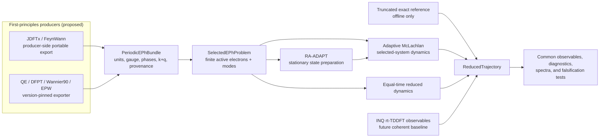

# Ping-group open-dynamics program

## Decision

The repository's flagship near-term program is a **source-anchored,
solver-neutral benchmark for equal-time non-Markovian electron--phonon
dynamics**, beginning with the driven spinful Holstein dimer studied by
Riva, Simoni, and Ping. The implemented first slice exposes the repository's
existing truncated-exact, coherent-only, and independent 31-real-coordinate
trajectories through one reduced-moment contract.

The phrase *source-anchored* is deliberate. The public v1 arXiv archive does
not include the supplement identified in the paper as containing the
spin-reduced dimer equations, and it publishes no numerical dataset. The
repository therefore does not claim to reproduce the authors' implementation
or curves. Its representability and closure analyses are independent work and
have not been reviewed by Gabriele Riva, Jacopo Simoni, Yuan Ping, or their
collaborators.

Primary anchors:

- [Yuan Ping's UW--Madison profile](https://engineering.wisc.edu/directory/profile/yuan-ping/)
- [First-principles open quantum dynamics for solids](https://arxiv.org/html/2504.17936v2)
- [Equal-time non-Markovian electron--phonon dynamics](https://arxiv.org/html/2606.22233v1)
- [Public FPDMD repository](https://github.com/Ping-Group-UCSC/FPDMD_development)
- [Public GaAs DMD workflow](https://github.com/Ping-Group-UCSC/Tutorials/blob/master/DMD-workflows/GaAs-DMD-example.md)
- [Spin-noncollinear rt-TDDFT in INQ](https://arxiv.org/abs/2506.21908)

## Implemented first slice

`pipelines/open_dynamics/` now provides:

- `ReducedTrajectory`, `MomentSeries`, `MethodIdentity`, and separated
  source/repository provenance;
- capability-declared coherent phonon, normal/anomalous fluctuation, and
  connected electron--phonon moments;
- structural validation and non-mutating Hermiticity, trace, eigenvalue, and
  phonon-symmetry diagnostics;
- `reference_access="offline_only"` for exact reference trajectories;
- a field-wise adapter over `paper_5/src/paper5/stability/` that exposes no
  exact wavefunction or Hamiltonian;
- a common short protocol with the paper-stated physics separated from
  repository integration, cutoff, initialization, and Fourier choices; and
- explicit polarization and symmetric-Hann DFT conventions.

The coherent-only adapter contains only the electronic 1-RDM and coherent
phonon amplitude. Unavailable fluctuation and connected-correlation tensors are
omitted, not zero-filled.

Focused acceptance currently consists of 12 new tests plus 19 unchanged Paper V
matrix/exact-reference regression tests.

## Program architecture

## Secondary interface 1: periodic electron--phonon bundle

Status: **proposed, not implemented**.

The group-native first producer is a portable sidecar emitted inside the
modified FeynWann initializer from the same in-memory values used to create
`ldbd_data`. The public legacy directory is not a safe external API: its binary
files use native layouts without self-describing dtype, endianness, version,
shape, or complete runtime semantics. A consumer must never guess those fields
or fall back to `numpy.fromfile`.

The eventual neutral bundle will use a JSON manifest and `allow_pickle=False`
NPZ arrays. It must include electronic energies and occupations, phonon
frequencies/eigenvectors, full complex electron--phonon couplings, mesh weights,
k+q maps, units, basis/gauge, symmetry expansion, zero-point and finite-grid
normalization, active windows, producer capabilities, software/input hashes,
and pseudopotential provenance.

QE/DFPT/Wannier90/EPW is an alternate producer of that same contract. Documented
QE XML, Wannier90 text, and matdyn/dynmat text can support fixtures, but coherent
complex `g` requires a pinned exporter. Degeneracy-averaged printed magnitudes
must not be used as complex coupling tensors, and EPW restart binaries are not
the first public seam.

Go gate: implement the bundle only when either a producer-side FeynWann fixture
or a pinned QE/EPW complex-coupling export is available with inputs and hashes.

## Secondary interface 2: common reduced trajectories and INQ observables

Status: **reduced-trajectory core implemented; INQ producer proposed**.

The common trajectory is the comparison seam among explicit truncated-exact,
coherent-only, equal-time non-Markovian, adaptive McLachlan, and future INQ
outputs. Every producer declares its available moments. An INQ adapter will be
electronic-observable-only unless a separate environmental model is actually
present; rt-TDDFT is not labeled as the equal-time collision theory.

Go gate: add an INQ adapter only from a versioned collaborator- or
cluster-produced trace with its field, time, basis, unit, and observable
conventions.

## Quantum role

Quantum computing is a downstream falsifiable benchmark, not the program's
center. A future validated `SelectedEPhProblem` supplies a finite explicit
electron-plus-mode Hamiltonian and common-moment operators. RA-ADAPT prepares a
stationary correlated state; adaptive McLachlan propagates it. QSE may supply
response or spectral information. None of these is relabeled as FPDMD.

The quantum path must log zero online exact-reference access. Continue beyond
small exact-solvable cases only if common moments agree within joint numerical
and sampling uncertainty and beat the coherent-only baseline at preregistered
held-out points after timestep and phonon-cutoff refinement. Passing this gate
supports more benchmarking, not a claim of quantum advantage.

## Claim ledger

- **Implemented and verified:** implemented in this repository and verified by
  named automated tests against declared invariants or the repository's
  truncated-exact reference; no external validation is implied.
- **Fixture-validated:** validated only on a named fixture with recorded
  producer, inputs, conventions, capabilities, and hashes; broader
  compatibility is unestablished.
- **Independent and unreviewed:** an independent repository implementation or
  result, not reviewed, validated, or endorsed by the Ping group.
- **Proposed:** specification only, with no implementation or validation claim.
- **Future collaborator-validated:** usable only after a named supplied artifact
  passes a predeclared acceptance test and the collaborator approves that
  specific compatibility description.

The overview must not claim ab initio dimer results, published-curve
reproduction, Ping-group endorsement, a demonstrated defect in the published
theory, producer compatibility without a real fixture, replacement of FPDMD by
ADAPT/McLachlan, or quantum advantage.
