# Repo Implementation Guide v3 (HH-First)

Implementation-first guide for `Holstein_test` with Hubbard-Holstein (HH) as the primary production model and pure Hubbard as secondary validation context.

Audience assumption: physics and math are already understood; this document focuses on how physics is encoded in code, what invariants are enforced, and how to read artifacts/plots correctly.

## 1. Reader Contract And Review Goal (HH-First)

This guide answers one question: is the current implementation faithful and auditable?

What is in scope:

- exact codepath mapping for HH and Hubbard runs,
- invariants that must not drift,
- how VQE/ADAPT/Trotter/drive are actually implemented,
- what each JSON key and plot channel means,
- how to detect implementation bugs from artifact signatures.

What is intentionally out of scope:

- re-deriving Hubbard or HH theory from first principles,
- CLI catalogs beyond a tiny appendix,
- workflow/process material not tied to implementation correctness.

Canonical audit artifacts in this guide:

- HH primary static: `artifacts/json/hc_hh_L2_static_t1.0_U2.0_g1.0_nph1_strong.json`
- HH primary drive: `artifacts/json/hc_hh_L2_drive_J1_U2_g1_nph1_from_adapt.json`
- HH primary ADAPT: `artifacts/json/adapt_hh_L2_static_t1.0_U2.0_g1.0_nph1_paop_deep.json`
- Hubbard context static: `artifacts/json/hc_hubbard_L3_static_t1.0_U4.0_S128_heavy.json`
- Hubbard context drive: `artifacts/json/hc_hubbard_L4_drive_t1.0_U4.0_S256.json`

Review method used throughout:

1. State quantity/contract.
2. Point to implementation function family.
3. Point to JSON/plot channel.
4. State failure signature.

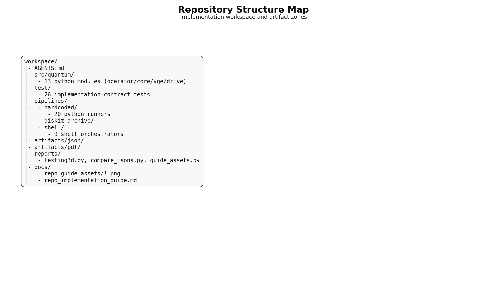

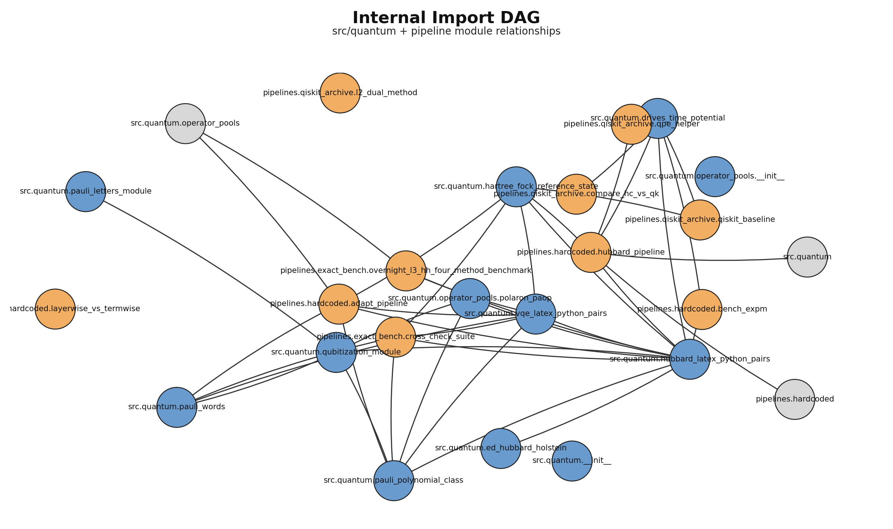

## 2. Non-Negotiable Invariants

### 2.1 Pauli alphabet invariant

Internal operator algebra uses `e/x/y/z`. Any `I/X/Y/Z` conversions are boundary-only formatting concerns.

Why this matters: labels are dictionary keys and graph nodes in several stages; mixed conventions silently break term-matching.

### 2.2 Pauli word ordering + bit indexing invariant

String convention: left-to-right is `q_(n-1)...q_0`; qubit 0 is rightmost in strings.

Statevector bit arithmetic still uses qubit 0 as least significant bit in integer basis index operations.

### 2.3 JW source-of-truth invariant

JW ladders should come from the established helper layer (`pauli_polynomial_class` path), not fresh ad-hoc rewrites.

### 2.4 Canonical `PauliTerm` source

Canonical class is `src/quantum/qubitization_module.py` with compatibility aliases only; no parallel class implementations.

### 2.5 Drive pass-through invariant

Compare pipeline forwards drive parameters; it should not reinterpret drive physics.

### 2.6 Safe-test invariant

The A=0 drive path should match no-drive trajectory behavior within threshold (`1e-10` in compare checks).


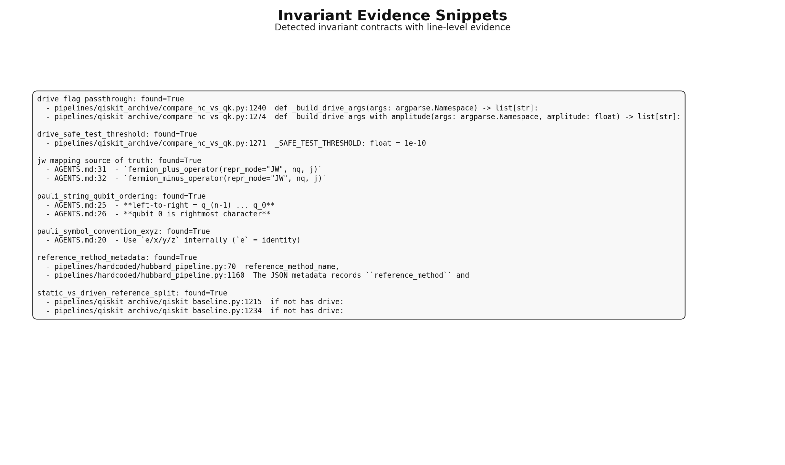


## 3. Current Repo Topology And Active Codepaths

Primary active code paths in this repo shape:

- hardcoded production pipelines:
  - `pipelines/hardcoded/hubbard_pipeline.py`
  - `pipelines/hardcoded/adapt_pipeline.py`
- qiskit archive validation/orchestration:
  - `pipelines/qiskit_archive/qiskit_baseline.py`
  - `pipelines/qiskit_archive/compare_hc_vs_qk.py`
- physics core:
  - `src/quantum/hubbard_latex_python_pairs.py`
  - `src/quantum/vqe_latex_python_pairs.py`
  - `src/quantum/hartree_fock_reference_state.py`
  - `src/quantum/drives_time_potential.py`
  - `src/quantum/operator_pools/polaron_paop.py`

Implementation split used in practice:

- HH production depth is in hardcoded path (+ ADAPT/pool variants).
- Qiskit path remains a comparator for supported Hubbard cases and shared drive reference semantics.
- Tests in `test/` are executable specification for many invariants, not just smoke checks.

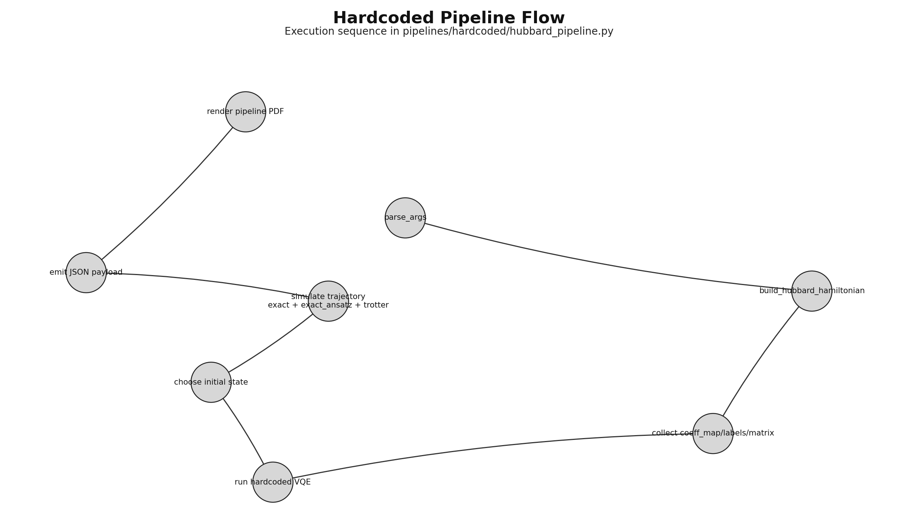


## 4. HH Hamiltonian Assembly And JW Contracts

### 4.1 Core decomposition implemented

The implemented HH model logic is assembled into PauliPolynomial terms and then traversed as label-coefficient maps:

$$
H = H_t + H_U + H_{\text{phonon}} + H_{e\text{-}ph} + H_v.
$$

For Hubbard-only runs, the reduced decomposition is used.

### 4.2 Number operator and label placement contract

Number operator convention remains:

$$
n_p = \frac{I - Z_p}{2},
$$

with Pauli-string placement consistent with `q_(n-1)...q_0` convention.

### 4.3 Term collection vs ordering

Collection stage accumulates duplicate labels into one coefficient map; ordering stage chooses traversal order (`native` vs `sorted`) for product-form exponentials.

Reordering changes finite-step Trotter error profile; it does not change Hamiltonian definition.

### 4.4 HH register expansion

HH introduces phonon register qubits in addition to fermion spin-orbital qubits.


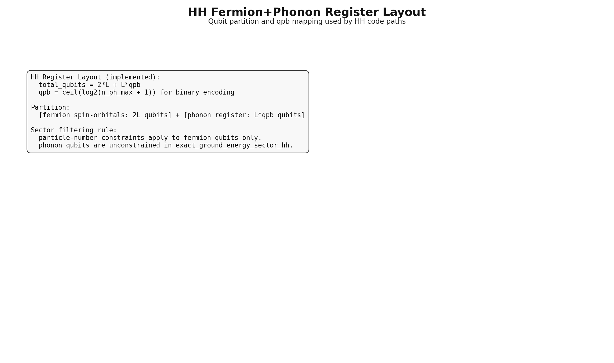

## 5. HF And Reference-State Construction (Hubbard + HH)

### 5.1 Hubbard HF construction

For `L` sites, fermion qubits are `N_q = 2L` with half-filling split:

$$
N_\uparrow = \lceil L/2 \rceil, \qquad N_\downarrow = \lfloor L/2 \rfloor.
$$

Placement is indexing-dependent (`blocked` vs `interleaved`) and implemented via bit-index helper + reference-state constructor.

### 5.2 HH reference construction

HH reference state includes fermionic half-filling pattern plus phonon vacuum encoding block; this is not the same as the pure Hubbard HF vector on `2L` qubits.

### 5.3 Basis index interpretation

Bitstring printed order and integer-basis bit tests are intentionally dual-view; both are required for correct occupancy extraction.


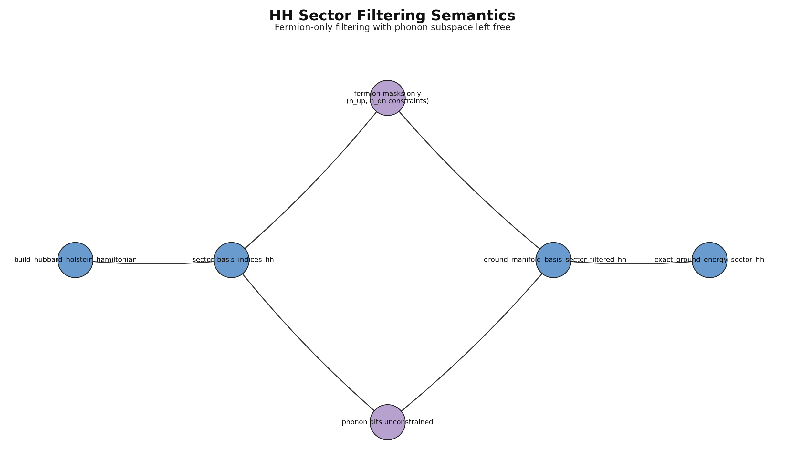

## 6. VQE Internals: Ansatz Families, Theta, Restarts

### 6.1 Objective implemented

VQE minimizes:

$$
E(\theta)=\langle \psi(\theta)|H|\psi(\theta)\rangle,
$$

with statevector backend in hardcoded path.

### 6.2 Theta semantics

`theta` is always a real vector, but dimension semantics differ by ansatz family.

- layerwise families: grouped parameterization,
- termwise families: one scalar per traversed generator term per repetition.

### 6.3 Inner optimizer and restarts

Hardcoded VQE path uses SciPy when available (default configurations commonly COBYLA in pipeline settings) and fallback search when absent.

Restart semantics:

1. sample independent initialization,
2. optimize objective,
3. keep lowest terminal energy.

### 6.4 Practical correctness checks

For meaningful comparisons, keep fixed:

- optimizer method,
- restart count,
- `maxiter`,
- seed,
- ansatz family/depth.


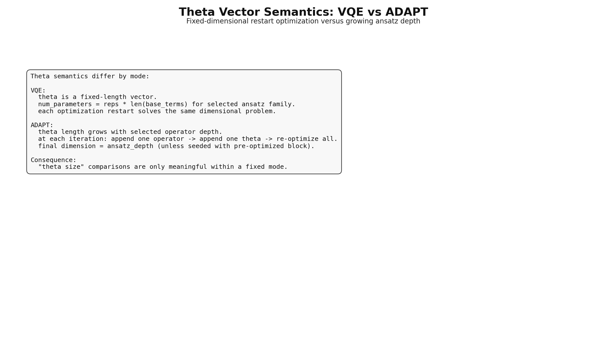

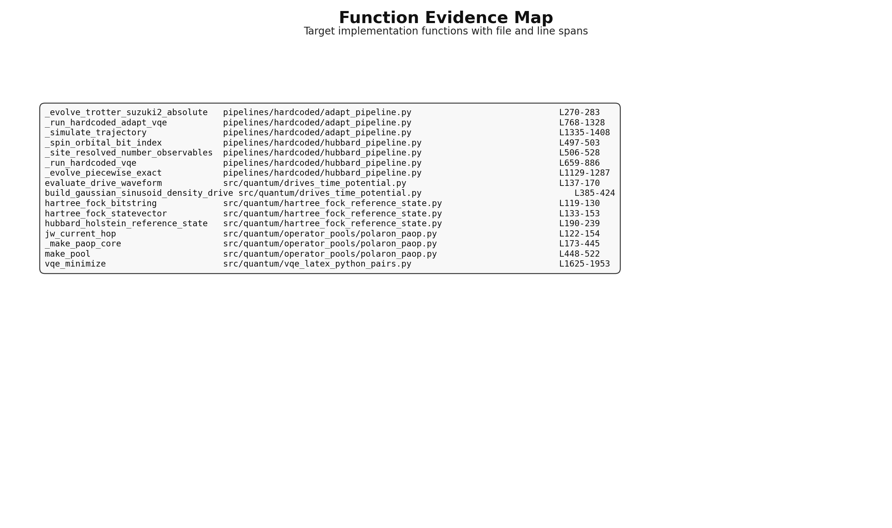

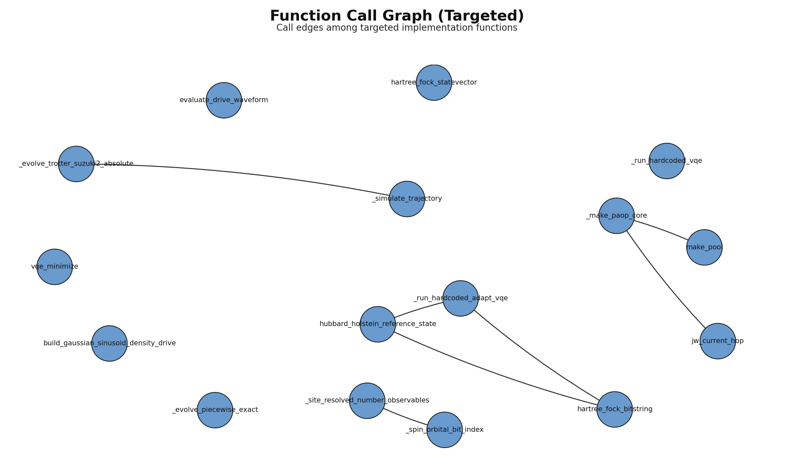

## 7. ADAPT Internals And Pool Semantics (PAOP/LF)

### 7.1 ADAPT loop in code terms

Implemented ADAPT flow:

1. build pool,
2. prepare current state,
3. compute commutator-gradient score per candidate,
4. select best candidate (repeat-bias logic when repeats enabled),
5. finite-angle fallback scan when gradients are below threshold (if enabled),
6. re-optimize all parameters (COBYLA),
7. stop by gradient/energy/depth conditions.

### 7.2 Pool family semantics

HH pool families are materially distinct and should not be treated as aliases except where explicit alias rules are defined.

PAOP-LF additions introduce new channel structure (e.g., current-like odd channel, second-order even channel, full extensions).

### 7.3 Merge/dedup path

For HH with nonzero coupling in several branches, merged pool construction and polynomial-signature deduplication are explicit implementation steps.

### 7.4 Artifact interpretation impact

`adapt_vqe` payload fields (depth, selected operators, stop reason, pool type) must be read with the same weight as final energy when validating implementation behavior.

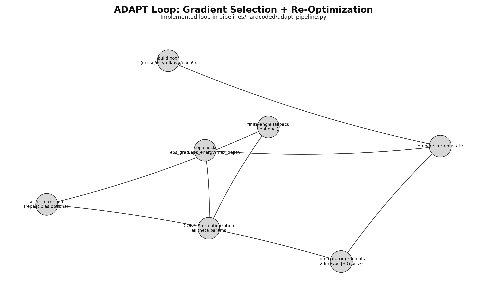

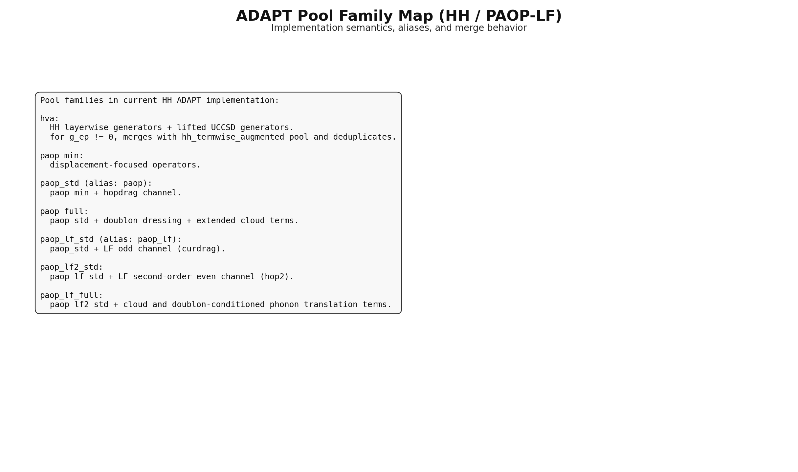

## 8. Trotter Ordering Semantics And Non-Commutation

For finite step size, product ordering matters whenever terms do not commute.

Implemented symmetric Suzuki-2 style traversal uses forward/reverse passes over ordered labels with per-step sampling semantics.

Why step refinement helps:

- local BCH error terms scale with higher powers of $\Delta t$,
- reducing $\Delta t$ shrinks order-sensitive error terms,
- ordering effect approaches zero in the exact-limit regime.

This does not mean ordering is irrelevant at finite discretization; it means its induced error shrinks predictably with refinement.


## 9. Drive Implementation, Reference Split, Safe-Test

### 9.1 Drive waveform implementation

Drive path is Gaussian-envelope sinusoid with spatial weighting patterns.

### 9.2 Static vs drive-enabled reference methods

- no-drive: static eigendecomposition reference branch,
- drive: piecewise exact numerical propagator path with `reference_method` metadata and step refinement via `exact_steps_multiplier`.

### 9.3 Safe-test contract

Drive enabled with `A=0` should match no-drive channels within threshold; this guards routing and numerical branch consistency.

### 9.4 Architecture boundaries

Compare path routes drive args and evaluates consistency metrics; hardcoded/qiskit sub-pipelines perform actual physics propagation.


## 10. Observable Computations And Trajectory Contracts

### 10.1 Site-0 occupations

`n_up_site0_*`, `n_dn_site0_*` channels come from basis-index occupancy extraction over probability amplitudes.

### 10.2 Doublon and staggered observables

Doublon is summed sitewise joint occupancy channel; staggered order is alternating-sign site density aggregate.

### 10.3 Energy channels

- static energy channels use static Hamiltonian expectation,
- total energy channels include instantaneous drive contribution when drive active.

### 10.4 Fidelity channel

Fidelity is projector-overlap against filtered ground-manifold subspace basis, not generic full-space overlap to a single eigenvector.

### 10.5 Schema differences

HH ADAPT payloads may use compact energy key names (`energy_exact`, `energy_trotter`) while HC VQE payloads include expanded static/total key families. Audit tooling must map both.


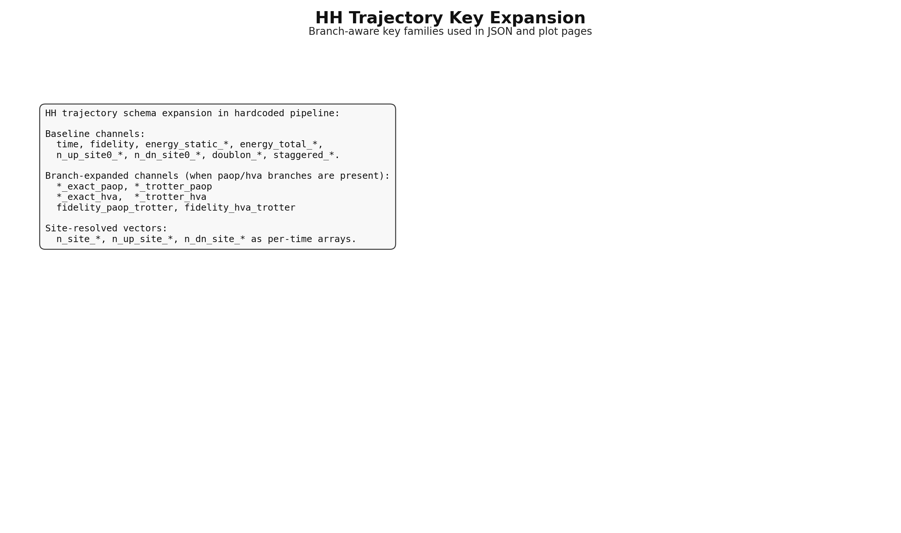

## 11. Plot Generation Internals And Interpretation

### 11.1 Pipeline plot assembly behavior

Pipeline PDFs combine trajectory arrays into page families (summary, energy overlays, occupancy channels, drive pages, error pages, provenance/manifest sections).

### 11.2 Correct interpretation rules

- compare like-for-like branches,
- distinguish static from total energies in drive runs,
- treat branch provenance (`exact_gs`, `paop`, `hva`) explicitly,
- check fidelity with its subspace definition in mind.

### 11.3 Common misreads to avoid

- mistaking ordering effects for Hamiltonian-definition changes,
- mixing branch labels across paop/hva/legacy tracks,
- interpreting `A=0` drive equivalence failures as physical instead of implementation routing issues.


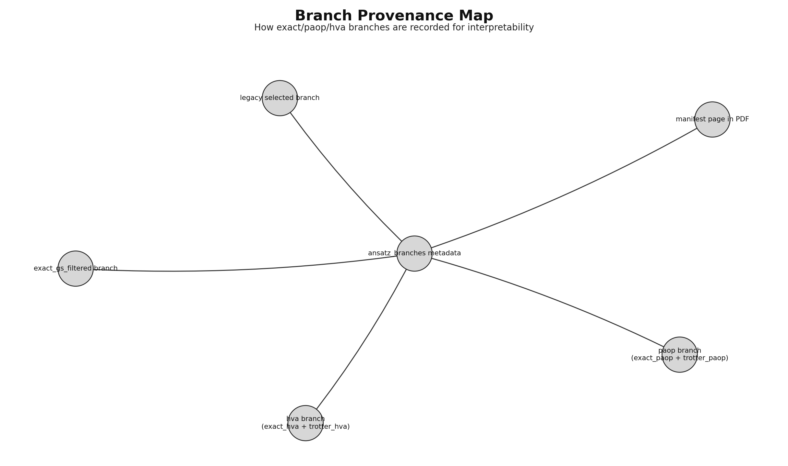

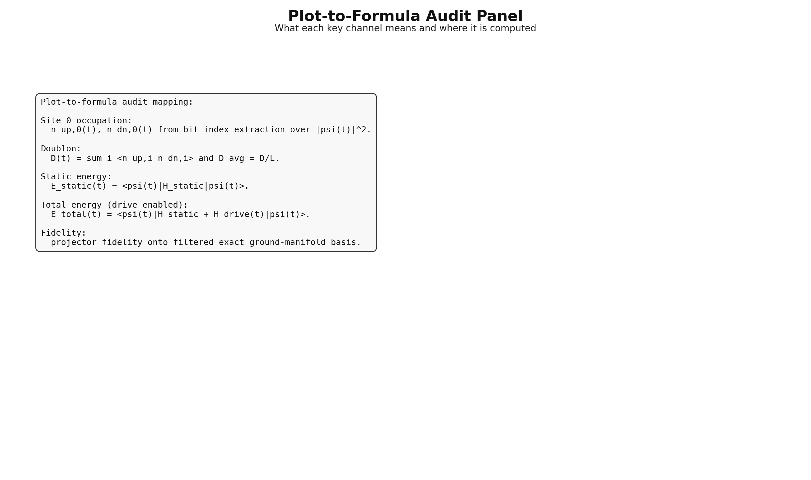

## 12. Artifact-Grounded Audits (HH Primary, Hubbard Context)

### 12.1 HH primary case A (static)

Audit source: `hc_hh_L2_static_t1.0_U2.0_g1.0_nph1_strong.json`

Key checks:

- consistency of static and total channels in no-drive mode,
- physically bounded occupancy channels,
- sensible fidelity and energy error envelopes.

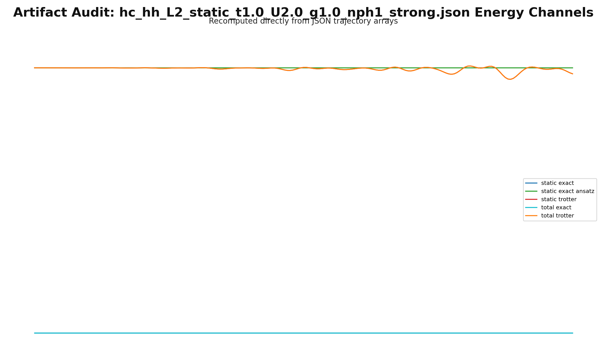

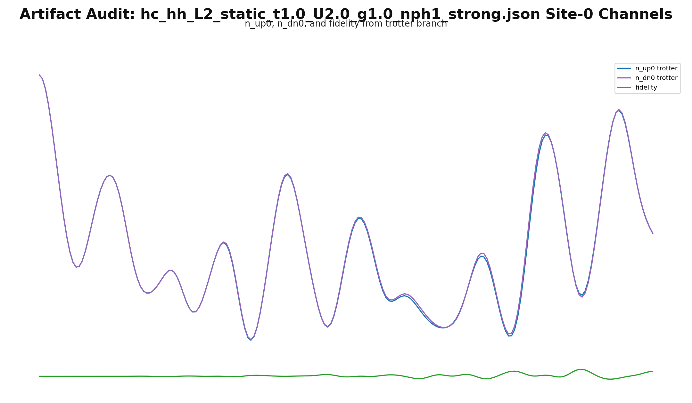

### 12.2 HH primary case B (drive)

Audit source: `hc_hh_L2_drive_J1_U2_g1_nph1_from_adapt.json`

Key checks:

- static vs total energy divergence when drive active,
- branch-expanded paop/hva channel coherence,
- drive metadata consistency with behavior.

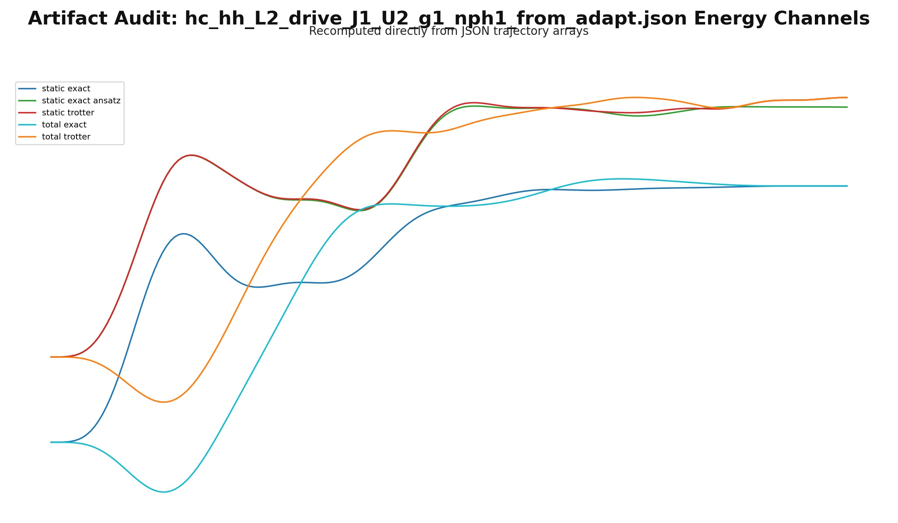

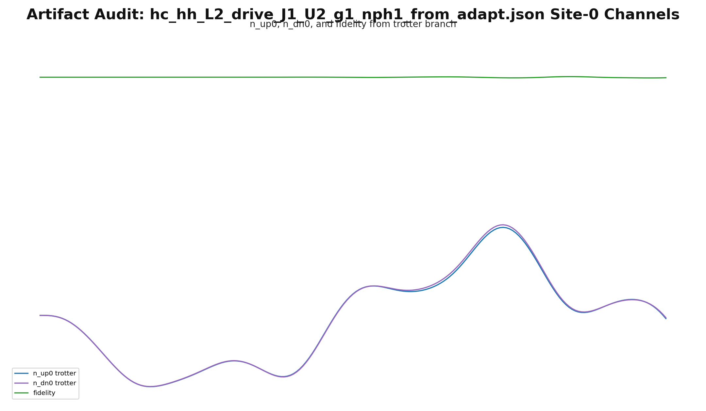

### 12.3 HH primary case C (ADAPT)

Audit source: `adapt_hh_L2_static_t1.0_U2.0_g1.0_nph1_paop_deep.json`

Key checks:

- compact schema decoding correctness,
- ADAPT depth/selection behavior consistency with trajectory quality,
- no contract break in mapped energy channels.

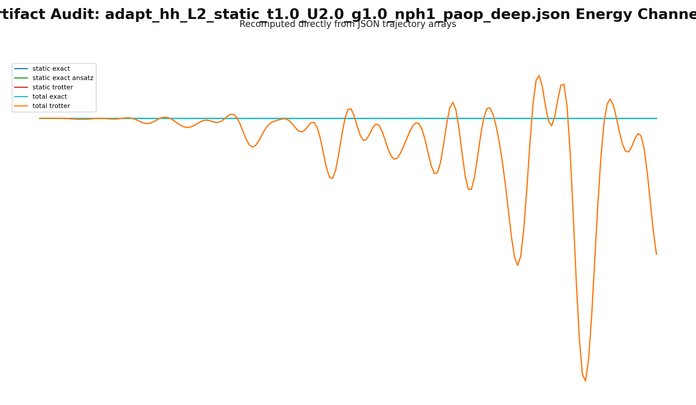

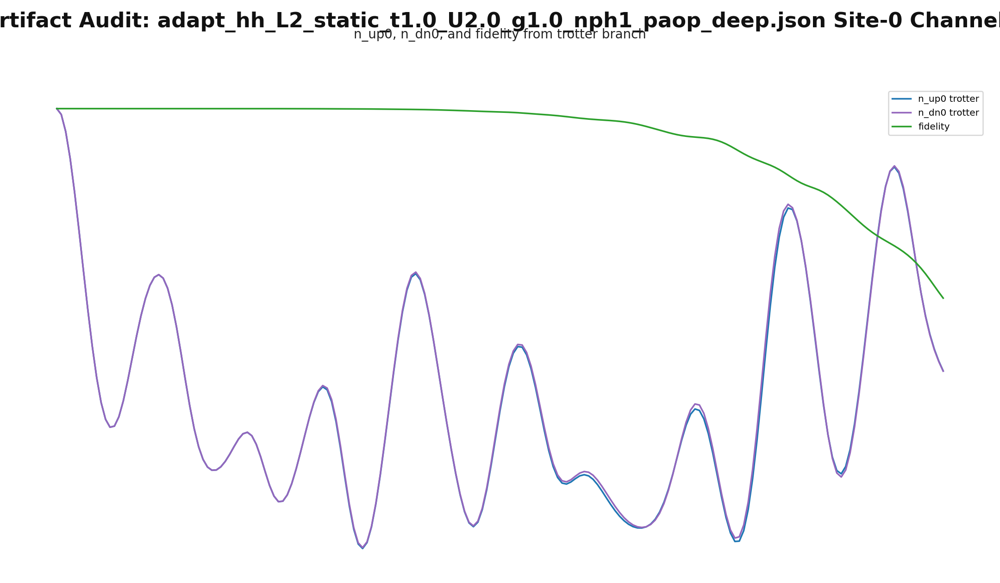

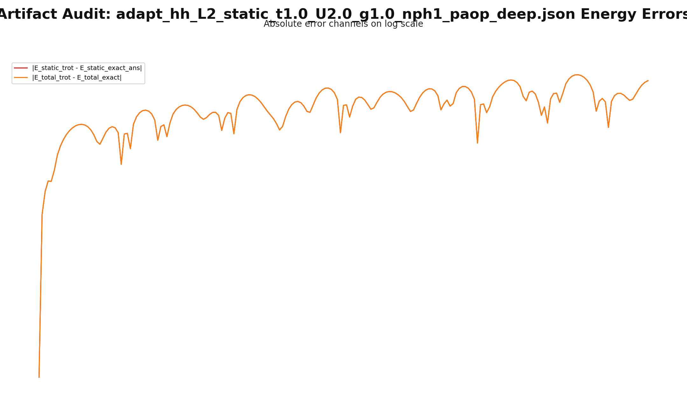

### 12.4 Hubbard context cases

Context sources:

- `hc_hubbard_L3_static_t1.0_U4.0_S128_heavy.json`
- `hc_hubbard_L4_drive_t1.0_U4.0_S256.json`

Purpose:

- maintain continuity with prior validation baseline,
- sanity-check shared kernels and interpretation rules outside HH-primary trio.

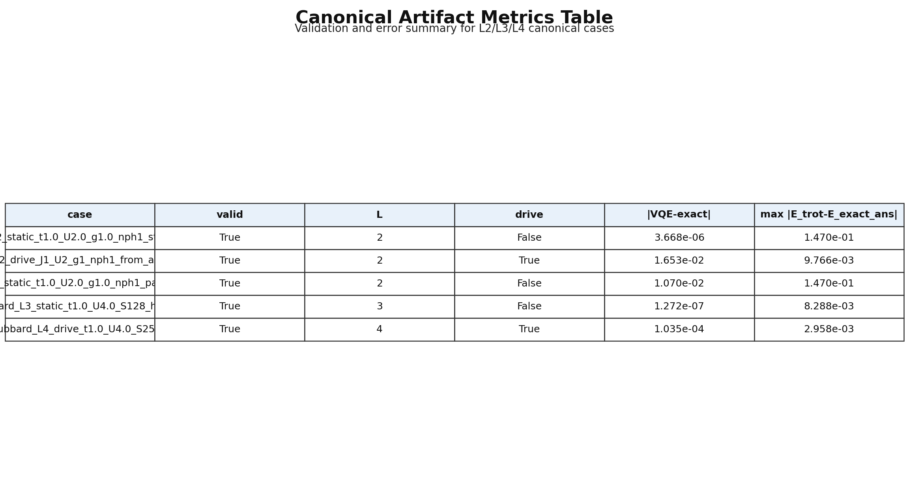

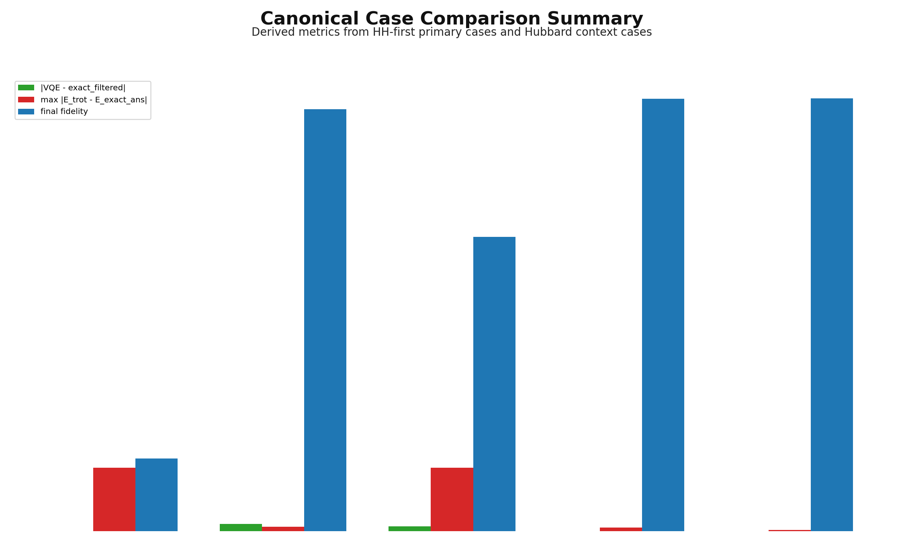

## 13. Extension Safety: Safe And High-Risk Edits

Safe edits usually preserve:

- Pauli/order/JW invariants,
- canonical operator-core semantics,
- drive pass-through and safe-test contracts,
- trajectory key meaning and manifest structure.

High-risk edits include:

- changing indexing/bit mapping without synchronized observable updates,
- rewriting number/JW logic ad hoc,
- adding drive knobs without full pipeline surfacing,
- changing existing JSON key semantics under old names.

Minimal pre-merge checks for implementation changes:

1. regenerate canonical guide assets,
2. verify evidence anchors still resolve,
3. run `pytest -q`,
4. inspect safe-test behavior in drive-related changes,
5. inspect metrics deltas on HH primary cases.


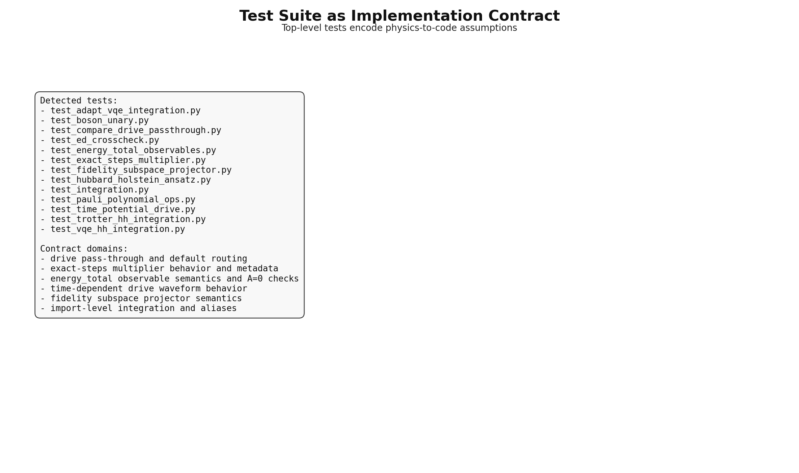

## 14. Ultra-Brief Run Appendix

Build from repo root:

```bash
pipelines/shell/build_guide.sh
```

It regenerates diagrams/summary JSON, runs deterministic checks, snapshots `pytest -q`, and rebuilds:

- `docs/Repo implementation guide.PDF`
- `docs/repo_guide_assets/repo_guide_summary.json`
- `docs/repo_guide_assets/repo_guide_artifact_metrics.json`

For implementation review, start with sections 5, 7, 9, 10, and 12.

## Appendix A. Figure Atlas


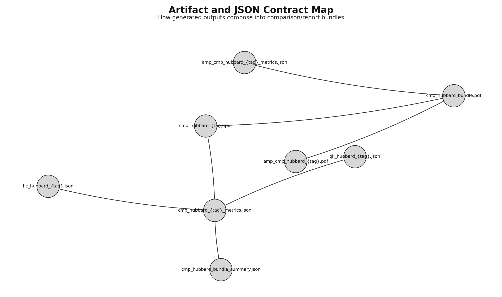


## Appendix B. Evidence Anchors

Authoritative generated anchors are emitted to:

- `docs/repo_guide_assets/repo_guide_summary.json`

Key target function families tracked include:

- hardcoded dynamics trajectory kernels,
- VQE minimization and HF constructors,
- ADAPT core and pool constructors,
- drive waveform/build helpers,
- PAOP/LF pool internals.

## Appendix C. Metrics Snapshot Contract

Authoritative generated metrics are emitted to:

- `docs/repo_guide_assets/repo_guide_artifact_metrics.json`

Interpret this JSON as the canonical computed view of:

- HH primary-case validity,
- Hubbard context-case validity,
- trajectory schema mapping used during auditing,
- cross-case summary values rendered into guide figures.
